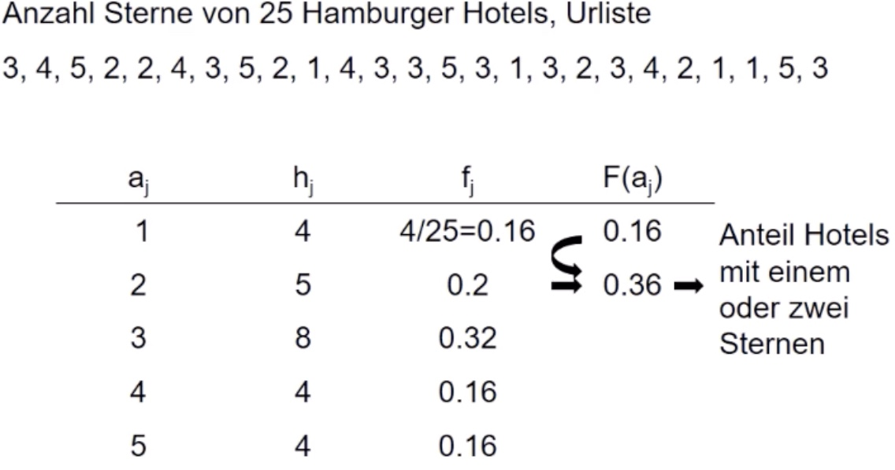
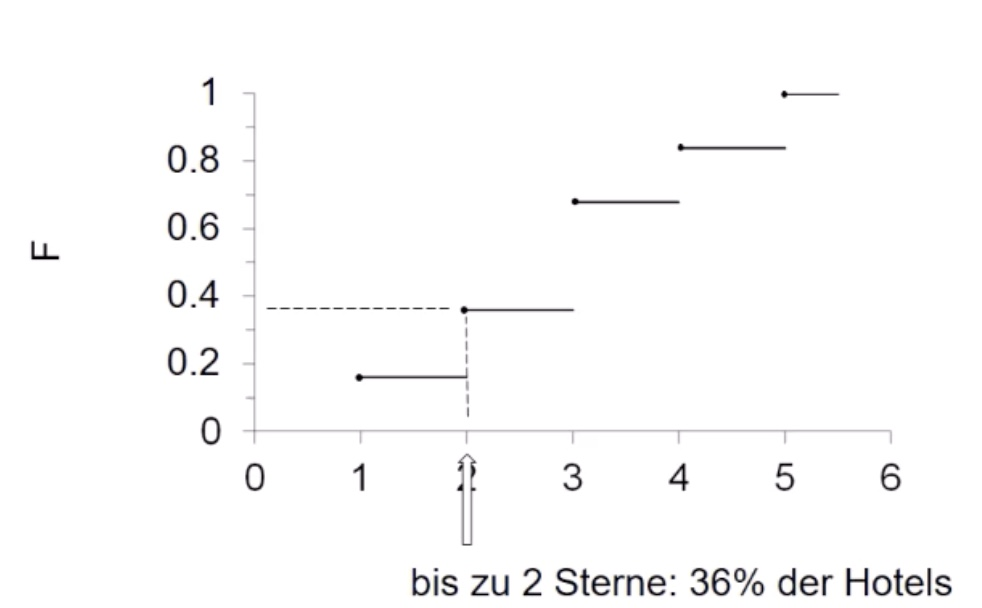
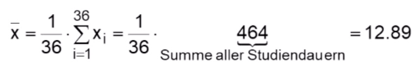

# 05.11.2021 Häufigkeiten

### kumulierte Verteilung

anders als bisherige Darstellungen diesesmal: *kumulierte Häufigkeitsverteilung*

> **kumulierte Häufigkeitsverteilung**: Berechnung der Anteile Ober/unterhalb einer bestimmten Grenze (bspw Armutsgrenze)

Allgemein Merkmal X: 

- *n* Beobachtungen, Werte: x*1*, ... ,x*n*
- zu jedem x: Anteil der Werte, die kleiner/gleich x ist => **empirische Verteilungsfunktion** von X
    - $F(x) = \sum_{j:a_j\leq x}$
    - F(x) = Anteil der Beobachtungen kleiner gleich x

> **empirische Verteilungsfunktion**: $F(x) = \sum_{j:a_j\leq x} mit \ 0\leq F(x) \leq 1$
>
> lesen als F(x) = Anteil der Beobachtungen kleiner gleich x

---

#### Beispiel: 

Graphische Darstellung:

---

#### Review: graphische Darstellungen

*Stab-, Säulen-, Balken-, Kreisdiagramm*:  nominal und ordinal skalierte Merkmale

*Histogramm*: metrisch skalierte (stetige) Merkmale , **klassiert**

## Statistische Kenngrößen

erlauben Zusammenfassung von Verteilung auf einzelne Zahlen

Arten: *Lage, Streuung, Schiefe, Konzentration* 

### arithmetisches Mittel ("Durchschnitt")

benötigt metrisch skalierte Merkmale

Notation: $\bar{x} = \frac{1}{n} \sum^n_{i=1} x_i$ (beachte x-quer)

Beispiel aus Absolventenstudie : Merkmal Studiendauer

Bei Zusammefassung von arithmetischen Mitteln immer die Stichprobengröße/Gewichtung beachten!

### geometrisches Mittel 

braucht metrische Merkmale > 0

für Wachstumsraten / relative Änderungen gut

Beispiel:

- Zeit t=1 ; Wert x1=10
- Zeit t=2 ; Wert x2=16
- Zeit t=3 ; Wert x3=20
- Wachstumsfaktor t=1 bis t=2 : 16/10 = 1.6
- Wachstumsfaktor t=2 bis t=3 : 20/16 = 1.25

=> durchschnittliches Wachstum beider Zeiträume = *geometrisches Mittel*

Berechnung: $ 1.6 * 1.25 = 2 \implies \bar{x}_{geom} = \sqrt{2}$ 

Notation: $\bar{x}_{geom} = \sqrt[n]{x_1*...*x_n}$ (Wachstumsfaktoren multiplizieren und die Wurzel mit Anzahl der Faktoren ziehen)

