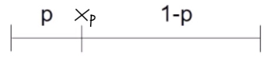
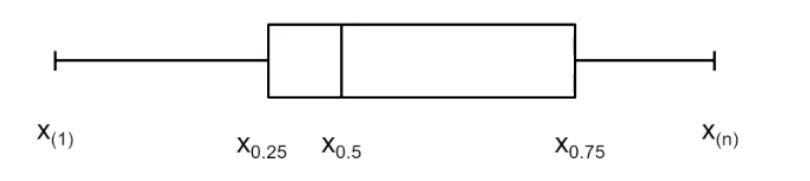

# 16.11.2021 weitere Lagemaße


### Median

> **Median:** Mitte einer *geordneten* Beobachtungsreihe

wenn *n* ungerade: $x_{med}= x_{ \left( \frac {n+1} {2} \right) }$= `Mittlere Zahl`

wenn *n* gerade: $x_{med} = \frac{1}{2} * \left( x_{\left( \frac {n} {2} \right)} + x_{\left( \frac {n+1} {2} \right)} \right)$  = `Mittelwert der mittleren Zahlen`


### Modus

> **Modus:** Merkmal mit größter Häufigkeit $x_{mod}$

wie viele Merkmale von Modus gibt es = *Modalitätsgrad*

Modalitätsgrad = $h(x_{mod}) / n$ `relative Häufigkeit des Modus`


### Sonderfälle

#### Transformationen

Transformation von Lagemaßen bei **linearen** Transformationen möglich: $y_i = a*x_i + b \iff \bar{y} = a * \bar{x} + b$


#### Klassierte Daten

Lagemaße wie arithmetisches Mittel nur näherungsweise berechenbar 

Vorgehen:

1. für jede Klasse Klassenmitte *m* bilden
2. *m* gewichten mit mit häufigkeit *f* 
3. Durchschnitt aller Klassen bilden


Notation: $\bar{x}_{klass} = \sum_{j=1}^k m_j * f_j$


### Quantile

Aufteilung der Beobachtung in Werte unter-/ oberhalb von $x_p$ 

> **p-Quantil**: $x_p$ teilt Beobachtungsreihe auf in zwei Anteile



für 0 < p < 1; 

**falls _n*p_ nicht ganzzahlig** = aufrunden

```
Studiendauer: n = 36, p = 0,9
n * p = 36 * 0.9 = 32.4 -> aufrunden auf 33
=> 33ten Wert aus geordneter Reihe ablesen
```

Ergebnis: $x_{(0.9)} = x_{(33)} $

**falls _n*p_ ganzzahlig** = Mittelwert von $n*p $ und $ n*p+1 $

```
Studiendauer, n = 36, p = 0.75
n*p = 27 -> ganzzahlig
=> Mittelwert aus 27ten und 28ten Wert
```
Ergebnis: $x_{(0.75)} = \frac{1}{2}* (x_{(27)} + x_{(28)} )$


#### Spezielle Quantile

- p = 0.25 : *1. Quartil*
- p = 0.5 = **Median**, *2. Quartil*
- p = 0.75 : *3. Quartil*


#### Fünf-Punkte-Zusammenfassung

Beobachtungen unterteilt in 4 Intervalle durch 5 Schnitte

- $x_{(1)}$ = Minimum
- 1\. Quartil
- Median
- 3\. Quartil
- $x_{(n)}$ = Maximum

Graphische Darstellung mithilfe des **Boxplots**



