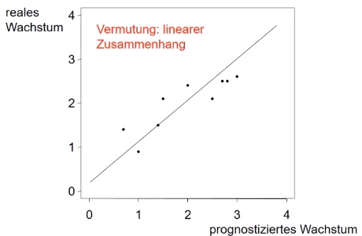

# 10.01.2022 Korrelation

Bestimmung des Zusammenhangs für höher skalierte Werte als die nominalen

### Pearsons Korrelationskoeffizient 

für *metrische* Merkmale!

2 Merkmale X,Y mit Paaren $(x_1,y_1), ...,(x_n,y_n)$,

Berechnung: 

Wertebereich: $-1 \le r_{XY} \le 1$ , 

- $|r_{XY}|$ = Zusammenhang
- Einteilung wie bei $K^*$ (stark, schwach,...)
- Vorzeichen => Richtung des Zusammenhangs

alternative Berechnung: 

#### Beispiel

Prognoziertes Wachstum (X) vs reales Wachstum (Y)

Darstellung im Streudiagramm:

Berechneter Korrelationskoeffizient ~0.87 = stark

### Rangkorrelation

für *ordinale* Merkmale

Beispiel: Beliebtheit von 5 Politikern 

Problem: die beiden *wenigs* haben keine exakte Bindung

Lösung: beide die Mitte = 3.5 nehmen! (Mittelrangbildung)

#### Rangkorrelationskoeffizient

- Wertebereich $-1 \le r_{sp} \le 1$
- Messung der Monotonie
- Zusammenhangstärke : $|r_{sp}|$
- vereinfachte Version, wenn keine Bindungen (Formelsammlung)

aus Pearson abgeleitet, aber mit Ränge statt Werte
$$
r_\text{Sp} = \frac{\sum_{i=1}^n (\text{rang}(x_i) – \overline{\text{rang}(x)}) (\text{rang}(y_i) – \overline{\text{rang}(y)})}{ \sqrt{\sum_{i=1}^n (\text{rang}(x_i) – \overline{\text{rang}(x)})^2} \cdot \sqrt{\sum_{i=1}^n (\text{rang}(y_i) – \overline{\text{rang}(y)})^2} }
$$
Vereinfachung: Rangmittelwerte bilden

- $\overline{\text{rang}(y)} = \overline{\text{rang}(x)}= \frac{n+1}{2}$

Vereinfachter Spearman-Koeffizient:

### Interpretation der Korrelation

- keine Wirkrichtung, sondern wechselseitiger **Zusammenhang**
- Korrelation ≠ Kausalität
- Richtung des Zusammenhangs -> bei mind. ordinalen Merkmalen
- für Ursache-Wirkung: **Regression!**

