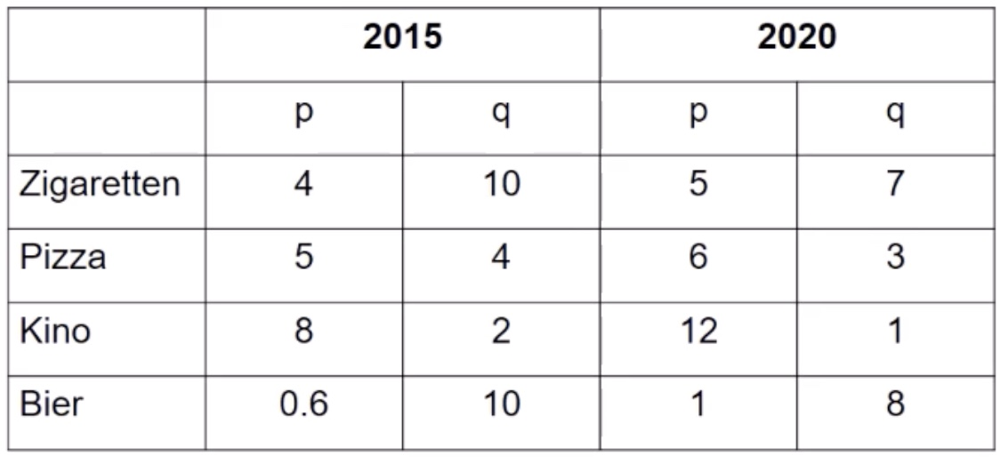

# 25.01.2022 Analyse zeitlicher Verläufe

Letze Woche die **Zeitreihenanalyse**, heute

## Indexrechnung

Indexzahlen:
- Maßzahlen desselben Merkmals, zwei Zeitpunkte
- Vergleich Basisperiode | Berichtsperiode
- Interpretation: Änderung der Maßzahl im Zeitvergleich (Preise, Mengen,...)

Beispiel Warenkorb: 

- Ausgaben 2015: Quantität (q) * Preis (p) = 82€
- 2020 = 73€
- $\frac{Ausg.2020}{Ausg. 2015} = \frac{73}{82} = 0.89 = 89\%$ 

Formal: (Wertindex)

- Warenkorb: *n* Güter
- Basiszeit: 
    - Güterpreise $p_0(1),...,p_0(n)$
    - Mengen: $q_0(1),...,q_0(n)$
- Berichtszeit:
    - $p_t(1),...,p_t(n)$
    - $q_t(1),...,q_t(n)$

Vorgehen bei Preis / Mengenänderung:

- Mengen aus Basiszeit fest, Preise anpassen: *Laspeyres*
    - für Preisindex: $P_{0,t}^L = \frac{\sum p_t(i) * q_0(i)}{ \sum p_0(i) * q_0(i)}$ 
    - Gefahr: veraltete Preise / Warenkorb bei Berichtszeit
- Preise aus Basiszeit fest, Mengen anpassen: *Paasche* 
    - $P_{0,t}^P = \frac{\sum p_t(i) * q_t(i)}{ \sum p_0(i) * q_t(i)}$
    - Gefahr: futuristischer Warenkorb bei Basiszeit

