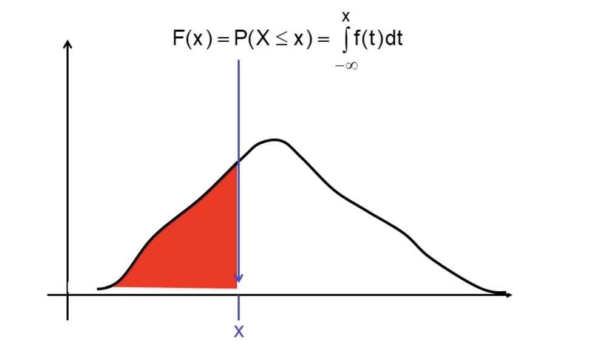
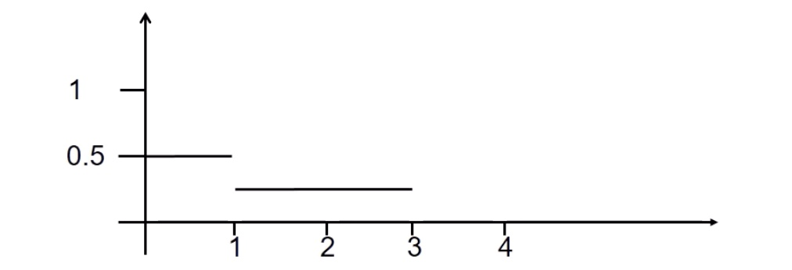
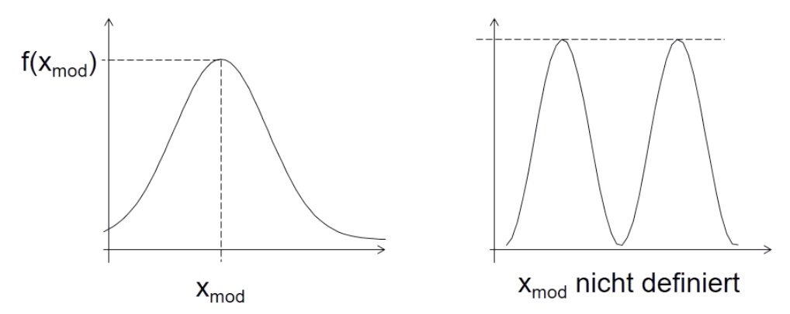
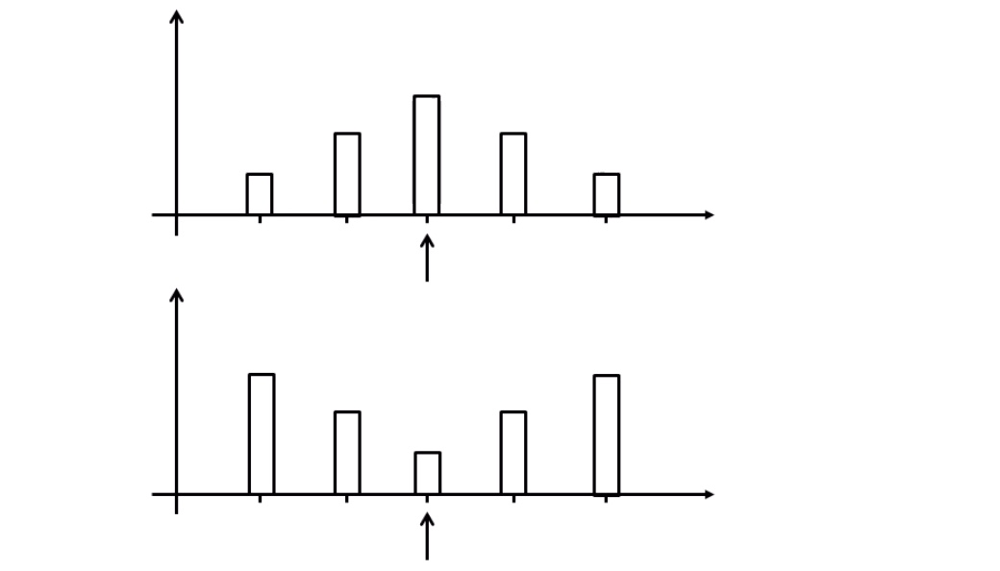
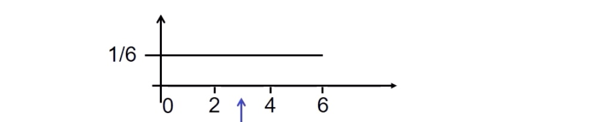

# 01.05.2022 Dichte und Lageparameter

für stetige Zufallsvariable

- *Wertebereich* $X(\Omega)= \R$
- *Definition*: $P(X \le x) = F(x) = \int_{-\infty}^x f(t)dt$
    - Fläche unter der Kurve die bis Funktionswert *x* ist
- *es gilt:* $f(x) \ge 0  \ \forall x;\ \int_{-\infty}^\infty f(t)dt=1$
    - die gesamte Fläche der Kurve ergibt 1 = 100 %

### Beispiel

Betrachtete Funktion:
$$
f(x) = 

\left\{\begin{array} 
00.5 & 0\le x\le 1 \\
0.25 & 1 < x \le 3 \\
0 & \text{sonst}
\end{array}\right.
$$

- nicht mathematisch stetig
- Bedingung für Funktionen !
    - [x] Werte > 0
    - [x] $\int_{-\infty}^\infty f(t)dt = 1$ 

anhand einfacher Lageparameter erfassbar:

## Modus 

Definition: x-Wert, bei dem f(x) maximal

- bei zwei gleichen Werten = *undefiniert*

## Erwartungswert

Gegenstück zum arithmetischen Mittel bei diskretem X

Definition:
$$
E(x) =\int_{-\infty}^\infty x * f(x)dx
$$

- kann auch nicht existieren
- Transformationsfest: $Y = a*X+b \to E(Y) = a*E(x)+b$
- Erwartungswert  ist Schwerpunkt / Symmetriestelle (bei symmetrischer Funktion)

#### Beispiel

- Alle 6 Minuten kommt Straßenbahn, wie lange muss ich wahrscheinlich warten wenn ich irgendwann losgehe?

Bestimmung des Erwartungswertes mit Integralen
$$
\begin{aligned}
E(x) 
&= \int_{-\infty}^\infty x * f(x)dx \\ 
&= \int_0^6 x * \frac{1}{6}dx  \\
&= \frac{1}{6}*\Big( \frac{1}{2}* x^2\Big)\bigg|_0^6 \\
&= \frac{1}{12}*(36-0) = \frac{36}{12} = 3
\end{aligned}
$$
graphische Darstellung:

- auch Argumentation mit Symmetriestelle möglich

## p-Quantil

für stetige Zufallsvariable:
$$
\text{Definition: }\underbrace{P(X < x_p)}_{F(x_p)} = p
$$
für diskrete Zufallsvariable:
$$
P(X < x_p) \le p \text{ und } P(X > x_p) \le 1-p
$$

- Stelle suchen, dass unter/ oberhalb von Stelle Wahrscheinlichkeit kleiner / größer

