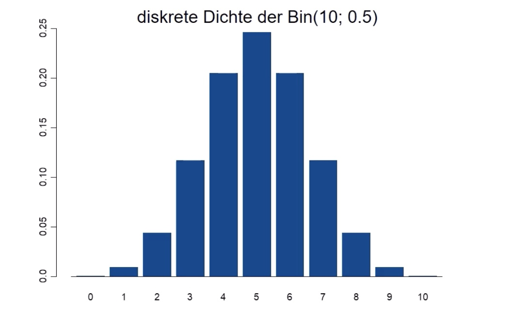
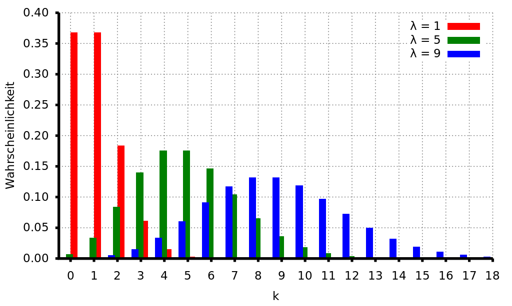

# 17.05.2022 Verteilungen

## Bernoulli Verteilung

binäre Verteilung als 0 oder 1

- bspw. Klausur bestanden / nicht bestanden mit Wahrscheinlichkeit *p*

Dichtefunktion: $f(x_i) = p^{x_i} * (1-p)^{1-x_i}$ für $x_i = 0,1$

ist Spezialfall der Binomialverteilung: $X \sim Bin(1,p)$

## Binomialverteilung

Dichtefunktion: 
$$
f(x_i) = \underbrace{\binom{n}{x_i}}_{\text{Binomkoeff}} * \underbrace{p^{x_i}}_{\text{Erfolge}} * \underbrace{(1-p)^{n-x_i}}_{\text{Misserfolge}}
$$
Binomkoeffizient beschreibt Anzahl aller möglichen Kombinationen

Binomialverteilung = Situation Ziehen mit Zurücklegen

- Urne mit N Kugeln, davon M mit interessierender Eigenschaft
- n Kugeln ziehen mit Zurücklegen
- $X \sim Bin(n,p)$ mit $p = M / N$

## hypergeometrische Verteilung

Ziehen ohne Zurücklegen

- Urne mit N Kugeln, davon M mit interessierender Eigenschaft
- n ziehen ohne zurücklegen
- $X \sim Hyp(n,M,N)$

Dichtefunktion:
$$
f(x_i) = \frac{ \binom{M}{x_i} * \binom{N-M}{n-x_i} }{ \binom{N}{n}}
$$

## Poisson Verteilung

X diskrete Zufallsvariable: 0, 1, 2, ...

Dichtefunktion: $f(x_i) = \frac{\lambda^{x_i}}{x_i!} e^{-\lambda}$

auch *Verteilung der seltenen Ereignisse*

