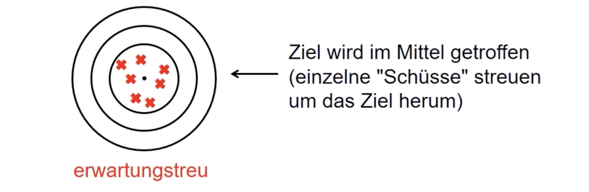
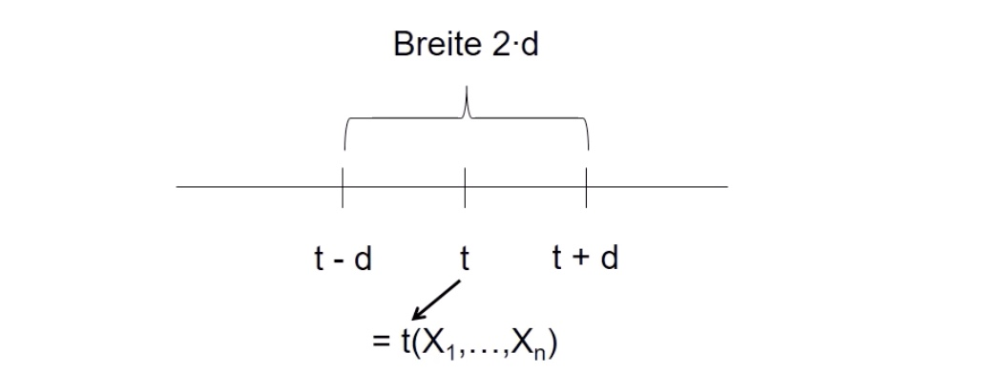
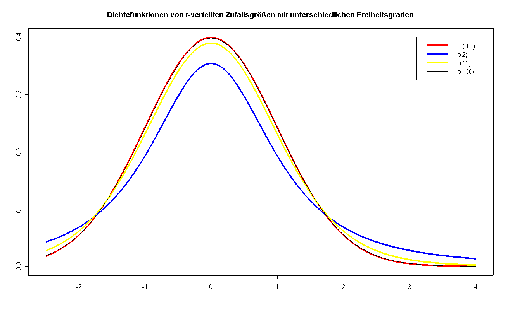
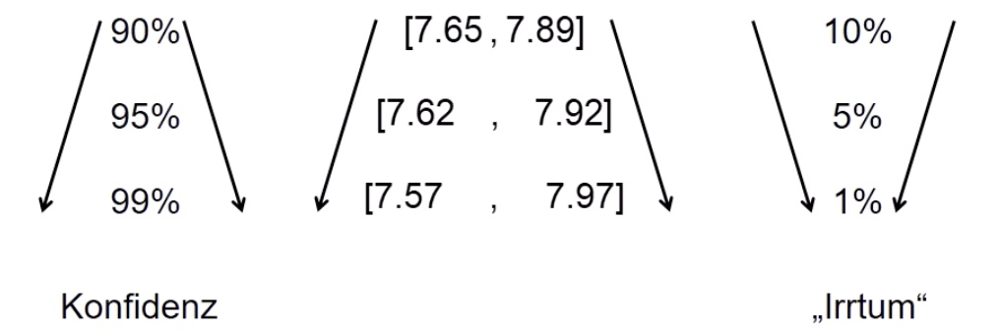

# 02.06.2022 Schätzer

## Punktschätzer

direkte Angabe eines Punkts für Parameter von Interesse

- Merkmal X
- Verteilung von X charakterisiert durch Parameter
- $X_1,...,X_n$ unabhänhig und identisch wie X verteilt

Punktschätzer: 

- Funktion $t(X_1,...,X_n)$ 
- Anwendung der Funktion auf Beobachtungswerte $t(x_1,...,x_n)$

### Gütekriterien

Erwartungstreue:

außerdem *geringe Varianz* um den Mittelpunkt

Formal:

- $t(X_1,...,X_n)$ als Schätzer für Parameter $\theta$
- Erwartungstreu, wenn $E(t(X_1,\dots,X_n)) = \theta$

### Varianzschätzer

verschiedene Schätzer:
$$
1)\ \tilde{S}^2 = \frac{1}{n} \sum (X_i-X_n)  
\text{ mit } 
E(\bar{S}^2) = \frac{n-1}{n} \sigma^2 \\
2) \ S^2 = \frac{1}{n-1} \sum (X_i-X_n)  
\text{ mit } E(S^2) = \sigma^2
$$

## Intervallschätzer

Interesse ist Angabe eines Intervalls, das den Parameter enthält

- X Zufallsvariable
- Verteilung von X = $\theta$

Wahrscheinlichkeit $\alpha$ ($0 \le \alpha \le 1$) gegeben (auch *Irrtumswahrscheinlichkeit*)

### Definition

Konfidenzintervall: $[K_u,K_o]$ Mit

- Untergrenze $K_u = K_u(X_1,...,X_n)$
- Obergrenze $K_o = K_o(X_1,...,X_n)$

Sodass $P ( \theta \in [K_,K_o]) = \underbrace{1-\alpha}_{\text{Konfidenzniveau}}$

### Eigenschaften

Oft: symmetrische Konfidenzintervalle, insb. bei symm. Schätzern

### Konfidenzintervall bei Normalverteilung

symmetrisches Konfidenzintervall für $\mu$; 

=> Suche: Konfidenzintervall der Art: $[\bar{X}-d, \bar{X}+d]$

---

$\sigma^2$ bekannt:
$$
\Big[\bar{X}- \frac{\sigma}{\sqrt{n}}\cdot z_{1-\alpha/2}
\ , \
\bar{X} +  \frac{\sigma}{\sqrt{n}}\cdot z_{1-\alpha/2}\ \Big]
$$
für $(1-\alpha)$ Konfidenzintervall

---

$\sigma^2$ Unbekannt:

- als Schätzer für Sigma *S* = Varianz der Beobachtungen
- $(1-\alpha/2)$ Quantil der **t-Verteilung** statt *z*

$$
\Big[\bar{X}- \frac{S}{\sqrt{n}}\cdot t_{(n-1;1-\alpha/2)} 
\ , \ 
\bar{X}+ \frac{S}{\sqrt{n}}\cdot t_{(n-1;1-\alpha/2)}\Big]
$$

für $(1-\alpha)$ Konfidenzintervall

Exkurs: **t-Verteilung:**

- DIche symmetrisch um 0
- Glockenform ähnlich zu Normalverteilung
- stellt SNV ab n=30 dar ($t_N \to N(0,1)$)

### Beispiel Lohnverteilung

- unterstellt Normalverteilung für Lohn X
- $\sigma^2$ unbekannt  

aus Stichprobe:

- n = 39
- $\bar{x} = 7.77$
- s = 0.46

wähle $\alpha = 0.1,0.05,0.01$

Ergebnis: 