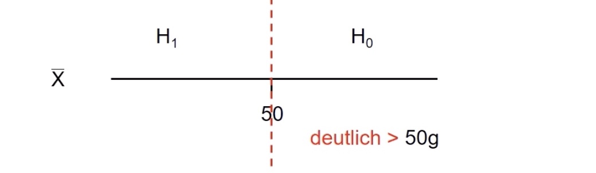

# 20.06.2022 Tests 2

## Ablauf eines Tests

- Testproblem mit 2 Thesen $H_0$ und $H_1$
- Signifikanzniveau $\alpha$, meist *0.01, 0.05, 0.1*
- **Zufalls**stichprobe 
- Berechnung Teststatistik
- Entscheidungsregel anwenden

---

**Beispiel**: sind Brötchen vom Bäcker zu leicht (weniger als 50g)?

- Brötchengewicht X
- Annahme $X \sim N(\mu, \sigma^2)$, hier $\sigma^2 = 1.44$
- Behauptung Bäcker: $\mu = 50$
- $H_0: \mu \ge 50$ (zufrieden) vs. $H_1: \mu < 50$ (unzufrieden)

statistische Modellierung:

- Kunde zieht Stichprobe vom Umfang n: $X_1, ...,X_n$
- $\bar{X}$ = Durchschnittsgewicht = Prüfgröße

 

## Hypothesentests

mit $\mu$ der zu überprüfende Wert und $\mu_0$ der ausgesagte Wert

| Test         | Hypothese $H_1$ | Gegenhypothese $H_1$ | $H_0$ Ablehnen, falls                                        |
| ------------ | --------------- | -------------------- | ------------------------------------------------------------ |
| linksseitig  | $\mu \ge \mu_0$ | $\mu < \mu_0$        | $\sqrt{n}\cdot\bigg| \frac{\bar{X}- \mu_0}{\sigma}\bigg| > z_{1-\frac{\alpha}{2}}$ |
| rechtsseitig | $\mu \le \mu_0$ | $\mu > \mu_0$        | $\sqrt{n}\cdot\frac{\bar{X}- \mu_0}{\sigma}< -z_{1-\alpha}$  |
| Zweiseitig   | $\mu = \mu_0$   | $\mu \ne \mu_0$      | $\sqrt{n}\cdot\frac{\bar{X}- \mu_0}{\sigma}> z_{1-\alpha}$   |

Beispiel linksseitige Hypothese: = Brötchenbeispiel

- Bäcker sagt, dass seine Brötchen größer sind als 50g: $H_0: \mu \ge 50$ 
- Verbraucher stellt Gegenthese, dass sie kleiner sind: $H_1: \mu < 50$

Beispiel: Schafft Partei A es in Landtag?

- Hypothese: sie schafft die 5%-Hürde: $p \ge 0.05$
- Gegenhypothese: $H_1: p < 0.05$

Wahlbefragung Stichprobe: 

- n=100
- 4 Wähler von A

Jetzt: **Bernoulli-Test**, nicht mehr normalverteilt!
$$
X_i = 
\begin{cases}
1, &\text{wählt A}\\
\quad i-\text{ter Wähler}\\
0 &\text{wählt nicht A}
\end{cases}
$$
Erfolgswahrscheinlichkeit *p* entspricht Stimmenanteil

und da Bernoulli eine Binomialverteilung:
$$
X_i \sim Bin(1,p)
$$
und Binomialverteilung erlaubt uns, anzunehmen, dass 4% der Menschen Partei A wählen

### Test auf Unabhängigkeit zweier Merkmale

Testproblem: 

- $H_0$: X, Y unabhängig vs. $H_1$: X, Y abhängig
- X, Y kategorisiert mit *k* bzw *m* Kategorien

$H_0$ zum Niveau $\alpha$ verwerfen, falls
$$
\chi^2 = \sum_{i=1}^k \sum_{i=1}^m 
\frac{(h_{ij}-e_{ij})^2}{e_{ij}} >
\chi_{(k-1)(m-1);1-\alpha}
$$

### $\chi^2$-Verteilung (Chi-Quadrat)

- nicht symmetrisch
- Parameter q = "Freiheitsgrade"
- $X \sim \chi^2_q$ 
    - E(X) = q
    - Var(X) = 2q

## Ablauf des Tests

- Testproblem: $H_0$ Vs. $H_1$
- Signifikanzniveau vorab wählen: $\alpha$
- Teststatistik anhand Stichprobe berechnen
- Entscheidungsregel: $H_0$ Verwerfen, falls ...
- Entscheidung

Besonderheiten:

- interessierende Aufgabe als Gegenhypothese $H_1$ formulieren
    - dann aktive Entscheidung für unsere Hypothese
    - $H_1$ muss sich gegen $H_0$ durchsetzen

## Beispiel

Studie zu Kindeswohl in 29 Industrienationen

- Deutschland: 84.1 % der Kinder sagen, es geht ihnen gut
    - ist das gut für eine Industrienation?

Durchschnitt der Länder = 85.74 , Standardabweichung = 3.43

### Konfidenzintervalle für deutschen Wert

- Annahme der Normalverteilung $X_i \sim N(\mu,\sigma^2)$

Formelsammlung 16.2 und sigma unbekannt (S.25): Konfidenzintervalle
$$
\Big[\bar{X}- \frac{S}{\sqrt{n}}\cdot t_{(n-1;1-\alpha/2)} 
\ , \ 
\bar{X}+ \frac{S}{\sqrt{n}}\cdot t_{(n-1;1-\alpha/2)}\Big]
$$

- $\bar{X}$ = Durchschnitt = 85.74
- S = 3.43
- n = 29
- $\alpha$ = 0.05, da weder besonders streng, noch besonders nachlässig

$$
\Big[85.74- \frac{3.43}{\sqrt{29}}\cdot t_{(28;0.975)} 
\ , \ 
85.74 + \frac{3.43}{\sqrt{29}}\cdot t_{(28;0.975)}\Big] \\
= [84.44,87.04] \notin 84.1
$$

zu erwartender Wert für Industrienationen liegt mit *95%-iger Sicherheit über* dem Wert, den Deutschland erreicht

### Hypothesentest

Testproblem:

- $H_0: \mu = 84.1$ : Deutschland ist im erwarteten Wert der Industrienationen
- $H_1: \mu \ne 84.1$
- Entscheidungsregel: $H_0$ verwerfen falls
    - $\sqrt{n}\cdot\frac{|\bar{X}- \mu_0|}{\sigma}> t_{n-1;1-\alpha}$

Test (mit Konfidenz 5%)
$$
\sqrt{29}\cdot\frac{|85.74- 84.1|}{3.43} = 2.57 > 2.0484 = t_{28;0.975}
$$

- $H_0$ muss verworfen, Deutschland entspricht nicht dem erwarteten Wert der Industrienationen

