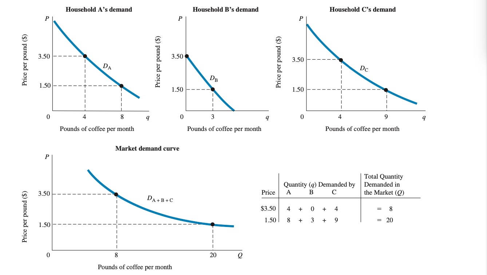

# 02.11.2021 Angebot und Nachfrage

### Markt

#### grundlegende Organisationen des Marktes

> **Unternehmen:** Organisation, die Ressourcen in Produkte umwandelt ; wichtigste Produktionseinheit im Markt

Unterschied zu Unternehmer: Unternehmensorganisator, der Risiken übernimmt

> **Haushalte:** Konsumenten von Produkten der Marktwirtschaft, und Arbeitnehmer + Kapitalgeber für Unternehmen

#### Arten von Märkten:

Input-Märkte (*Faktormärkte*) <--> Output-Markt (*Produktmarkt*)

> **Faktormarkt**: Märkte, auf denen Ressourcen gehandelt werden, z.B. :

- Arbeitsmarkt: Arbeit gegen Lohn
- Kapitalmarkt: Ersparnisse gegen Zinsen
- Bodenmarkt: Boden gegen Pacht / Miete

> **Produktmarkt**: Märkte, auf denen Waren und Dienstleistungen getauscht werden

### Nachfrage

> **Gesetz der Nachfrage**: Nachfrage fällt nach unten ab

Darstellung: Nachfrageplan (Tabelle) vs Nachfragekurve (Graphen)

**Nachfragekurve:** Darstellung der Nachfragemenge:

- Blau 
- negative Steigung
- schneidet Mengenachse X (wegen Grenznutzen)
- schneidet Preisachse Y (begrenztes Einkommen)

#### Einflüsse auf Nachfrage auf Produktmärkten

- Preis des Produktes
    - Logisch: Preis steigt, Nachfrage sinkt
- verfügbares Haushalts-Einkommen (Stromgröße) / Vermögen (Bestandsgröße)
    - normale Güter: E steigt, N. steigt
    - inferiore Güter: E steigt, N. sinkt
- Preis der Alternativen (Substitute)
    - Preis Original steigt, Nachfrage nach Original sinkt
- Erwartung der Vermögensentwicklung

#### Bewegungen der Nachfrage:

- *Verschiebung Nachfragekurve*: Änderung der ursprünglichen Bedingungen, neue Beziehung zwischen Preis und Nachfrage, **Änderung Nachfrage**
- *entlang der Kurve*: **Änderung nachgefragter Menge** durch Änderung Preis

Marktnachfrage = aggregierte individuelle Nachfragekurven

### Angebot

> **Gesetz des Angebotes:** positive Beziehung  zwischen Preis und Menge; Anstieg Preis -> Anstieg Angebotsmenge

Darstellung wieder: Angebotsplan und Angebotskurve (rot)

#### Einflüsse auf Angebot:

- Preis der Ware / Dienstleistung
- Preis verwandter Produkte
- Herstellungskosten
    - Preis der Inputs (Arbeit, Kapital, Land)
    - Technologien

#### Arten der Bewegung

- Bewegung der Angebotskurve
- entlang der Kurve

Wieder: Aggregiertes Angebot aus einzelnen Angeboten

### Marktgleichgewicht

> **Marktgleichgewicht**: Zustand, in dem Angebot = Nachfrage

> **Überschussnachfrage / -angebot:** Zustand, in dem nachgefragte Menge / angebotene Menge die Angebotsmenge / Nachfragemenge zum aktuellen Preis übersteigt

Veränderung des Gleichgewichtes: -> neuer Gleichgewichtspreis

Beispiel: Kälteschock bei der Kaffeeproduktion   

