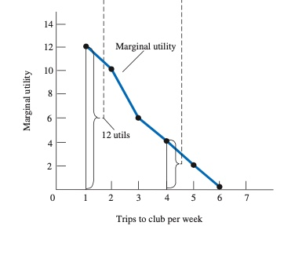

# 17.11.2021 Haushalte

### Haushaltsverhalten

jeden Tag treffen Konsumenten / Haushalte Entscheidungen auf Grundlage ihrer *Budgetbeschränkungen*

Einflussfaktoren der Entscheidung:

1. Preis
2. Haushaltseinkommen / Vermögen
3. Präferenzen
4. Preis der Substitute
5. Erwartungen zukünftiger Entwicklungen

> **Budgetbeschränkung:** Grenzen, die den Entscheidungen eines Haushalts gesetzt sind

Innerhalb der Budgetbeschränkung kann frei zwischen Gütern gewählt werden = (*Opportunitätsmenge*)

bei beschränktem Budget: Preis beinhaltet immer auch Opportunitätskosten

> **Opportunitätsmenge**: Menge der Güterkombinationen, die mit Budget möglich sind

**Budgetbeschränkung**: abhängig von Realeinkommen und Preisen

- Notation: $P_X X+ P_Y Y = I $
- wobei
    - $P_X$ = Preis des Gutes X
    - *X* = konsumierte Menge von X
    - $I$ = Einkommen (Income)
    - ...

Auswirkung einer Preissenkung

 

### Nutzen

jedes Produkt erzeugt eine Zufriedenheit beim Konsumenten = Nutzen

Es gilt das Gesetz des abnehmenden *Grenznutzen*

> **Grenznutzen:** zusätzliche Zufriedenheit durch den Konsum einer weiteren Grenzeinheit einer Ware

Grenznutzen: meist **abnehmend**, da jedes weitere Stück nicht genauso viel bringt wie vorheriges

> **Gesamtnutzen:** Gesamtzufiredenheit eines Produktes

| Gesamtnutzen                                    | Grenznutzen                                     |
| ----------------------------------------------- | ----------------------------------------------- |
|  |  |
| Gesamtnutzen steigt immer weiter                | der Grenznutzen nimmt aber ab!                  |

in Kombination mit anderen Gütern hilfreich, um *Nutzenmaximierende Kombination* zu ermitteln

> **Nutzenmaximierung:** Verbraucher streut Ausgaben bis beste Kombination gefunden

Notation: $\frac{MU_X}{P_X} = \frac{MU_Y}{P_Y}$ , wobei *MU* = Marginal Utility = Grenznutzen

### Einkommens- und Substitutionseffekt

Ein Preisrückgang von X führt *ceteribus paribus* zu gesteigertem Nutzen, da mehr Einkommen übrig => Resultat ist *Einkommenseffekt*

> **Einkommenseffekt:** Veränderung des Konsums von X aufgrund von Preisrückgang

Weiterer Effekt: Produkt wird relativ billiger => *Substitutionseffekt*

> **Substitutionseffekt:** Verlagerung des Kaufverhaltens von Produkt Y zu X aufgrund Preisrückgang von X (sinkende Opportunitätskosten)

bei Preissteigerung => gegengesetzter Effekt

### Haushalte in Arbeitsmärkten

Entscheidung über das Arbeitsangebot:

- Verfügbarkeit von Arbeitsplätzen
- Marktlohnsätze
- Fähigkeiten

resultiert in Zielkonflikt: Arbeit <--> Freizeit
- Preis der Freizeit = Lohnsatz

#### Effekte einer Lohnerhöhung

Auswirkungen von Substitutions/ Einkommenseffekten auf Arbeitsangebotskurve

- *Einkommenseffekt*: Mehr Geld -> es wird mehr Freizeit genommen -> weniger Arbeit
- *Substitutionseffekt*: freizeit wird teurer -> mehr Arbeit

Endergebnis abhängig von relativer Verteilung beider Effekte (Darstellung)

