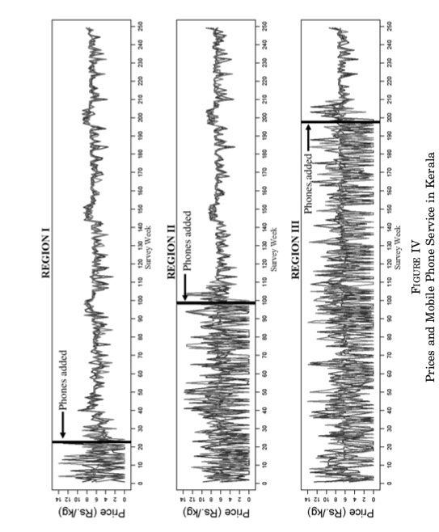

# Notizen zum Lesematerial

[Link zur Online-Version](https://skriptum.github.io/vwl1/#/VL_VWL/2021-11-29-Lesenotizen)

[Link zum Text](https://web.stanford.edu/class/comm1a/readings/jensen-digital-divide.pdf)

### Fragen

1. Kernaussage des Textes
2. Methodik und genutzte Daten
3. Hauptergebnisse
4. Wohlfahrtseffekte der Mobilfunkeinführung
5. "Sollten Informationstechniken in Entwicklungsländern stärker gefördert werden"

### 1. Kernaussage

Einführung von Mobilfunkdiensten in Entwicklungsländern kann zu besserer Marktfunktion und Wohlfahrtseffekten führen

> **Abstract:** When information is limited or costly, agents are unable to engage in optimal arbitrage. Excess price dispersion across markets can arise, and goods may not be allocated efficiently. In this setting, information technologies may improve market performance and increase welfare. Between 1997 and 2001, mobile phone service was introduced throughout Kerala, a state in India with a large fishing industry. Using microlevel survey data, we show that the adoption of mobile phones by fishermen and wholesalers was associated with a dramatic reduction in price dispersion, the complete elimination of waste, and near-perfect adherence to the Law of One Price. Both consumer and producer welfare increased.

### 2. Methodik

natürliches Experiment = Experiment durchgeführt durch Umstände außerhalb Einfluss des Studienautors

#### Methodik

arschkompliziertes Modell mit nem Haufen Variablen und Annahmen

Hauptannahmen: 

- *Law of One Price*: Preisunterschiede an Märkten sollten nur durch die Transportkosten zwischen ihnen erklärbar sein
- *fundamentales Theorem von Wohlfahrtsökonomie*: Ein perfekter Markt mit perfekter Information macht am meisten glücklich (ist Pareto-effizient)

#### Daten

3 Distrikte von Kerala (indischer Bundesstaat) von 1997 bis 2001

- wöchentliche Marktsurvey an fünfzehn Märkten an der Küste
    - Märkte nicht weiter als fünfzehn Kilometer vom nächsten entfernt
- an jedem Markt 10 zufällige Fischern gefragt nach
    - Preis, verkaufte Menge
    - Wetterkonditionen
    - ob sie ein Handy haben
- und Überschusskäufer (Käufer mit nicht genug Fisch)
- und Überschussverkäufer (Verkäufer mit zuviel Fisch, der weggeworfen wird) gezählt

Außerdem: jährliche Haushaltsbefragungen an den 15 Märkten zur Kontrolle

Einführung Mobilfunk in Kerala:

- Graduell, an unterschiedlichen Zeitpunkten in jedem Distrikt
- immer in Küstennähe => Fischer konnten auf See Mobilfunk nutzen
- kurz nach Einführung massive Zunahme an % von Fischern mit Handy (nach 3 Monaten 60%)

### Hauptergebnisse

vor Einführung:

- Fischer verkaufen nur im Heimatmarkt
- es gibt oft Exzess-Verkäufer und Käufer in Märkten direkt nebeneinander
- es wird viel weggeworfen (5-8%)
- Preise unterscheiden sich um bis zu 10 Rupien / kg (viel!)

nach Handyeinführung:

- % der Fischer, die nicht in ihrem Heimatmarkt verkaufen steigt massiv (60% Anteil)
- Abfall wird auf quasi 0 reduziert
- Exzess-Käufer und Verkäufer gibts fast nicht mehr
- Preise unterscheiden sich in nahegelegen Regionen nur marginal
- Preise sind durchschnittlich wie davor, aber konstanter

=> Hauptannahmen werden bestätigt

### Wohlfahrtseffekte

Produzentenwohlfahrt:

- Erhöhte Verkaufsmenge durch weniger Wegwurf = mehr Profit (~5%)
- Kosten der Handys werden mehrfach ausgeglichen

Konsumentenwohlfahrt

- Preisreduzierung um ~4%
- weniger nutzloses Rumstehen ohne Kauf (Exzess-Verkäufer)

### Sollte man das mehr machen? 

Ja, weil:

- Wohlfahrtseffekte (siehe oben)
- diese Effekte helfen auch anderen Sektoren wie Gesundheit 
- ist Privatinvestement, verbrauchen also keine Steuergelder für andere Bereiche
- ist selbsterhaltend
- auch ärmere Schichten nutzen Technologie

# Notizen zum zweiten Text Coase-Cap

> **Coase-Theorem:** besagt, dass in einem Markt mit *klaren Eigentumsrechten* und *niedrigen Transaktionsksoten* Externalitäten effizient eingepreist werden

wenn diese Voraussetzung nicht gegeben: Staat kann Markt mit klaren Rechten und niedrigen Kosten erschaffen => **EU ETS** System in Kombination mit einem **Cap**-Mechanismus

Paper untersucht: Unabhängigkeit zwischen Zuteilung und Emissionen im EU-ETS

Unabhängigkeit: *ob, egal an wen die Allowances vergeben werden, es zu einem effizienten Ergebnis kommt*

Weitere Infos zum ["Independece Property"](https://economistsview.typepad.com/economistsview/2012/07/an-important-property-of-cap-and-trade.html)

Untersucht Verhalten bei Firmen, die 

- entweder 2013 ihre kostenlosen Rechte verloren haben (*Treatment Group*)
- oder weiter kostenlos zugeteilt bekommen (10c Rule für ärmere Länder) (*Kontrollgruppe*)

Ergebnisse: insgesamt ist Unabhängigkeit gegeben

- große Emissäre = unabhängigkeit
    - weniger Zuteilungen => gleiche Emissionen wie Vergleichsgruppe
- für kleine Emissäre keine Unabhängigkeit
    - Weniger kostenlose Zuteilungen => weniger Emissionen (als vllt. effizient wäre)
    - wegen zu hohe Transaktionskosten 
    - machen aber wenig Emissionen aus
