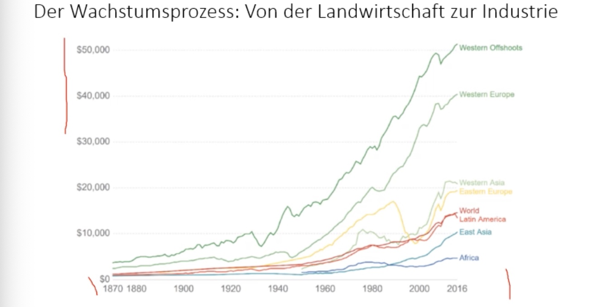
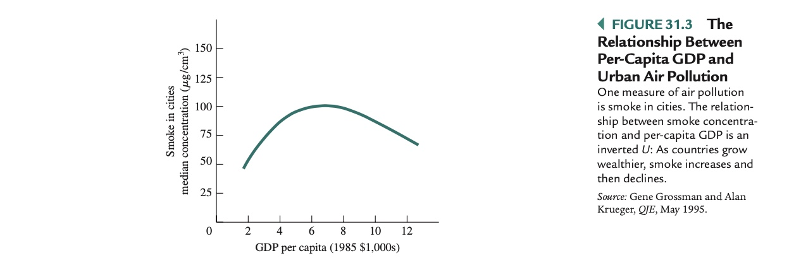
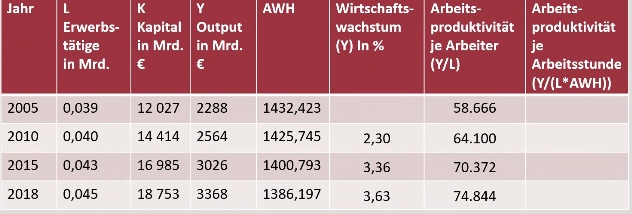

# 21.01.2022 langfristiges Wachstum

> **Produktionswachstum:** Wachstumsrate der Produktion der gesamten Wirtschaft

auch gemessen als:

- Pro-Kopf-Wachstum
- Wachstum der Arbeitsproduktivität (Output pro Arbeiter)

### Geschichte des Wachstums

- Beginn um 1750 in England durch neue *Maschinen* = (technischer Wandel)
- gesell. Wandel in städtische Industriegesellschaft
- durch mehr Arbeitskräfte + Steigerung der Produktivität

**merke:** *The Great Divide* = Auseinanderentwickeln der Staaten

verschiedene Ansätze zur Erklärung: 

#### Aufholprozess

- entwickelnde Länder zu höheren aufholen
- "Ausleihen" der Technologien der entwickelten Länder

funktioniert nicht so ganz, nur unter bestimmten **Voraussetzungen** : 

- Kapital, Institutionen, Technologien 

### Quellen des Wachstums

abhängig von **aggregierter  Produktionsfunktion** 

> **aggregierter Produktionsfunktion:** mathematische Funktion, die Produktion abhängig macht von eingesetzer Arbeit und Kapital

Beispiel:  $Y = 3*K^{1/3} L^{2/3}$

- Produktivität = $Y/L$
- Output pro Kapitaleinheit = $Y / K$
- Kapitalrendite = $\triangle Y / \triangle K$
- Kapitalintensität: Kapital pro Beschäftigtem

#### Zunahme der Arbeit

- steigende Erwerbsrate
- Wachsende Bevölkerung

Bei gleichbleibendem Kapital = sinkende Produktivität

#### Zunahme des Sachkapitals

- steigende Ersparnisse
- Ausländische Direktinvestitionen ADI

bei gleichbleibender Arbeit = sinkende Zinsen

#### Zunahme der Qualität der Arbeitskräfte 

- historischer Anstieg des Bildungsniveaus

=> erhöhte Produktivität

#### Zunahme der Qualität des Kapitals

- neue Technologien / Innovationen

=> steigert Produktivität

### Produktivitätsparadox

seit Jahren Grenzproduktivität steigt langsamer 

- Trotz *Computer Age* keine starken Produktivitätssteigerungen 

### Umwelt und Wachstum

Gibt es einen Zusammenhang zwischen beiden?

 

siehe dazu auch *Club of Rome: Grenzen des Wachstums* 

## Rechnungen

#### Formeln

- Wachstumsrate je Zeiteinheit : $p_t = \frac{x_t} {x_{t-1} } - 1$
- durchschnittliche Wachstumsrate pro Periode: $\bar{p} = (\frac{x_n}{x_0})^\frac{1}{n} - 1$ 
    - $x_0$ Anfangswert
    - $x_n$ Endwert
    - $n$  = Anzahl Perioden

#### *I*. Beispielrechnungen hiermit

- $p_t$ *1980:2000* =  (3806 / 1943) -1 **=>** **0.959** = 95% Steigerung
- $\bar{p}$ *1980:2000* = (1943/950)^(1/20) -1 **=>** **0.036** = 3,6 % pro Jahr Steigerung

#### *II.* Anwendung auf andere Einheiten 

- Wirtschaftswachstum 2005:2010 = *(2564/2288)^(1/5) -1*  **=> 0.023**
- Arbeitsproduktivität: $\frac{Output}{Erwerbstätige * AWH}$
    - AWH = Average working Hours per Year = Jahresarbeitszeit
    - *2005*: *2288/(0.039\*1432,423)* **=> 0.041** = 4,1%
- durchschnittliches Wachstum der Arbeitsproduktivität pro Arbeiter pro Jahr  $\bar{p} = (\frac{x_n}{x_0})^\frac{1}{n} - 1$
    - 2005:2010: *(64100/58666)^(1/5) -1*  **=> 0.018 ** = 1,8% 

