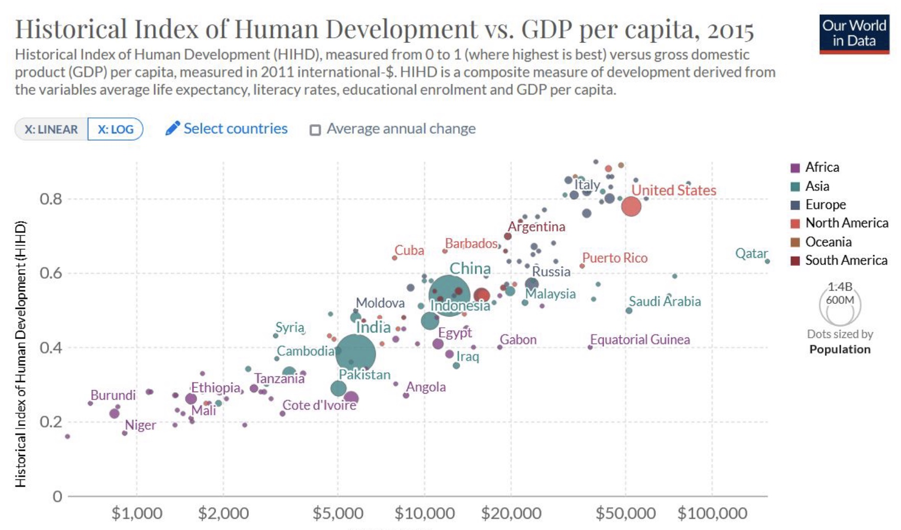
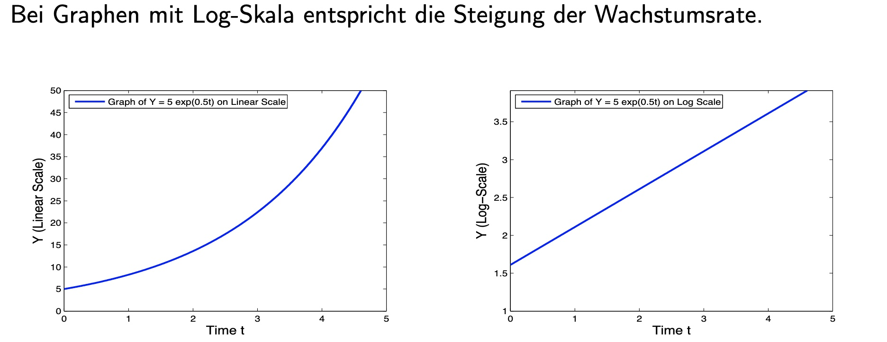

# 11.10.2022 Wachstum 1

## BIP

### BIP per Capita

| Vorteile             | Nachteile                       |
| -------------------- | ------------------------------- |
| Standardisierung     | Vernachlässigung Externalitäten |
| Vergleichbarkeit     | Verteilung nicht berücksichtigt |
| Einfach ermittelbar  | Verkürzung auf Neuproduktion    |
| einfach verständlich | kein Preis/Gut = kein Einfluss  |

Definition: Konsum + Investitionen + Staatsausgaben+ Netto Exporte

Alternativer Ansatz: **GDP-B** (Benefits)

- Nutzenmessung, die (digitale) Güter bringen
- über Befragung, wieviel Nutzer bezahlt werden müssten um nicht drauf zu greifen zu können

### Alternative: HDI

> **HDI:** Human Development Index, Indikator entwickelt von der UN, beihnaltet Lebenserwartung, Bildung, Einkommen
>
> $HDI=(I_{Life} \cdot I_{Education} \cdot I_{Income})^{1/3}$

Top 5:

1. Norwegen
2. Schweit
3. Irland
4. Hongkong

aber immer noch vergleichswise starke Korrelation mit BIP

### Fakten

1. BIP p.P in ärmsten Ländern ist 5% der reichsten
2. Wachstumsraten variieren erheblich
3. Wachstumsraten sind nicht konstant

## Wachstum

in den letzten 50 Jahren insbesondere in Asien

### Wachstumsarten

1. **Diskretes** Wachstum: Anfang der Periode $Y_0$ und Ende der Periode $Y_1$
    - $Y_1 = Y_0 \cdot (1+g)$
    - $g = \frac{Y_1}{Y_0}-1 = \frac{Y_1-Y_0}{Y_0}$
    - bei T Wachstumsperioden = Multiplikativ: $Y_T = Y_0 * (1+g_1)*(1+g_2)...$
    - Wachstumsrate: $g = \Big(\frac{Y_T}{Y_0} \Big)^{1/T} - 1$
2. **kontinuierliches** Wachstum: eher wie mit Zinseszins, immer von letztem Ausgansstandpunkt
    - zerlege Wachstumsperiode in *n* Zeitintervalle
    - je mehr *n*, desto größer Gesamtwachstum = Zinseszinseffekt durch häufige Kapitalisierung

Transformation und $n \to \infty$
$$
Y_1 = Y_0 \cdot (1+ \frac{g}{n})^n   
& \bigg| \text{ Ersetze }  \frac{g}{n}= \frac{1}{m} \\
\implies \underline{Y_1 = Y_0 \cdot e^g} \\
g = \ln(Y_1) - \ln(Y_0)
$$
Unterschiede verschwinden:

- Kleiner Beobachtungszeitraum
- kleine Wachstumsrate

$$
\text{Approximation }\to \ln(Y_1) - \ln(Y_0) \approx \frac{Y_1-Y_0}{Y_0}
$$

**Wachstumsmodelle nutzen kontinuierliches Wachstum!**

bei sehr kleinen Zeitintervallen = Ableitung:  $g= \frac{\delta \ln(Y)}{\delta t}$

### Produktionsfunktion

Cobb-Douglas-Funktion: $Y = K^a L^{1-a} \\$
$$
\begin{aligned}
ln(Y) &= ln(K^a) + ln(L^{1-a}) \\
&= a * ln(K) + (1-a) * ln(L) \\
 \implies \frac{\delta ln(Y)}{\delta t} &= a * \frac{\delta ln(K)}{\delta t} + (1-a) * \frac{\delta ln(L)}{\delta t} \\
\end{aligned}
$$
Term $\frac{\delta ln(K)}{\delta t}$ ist Wachstumsraten des  Kapitals

Logarithmen sind praktisch für Wachstumsraten

# Übung 1

### a)

- BIP:Summe der Produkte, die in einem Land in Zeitperiode hergestellt wurden
- Pro Kopf BIP
    - Vorteile: einfach berechenbar, verständlich
    - Nachteile: nicht bepreiste Güter = kein Eingang, Verteilung
- Nutzen der Digitalwirtschaft = nicht immer bereits = untererfassung
    - Konsumentennutzen über GDP-B (Benefits)

### b)

- $I_{life} = 8/13$
- $I_{Income} = 0.35148$
- $I_{Education} = 0.4222$
- $HDI = 0.4504$

### c)

|          | Jahr 1 | Jahr 2 | Jahr 3   | Jahr 4 |
| -------- | ------ | ------ | -------- | ------ |
| Ergebnis | 105    | 99,75  | 102,7425 | 107,87 |
| Zuwachs  | 5      | -5,25  | 2,9925   | 5,1275 |

Durchschnitt: 2,0925 

Wachstumsrate: $g = \Big(\frac{107,87}{100} \Big)^{1/4} - 1=0.01911$ = 1,91%

Gesamtwachstum: 7,87%

### d)

1. 111, 

### e)

$y_T = y_0 * (1+g)^T$

1. 5500
2. 7320
3. 710214,66
4. $Y_0 * e^g$ = 15020,83

### f)

1. 0,2
2. 0,046
3. 0,0035
4. 0,18