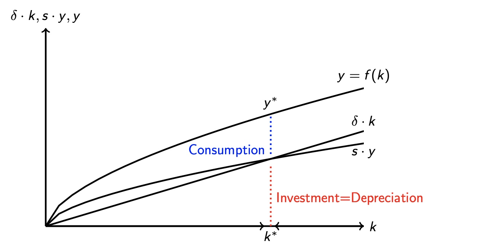
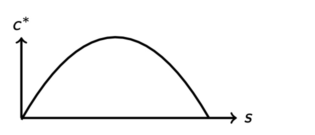
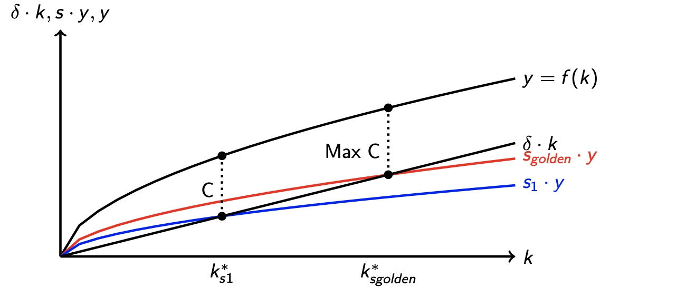
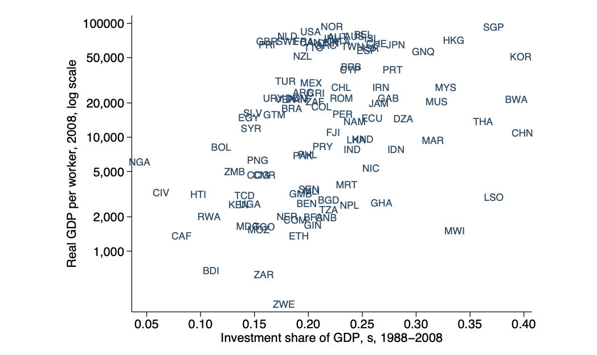

# 18.10.2022 Solow Modell

## Kaldors Fakten

"Stylized Facts", die ein Modell erfüllen muss

- p.P Einkommen = konstante Wachstumsrate
- Verhältnis Kapital-Output konstant
- Kapital / Arbeit Anteil am Output relativ konstant
- Rendite *r* ist relativ konstant

## Solow

### Produktionsfunktion

Produktionsfunktion: $Y = F(K,L)$

Annahmen: 

- Produktionsfunktion stetig, zweimal differenzierbar, konkav
- konstante Skalenerträge, abnehmende Grenzerträge
- L = Anzahl Arbeiter

### Unternehmen

- viele Unternehmen
- homogenes Output
- perfekter Wettbewerb
- Preisnehmer K,L

Gewinn:  $\Pi =K^a L^{1-a} - (rK+wL)$

- $a  \frac{Y}{K}= r = MP_K$
- $(1-a) \frac{Y}{L} = w = MP_L$

Output: $Y = wL+rK$(Gewinn ist null)

- Anteil Kapital an Output = *a*
- Anteil Arbeit an Output = *1-a*

Emprisch: $a=1/3$

### Pro-Kopf-Output

per Capita Output: $y = \frac{Y}{L}$

- $\to y = k^a =f(k)$ 

Wachstumsrate: 
$$
\frac{\delta \ln(y)}{\delta t} = a (\frac{\delta \ln(K)}{\delta t}-\frac{\delta \ln(L)}{\delta t})
$$

### Kapitalakkumulation

Annahme: L ist konstant, Ersparnisse = Investitionen

Veränderung des Kapitals = Investitionen - Abschreibung 
$$
\dot{K} = I-D =sY -\delta K
$$

- s = Sparquote
- $\delta$ = Abschreibungsquote

Wachstum Pro-Kopf-Kapital $\frac{\dot{k}}{k}=s\frac{y}{k}-\delta$

Solow Diagramm:

Kapital wächst bis zum Steady State, dort Investment = Abschreibungen

-> Wachstumsrate = 0

### Lösung des Modells

zu erklärende Variablen: Y und K

exogene Variablen: $a,s,\delta, k_0, n$ (Bevölkerungswachstum) 
$$
k^* = \Big(\frac{s}{\delta}\Big)^{\frac{1}{1-a}} \\
y^* = (k^*)^a = \Big(\frac{s}{\delta}\Big)^{\frac{a}{1-a}}
$$
je höher die Sparquote -> höheres Pro-Kopf-Einkommen

Tradeoff bei Sparquote:

- mehr s = höherer Steady State = höheres Einkommen = höherer  Konsum
- höhere Sparquote = niedrigerer Konsum

### Goldene Regel der Sparquote

das Maxmimum an Konsum ist an $s^*$ erreicht
$$
f' (k^*(s)) = \delta
$$
führt zu: Grenzprodukt des Kapitals = Abschreibungen des Kapitals

- Grenzprodukt des Kapitals = Steigung der Produktionsfunktion

Beispiel:

- $\delta = 0.05$
- $a = 0.5$
- $s = 0.2$

Rechnugn zu Steady State, Einkommen und Konsum
$$
k^* = \Big(\frac{s}{\delta}\Big)^{\frac{1}{1-a}} =
\Big(\frac{0.2}{0.05}\Big)^{\frac{1}{1-0.5}} = 16 \\
y^* = (k^*)^a = (16)^{0.2} = 4 \\
c^* = y^* - s \cdot y^* = 4-0.2 \cdot 4 = 3.2
$$
Optimale Sparquote wäre: (**nur im Cobb-Douglas!**)
$$
f' (k^*(s)) = \delta \\
\to s^* = a = 0.5
$$

## Fazit zu Solow

Empirie zwischen Sparquote und Einkommen

= genereller  Korrelation, aber wesentlich mehr Erklärungsfaktoren

- Wachstum nur durch Kapitalakkumulation 
- unzureichend für Einkommensunterschiede zwischen Ländern
