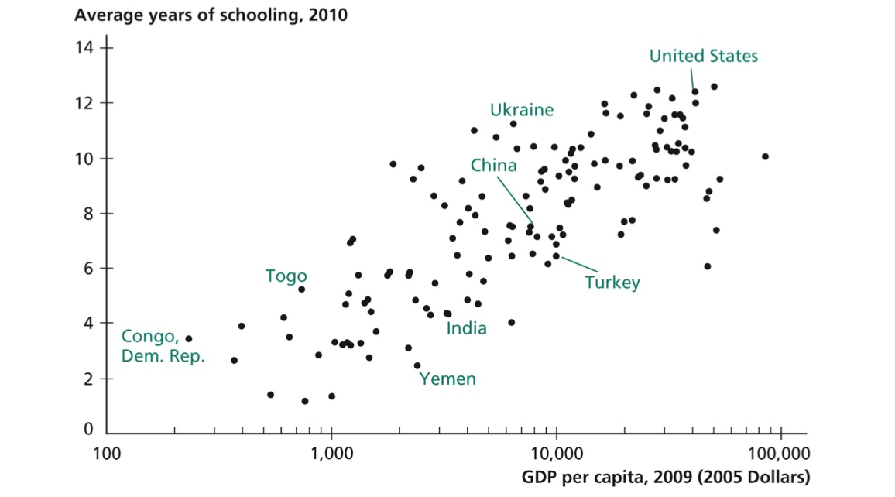
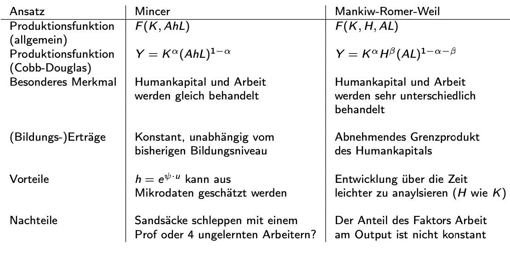

# 25.10.2022 Solow II und Humankapital

## Erweiterung des Solow Modells

### Bevölkerungswachstum

Annahme: konstantes Wachstum der Bevölkerung mit Rate *n*: $L(t) = L(0) \cdot e^{nt}$

Dann Veränderung des Pro-Kopf-Kapitalstocks:
$$
\frac{\dot{k}}{k}=s\frac{y}{k}-\delta - \bf{n} \\
\to \dot{k} = sy-(n+\delta)k
$$
=> Bevölkerungswachstum heißt weniger Pro-Kopf-Kapital = weniger Wachstum

Steady State: (jeweils im Nenner nur das n zu $\delta$ addiert)
$$
k^* = \Big(\frac{s}{n+\delta}\Big)^{\frac{1}{1-a}} \\
y^* = (k^*)^a = \Big(\frac{s}{n+\delta}\Big)^{\frac{a}{1-a}}
$$
=> Bevölkerungswachstum heißt niedrigerer Steady State

### Technologischer Fortschritt

Fortschritt = Skalierungsfaktor in Cobb-Douglas-Produktionsfunktion = **Technologieniveau**
$$
Y = F(A,K,L) = F(K,A\cdot L) = K^a (AL)^{1-a}
$$

- Fortschritt hilft Arbeit = *labor-augmenting techn. progress*
- bei Cobb-Douglas aber irrelevant: $Y = A \cdot F(K,L)$
- Wachstum von A mit konstanter Rate *g*: $A_t = A_0 \cdot e^{gt}$

Einkommen und Pro-Kopf-Einkommen:
$$
Y = K^a (AL)^{1-a} \\
\implies y = k^a A^{1-a}
$$
Insgesamt: **Wachstumsrate A = Wachstumsrate y**
$$
\frac{\dot{k}}{k} = \frac{\dot{y}}{y} = \frac{\dot{A}}{A} = g
$$
= *balanced growth path*

Steady State = Kapitalstock pro **effektivem Arbeiter**
$$
\tilde{k}^* = \frac{k}{A} = \Big(\frac{s}{n+\delta+g}\Big)^{\frac{1}{1-a}} \\
\tilde{y^*} = (\tilde{k}^*)^a = \Big(\frac{s}{n+\delta+g}\Big)^{\frac{a}{1-a}}
$$

echtes Pro Kopf = nicht effektiver arbeiter, also alles mit A multiplizieren

A bekommen wir aus Produktionsfunktion
$$
Y = K^a (AL)^{1-a} \\\to A= \Big(\frac{Y}{K^a L^{1-a}}\Big)^{\frac{1}{1-a}} \\
y^* = A \cdot (k^*)^a = A \cdot\Big(\frac{s}{n+\delta+g}\Big)^{\frac{a}{1-a}}
$$

Insgesamt: 

## Humankapital

im Solow Modell wirt zwischen den Arbeitskräften nicht unterschieden (Bildungslevel)

- beispielsweise anhand der Länge der Schulbildung

### Humankapital nach Mincer

$$
Y = K^a (AH)^{1-a} \text{ mit } H = e^{\psi \cdot u} L
$$

also gehen ungelernte Arbeiter:innen *L* für *u* Jahre zu Schule und realisieren $\psi$ Returns on Education pro Bildungsjahr

- $\psi$ wird meist mit 0.1 angenommen = 10% pro Jahr

$$
y = k^a (A \cdot h)^{1-a} \\ 
\text{ mit } h = \frac{H}{L}=e^{\psi u}
$$

Ähnlich wie vorher wird ProKopf Einkommen mit $A \cdot h$ multiplizieren
$$
y^* = Ah \cdot (k^*)^a = Ah \cdot\Big(\frac{s}{n+\delta+g}\Big)^{\frac{a}{1-a}} \\
\frac{k}{Ah} = \text{Effektive Gelernte Arbeiter:in}
$$

### Humankapital nach Mankiw/Romer/Weil

schlagen andere Einbeziehung vor:

- ungelernte Arbeiter:in *L*
- gelernte Arbeiter:in *H*

Humankapital ähnlich physischem K., 

- man kann in Bildung investieren $s_h$
- oder in physischem Kapital $s_k$

nicht durcheinander beschrieben wie bei Mincer
$$
Y = K^a H^b (AL)^{1-a-b} \\
\to y^*(t) = A(t) \Big[
\Big( \frac{s_k}{n+\delta+g}\Big)^a  
\Big( \frac{s_h}{n+\delta+g}\Big)^b 
\Big]^{\frac{a}{1-a-b}}
$$

### Vergleich beider Ansätze

beide sind gleich, wenn alle Arbeit ungelernt

- $\beta$ = 0 (Romer)
- $u= 0 \to e^{u}=0$
