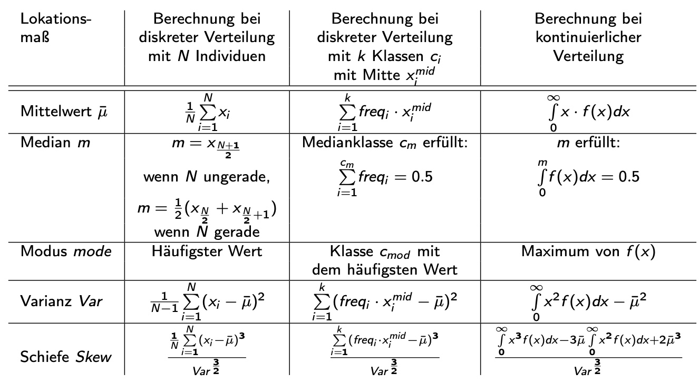
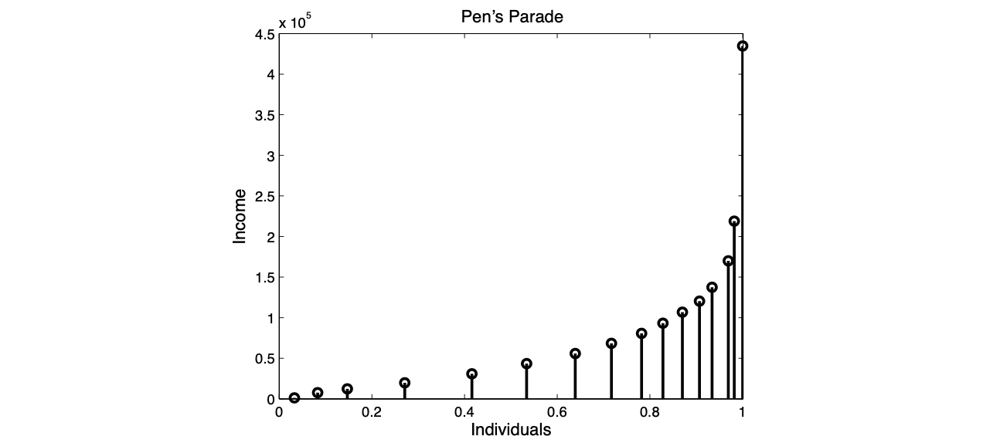
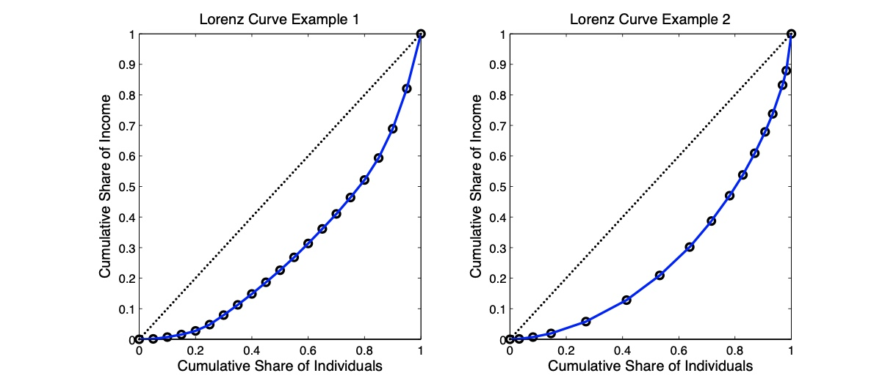
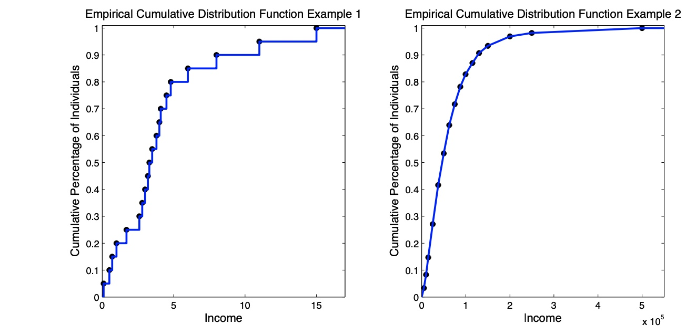
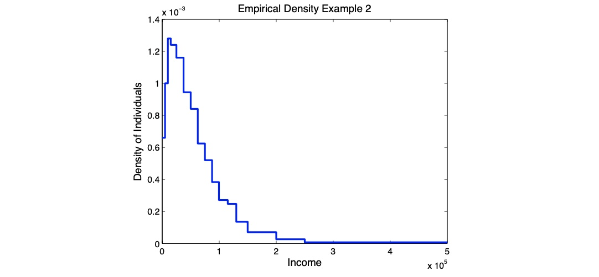

# 15.11.2022 Einkommensverteilung und Ungleichheit

## Inequality of what?

Ungleichheit der Einkommen:

- Brutto vs Netto
- Haushalts vs. individuelle Einkommen
- Einkommen im Querschnitt oder Lebenszeiteinkommen

Warum ist Konsum gleicher als Einkommen?

- Grundkonsum $C_0$ gleich
- Konsumfunktion $C = C_0+C_y \cdot Y$

## Lokationsmaße

Wichtig: Unterscheidung *N* Individuen, Klassen und kontinuierliche Verteilung

Beispiel individuelle Einkommenstabelle

| Income | Frequency | Cum Freq | % Income | % Cum Income |
| ------ | --------- | -------- | -------- | ------------ |
| *10*   | 0.25      | 0.25     | 0.1      | 0.1          |
| *20*   | 0.25      | 0.50     | 0.2      | 0.3          |
| *30*   | 0.25      | 0.75     | 0.3      | 0.6          |
| *40*   | 0.25      | 1        | 0.4      | 1            |
| **E**  | 1         |          | 1        |              |

Mittelwert = 25 € Einkommen

Median = 25€ = untypisch, oft kleiner

Verteilung = symmetrisch (normal rechtsschief)

## Graphische Darstellungen

### Pens Parade

einfache Darstellung der Anteile und Einkommen

### Lorenzkurve

Darstellung der kumulativen Anteile der Haushalte und des Einkommens

### Empirische Kumulative Verteilungsfunktion

- x-Achse : Einkommen
- y-Achse: kumulativer Anteil der Haushalte
- Interpretation: Wie viel % der Haushalte Einkommen < x

## Empirische Dichte

- x-Achse: Einkommen
- y-Achse: zugehörige Dichte f(x)
- Fläche unter Dichte = 1
- wieviel Prozent der Individuuen haben Einkommen gleich *x*?
- nicht bei Individuellen / nur Klassen!

