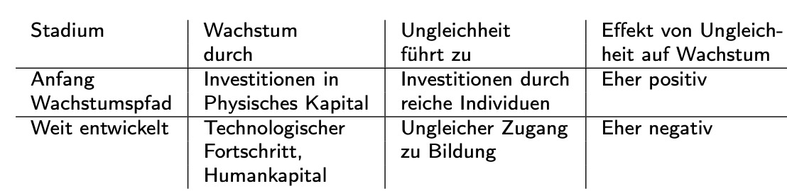
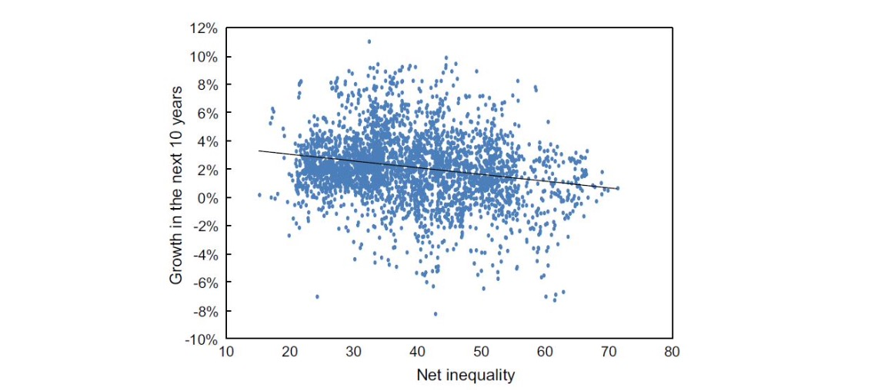
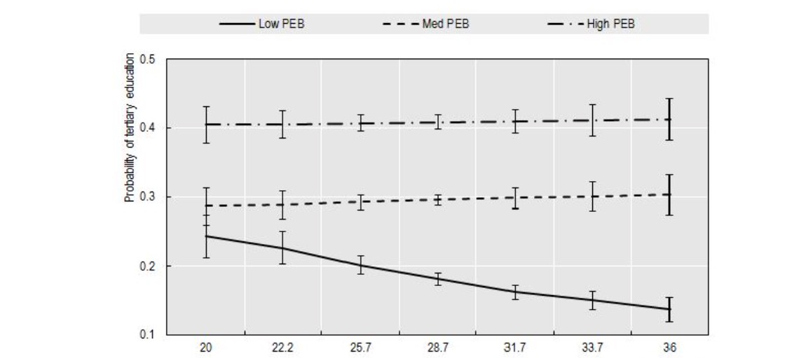
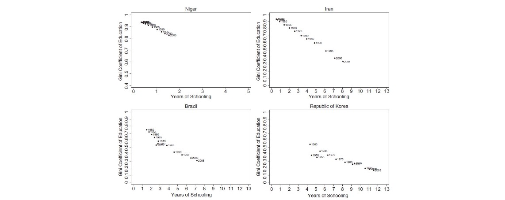

# 13.12.2022 Zusammenhang Wachstum & Ungleichheit

## Funktionskanäle

### wachstumsteigernde 

- **Anreiz und Entlohnung:** finanzieller Anreiz, Bedingung = soziale Mobilität
- **hohe Sparneigung:** à la *Trickle-Down-Economics*
- **Investment Indivisibilities:** risikoreiche Investitionen = von reichen, Bedingung = soziale Mobilität

### wachstumsenkende

- **geringe soziale Mobilität:** Klassengesellschaft
- **Korruption / Vetternwirtschaft:** politische Einflussnahme
- **soziale Instabilität**: Unruhen -> weniger investiert

- Umverteilungsdruck durch **"Median Voter"** 
    - würde von Umverteilung profitieren nach `Rodrik und Alesina (1994)`
    - schreckt Investoren ab nach `Pearson und Tabellina (1997)`
    - naja, nicht besonders überzeugend

- **Credit-Constraint** in *physisches Kapital* für arme Menschen 
    - bekommen kein Kredit = keine Effizienzsteigerung (Bsp. Landwirtschaft)

- **Credit-Constraint** in *Humankapital*

- **Financial Fragility** durch überhöhte Kreditaufnahme für *conspicous consumption* 

## Empirie

- abhängig von Stärke der Ungleichheit
- und von Punkt auf Wachstumspfad

Rahmenbedingungen

- politisches System / Institutionen
- Finanzsystem
- Bildungssystem (Durchlässigkeit)
- kulturelle Normen (Toleranz ggü. Ungleichheit)

Empirisch: keine stat. Signifikanz 

Beobachtung: OECD-Staaten = geringe Ungleichheit

### Regression

**Querschnittsregression** (zwischen Ländern)
$$
log(y_{i,t}) - log(y_{i,0}) = \alpha +\phi \log(y_{i,0}) + \gamma \cdot gini + \epsilon_i
$$
=> findet oft negativen Zusammenhang Gini und Wachstum

**Panelregression** (zwischen und innerhalb Ländern)

- erlaubt Kontrolle für *country-fixed effects*
- und *time-fixed-effects*

$$
log(y_{i,t}) - log(y_{i,0}) = \alpha_i+ \alpha_t +\phi \log(y_{i,0}) + \gamma \cdot gini + \epsilon_i
$$

- oft insignifakten Koeffizienten $\gamma$ auf g

Probleme:

- Rückkopplung Wachstum -> Ungleichheit (Endogenität)
- Nicht-Linearität der Effekte
- Asymmetrie

`Berg et al (2018)` = Instrument-Variablen-Schätzer

=> stat. signif. robusten **negativen Effekt**

- weniger Humankapitalakkumulation
- schlechtere Gesundheit
- Höhere Fertilität
- schwächere politische Institutionen

## Bildung und Ungleichheit

tertiäre Bildung abhängig von Hintergrund der Eltern 

=> niedriger = geringe Wahrscheinlichkeit zu studieren, besonders bei steigendem Gini

**Gini-Koeff. der Bildung** = Verteilung der Bildungsjahre

- je mehr durschnittliche Bildungsjahre = geringere Ungleichheit
- Fortschritt in letzten Jahren (außer UK/US)

## Inequality of Opportunity

Aufteilung der Ungleichheit nach `Marrero und Rodriguez (2013)`

- **Inequality of Returns to Effort**: unterschiedliche Leistung bei gleichen Voraussetzungen *=> positive Korrelation Wachstum*
- **Inequality of Opportunity:** gleiche Leistung bei unterschiedlichen Voraussetzungen *=> negative Korrelation Wachstum*

jetzt viel magische Regressionen etc.

