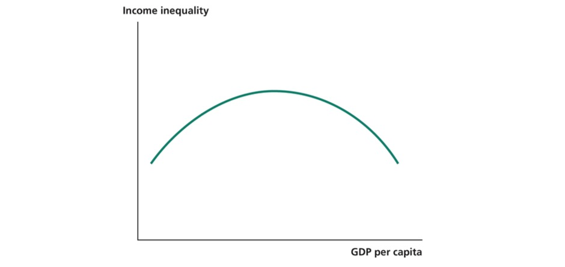
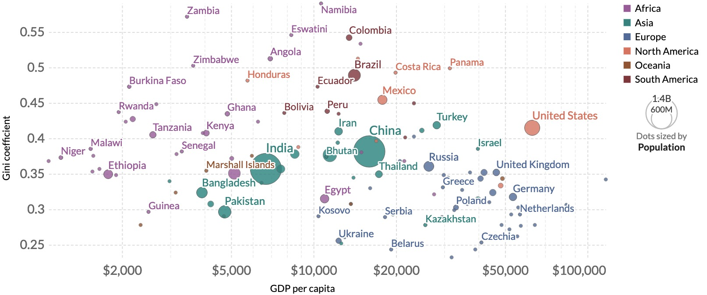
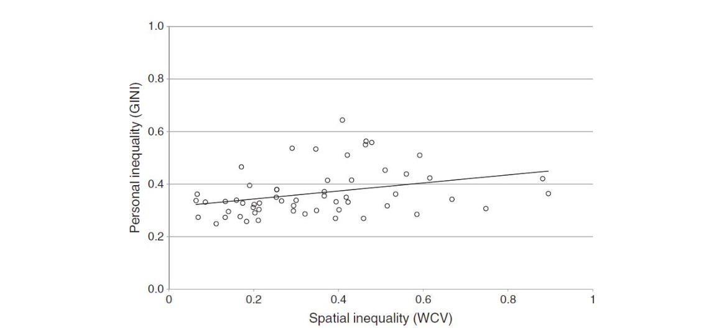
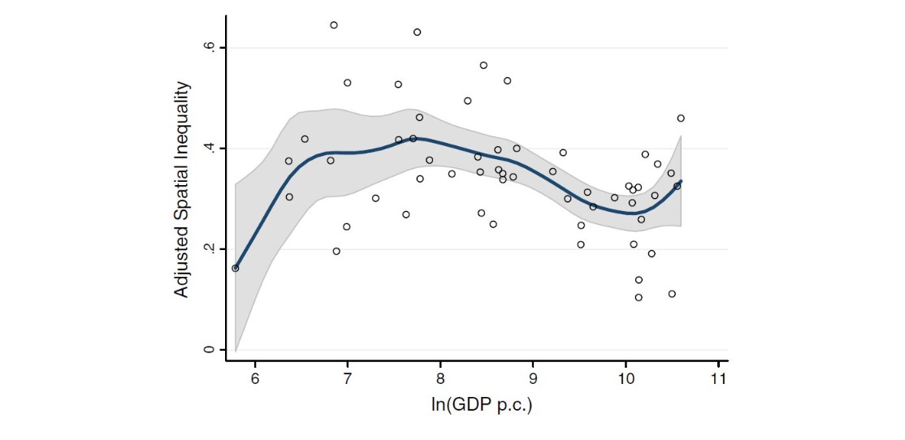
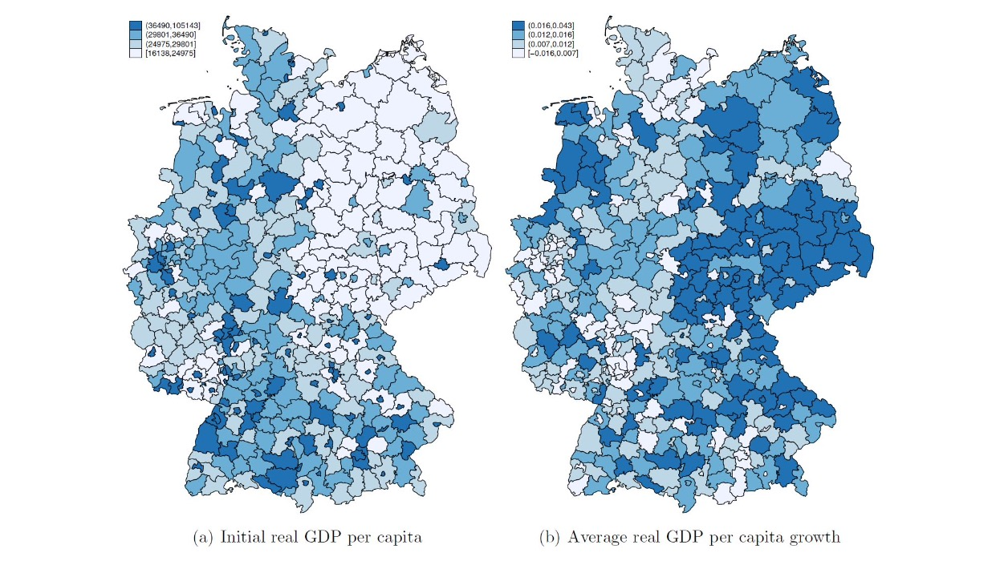
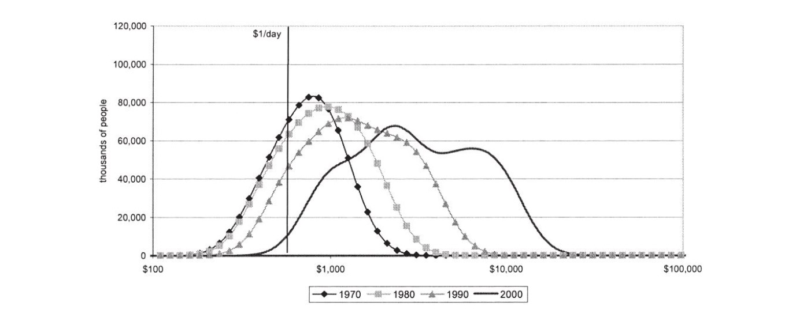
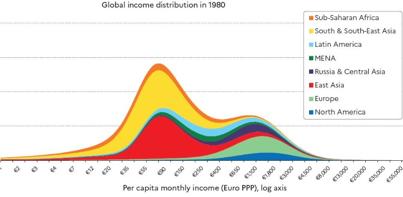
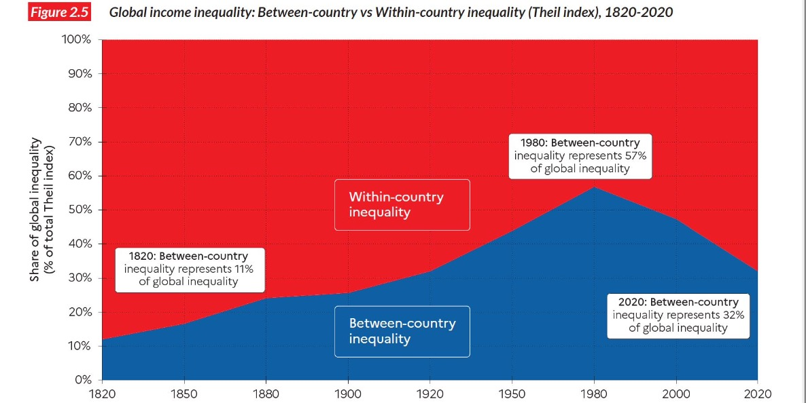
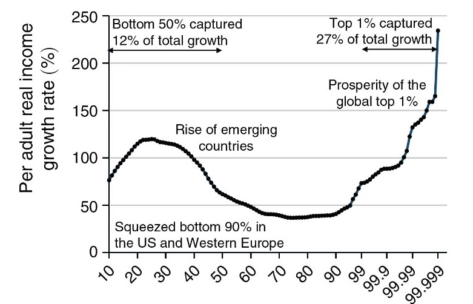

# 20.12.2022 Kuznets Kurve

## Ursprungskurve

Darstellung der Ungleichheit über historischen Zeitraum

historische Phasen:

1. Beginn der Entwicklung = agrarisch
2. Industrialisierung = Strukturwandel + Ungleichheit
3. Früchte des Wohlstands (Trickle-Down-Effekt) + Wohlfahrtsstaat

in Realität:

- nicht empirisch nachweisbar (Paneldatenstudien, Querschnittsanalysen)
- Anstieg der Ungleichheit in OECD Staaten seit 1980
- Ungleichheit ist politisch, nicht wirtschaftlich!

**=> also Theorie verworfen** und *regionale Ungleichheit* angeschaut

## Räumliche Ungleichheit

Kuznets Argumente sind meist räumlich (Agrar, Industrie) => **spatial inequality**

- da wohlstandsgenerierende Ressourcen meist regional konzentriert (Fabriken, Kohle)
- Entwicklung = Anstieg der *spatial inequality*
- ab gewissen Niveau: Umverteilung, Technologieverteilung

Wichtige Faktoren:

- Ressourcenreichtum
- Migration
- Mobilität des Kapitals
- Politik

Empirie

- Statistische Einsortierung der Regionen nach **NUTS**
- dann Bevölkerungsgewichtung

Beispiel `Lessmann (2014)` : Bevölkerungsgewichteter Variationskoeffizient auf NUTS2 (Regierungsbezirke)

=> insgesamt: Zusammenhang individuelle und regionale U.

- geringe regionale U.: Dänemark, Niederlande
- starke reg. U. : Belgien, Ukraine, (trotz geringer Gesamtu.)

Plot der Kuznets Kurve: *N-förmige* Kuznetskurve (regional)

- Neoliberalismus
- reiche Länder = Superstar Regionen
- Agglomerationseffekte

- bis 1300 USD: steigende regionale Ungleichheit
- bis 60k: fallende reg. U.
- ab 70k: wieder steigend

Faktoren

| Steigernde reg. U         | Sinkende       |
| ------------------------- | -------------- |
| ethnische Fragmentierung  | Staatsausgaben |
| höherer Handelsanteil BIP | Institutionen  |

= Frage der Kausalität!

## regionale U. in DE

aus `Krause & Kripfganz (2022)` : Kreisebene (NUTS3) 2002-2014

- Kreise mit hohem BIP = industrielle Zentren
- arme Regionen wachsen schneller (Beta-Konvergenz)
- große Relevanz für Konvergenz = Pendler
    - leben in ländlichen, armen LK
    - Arbeit in wirtschaftlichem Zentrum 

## Umverteilung und Armut

Armutsdefinition:

- **absolut:** UN = 2$ am Tag
- **relativ:** 60% des Medianeinkommens

### Armutsmaße 

nach `Foster, Greer, Thorbecke (1984)`

$$
P_a = \frac{1}{N}\cdot \sum_i^H \Big( \frac{z-y_i}{z} \Big)^a \text{ mit } a \ge 0
$$

- N = Gesamtbevölkerung
- z = Armutsgrenze
- H = Individuuen unter Armutsgrenze
- a = Gewichtung der ärmsten Einkommen

- a = 0: **Armutsquote**: 
  - $P_0 = \frac{H}{N}$
  - relative Anteil armer Menschen
  
- a = 1: **Armutslücke**: 
  - $P_1 = \frac{1}{N}\cdot \sum_i^H \frac{z-y_i}{z}$
  - Entferunung der Armen zur Armutsgrenze
- a = 2: **Schweregrad der Armut**: 
  - $P_2 = \frac{1}{N}\cdot \sum_i^H \Big( \frac{z-y_i}{z} \Big)^2$
  - ärmste Menschen = besonders Gewicht

Methoden der Armutsreduktion:

- Wachstum ("der Kuchen wächst")
- Umverteilung ("die Kuchenstücke wachsen / schrumpfen")

### Zerlegung der Armutsreduzierung

um wieviel % ändert H, wenn:

- wenn Durchschnittseinkommen um 1% steigt
    -  **Einkommenselastizizät der Armut**
    - $\epsilon_{\bar{\mu}}^H \le 0$  (Negativ)
- wenn Gini um 1% steigt
    - **Ungleichheitselastizität der Armut**
    - $\epsilon_{G}^H \ge 0$ (Positiv) 

Empirisch:

- beide Elastizitäten ähnlich: Ungleicheitsel. leicht unter Einkommensel.
- aber historisch: gab fast nur Wachstum (97%)

Entwicklung in China 

## Welteinkommensverteilung

Einkommen jedes Menschen

| 1980                                      | 2020                                                         |
| ----------------------------------------- | ------------------------------------------------------------ |
|  |  |

- sinkender Gini
- gleichmäßigere Verteilung
- dank asiatischer Länder

Also:

- U. zwischen Ländern nimmt ab
- aber: U. Innerhalb Länder nimmt zu

Stadien:

- 1820: alle Länder agrarisch, mit Reichen Landesherren + Arbeitern
- 1980: reiche Länder mit Wohlstand und geringer U.
- 2020: arme Länder holen auf, reiche werden ungleicher

### Elephant Curve 

Darstellung der Zuwächste einzelner Einkommensschichten 

zeigt:

- Aufstieg der Entwicklungsländer
- Abstieg des Proletariats im Westen
- die globale Kapitalistenklasse! (1%)

Töröööö :trumpet:  :elephant:

### Corona

=> *Between-Country-Inequality* steigt!

- höhere Ausgaben in reichen Ländern
- bessere soziale Sicherungen (Kurzarbeitergeld)
- Nahrungsmittelverlust

