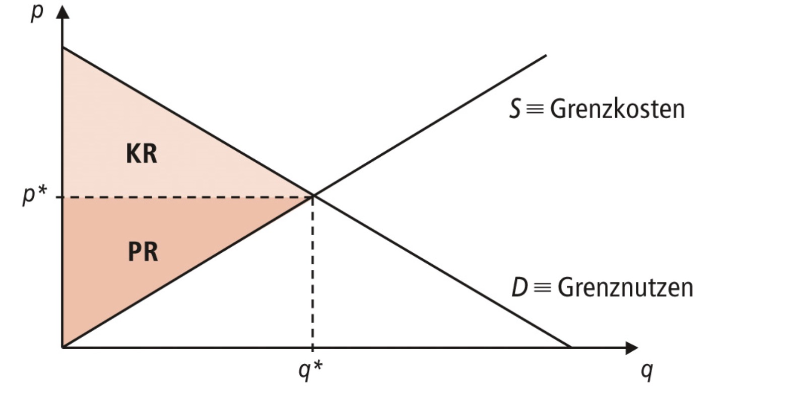

# 27.04.2023 Rationale Wirtschaftspolitik

## WiPO Beratung

> **Regel vin Tinbergen:** für zwei unabhängige Ziele = zwei unabhängige Instrumente

Probleme:

- Goodharts Law: ökonomische Beziehung wird isntabil, wenn man sie ausbeiten will
    - Kobra-Effekt
- Antizipation von Wirtschaftspolitischen Entscheidungen = Veränderung der ökonomischen Parameter

Modelle:

- Mikrofundierung
- Berücksichtung Informationen + Erwartungen
- Berücksichtigung Spieltheorie
- Berücksichtigung Institutionen Rahmenbedingungen
- Ordnungspolitik > Prozesspolitik

### Beratungsgremien der Bundesregierung

| Kontinuierlich + unabhängig | kontinuierlich zu Thema | Kontiniuerliche Beratung mit Auftrag           | Unverbindliche Beratung      |
| --------------------------- | ----------------------- | ---------------------------------------------- | ---------------------------- |
| Sachverständigenrat         | Beiräte der Ministerien | Wirtschaftsinstitute der Gemeinschaftsdiagnose | Arbeitskreise, Instiutue etc |

## Anwendungen der Ökonomik

- Marktallokation
- Marktversagen
- Regulierung / Deregulierung
- Marktmacht

Beispiel: Monopolregulierung im Telekomsektor

### Marktmodell

Determinanten der Nachfrage nach einem Gut

- Preis
- Einkommen
- Substitutionsgüter
- Präferenzen
- Erwartungen

Voraussetzungen für vollkommenen Markt

- Homogenität des Gutes
- vollständige Information
- Übereinstimmung indiviudeller / gesellschaftlicher Nutzung

Bedingungen vollkommene Konkurrenz

- vollkommener Markt
- viele Anbieter (keine Marktmacht)

### Marktallokation

Wohlfahrtsanalyse: hier maximale Wohlfahrt (da KR und PR maximal)

### Marktversagen

- instabiles GG
    - verzügerte Anpassungsreaktionen können zerstören
    - bspw. Schweinezyklen
- GG existiert nicht
- kein vollkommener Markt

