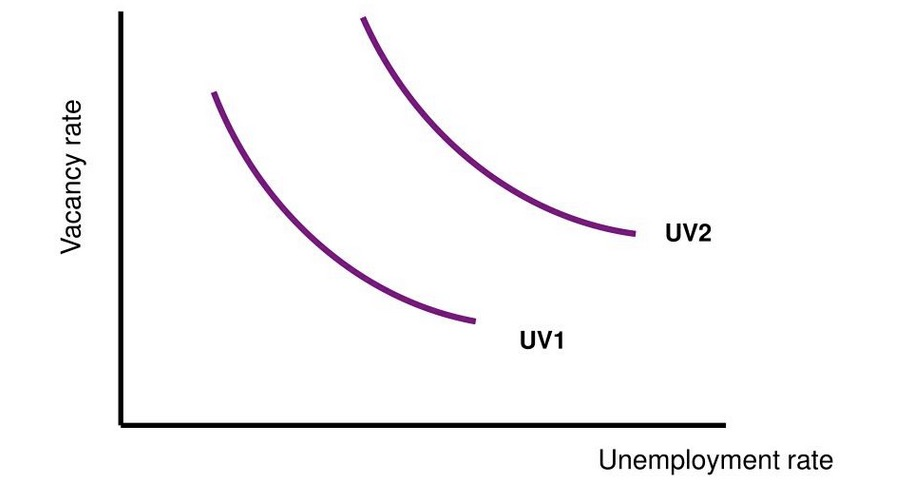
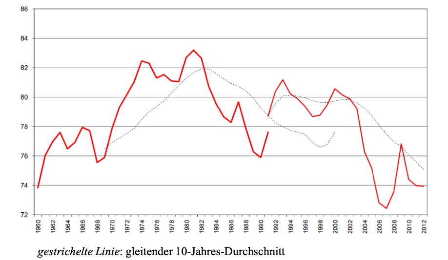
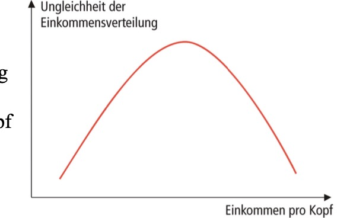

# 14.07.2023 Wohlfahrtsökonomik II

Ziele der Wirtschaftspolitik

## Vollbeschäftigung

Arten von Arbeitslosigkeit

- strukturell
- friktionell
- nachfrage-induziert

Darstellung mit **Beveridge Kurve**:

- U = Unemployed
- V = Vacancy

Verschiebung der Kurve = Änderungen der Struktur

## Preisstabilität

Geldwertstabilität:

- Innere Stab. = Preisniveaustabilität
- äußere Stab. = Wechselkursstabilität

Messung mit:

- Verbraucherpreisindex (CPI) mit *Laspeyre* Index
- Kerninflationsrate (ohne Brennstoffe / Nahrungsmittel)
- GDP-Deflator (*Paasche*)

=> Verhinderung von Inflation

## Wachstum

Gemessen anhand von Wachstum BIP

Probleme:

- Schwarzarbeit
- Umweltzerstörung
- außermartklihe Güterbereitstellung

Alternative: HDI etc.

## Umweltschutz

Berücksichtigung ökonomischer Kreislaufbeziehungen: Umwelt = 

- Lieferant Inputs
- Empfänger Outputs (CO2)
- Lieferant Lebensqualität

Messung von:

- Umweltschäden
- Immission in Umwelt
- Emission von Verursachern

## Verteilungsgerechtigkeit

aus dem Grundgesetz: "gleichwertige Lebensverhältnisse" (Art. 72 GG)

Indikatoren:

- Lohnquote (Anteil Arbeiter an Volkseinkommen)
- prozentuale Verteilung auf Dezile (Lorenz Kurve / Gini)
- anteil relativer Armut

Entwicklung Lohnquote

### Kuznets Kurve

Behauptung, dass Ungleichheit in Gesellschaft mit Wachstum erst zu- dann abnimmt

Erklärungen:

- Strukturwandel
- Bevölkerungswachstum
- erst profitieren Kapitalbesitzer, dann Arbeiter

Realität: nach 1980 Anstieg der Kuznets-Kurve

- aufgrund Steuersenkungen Reiche (*danke Neoliberismus*)
- Technologischer Wandel = weniger gut bezahlte Industriearbeitsplätze

Weiterentwicklung: Umwelt-Kuznets Kurve

