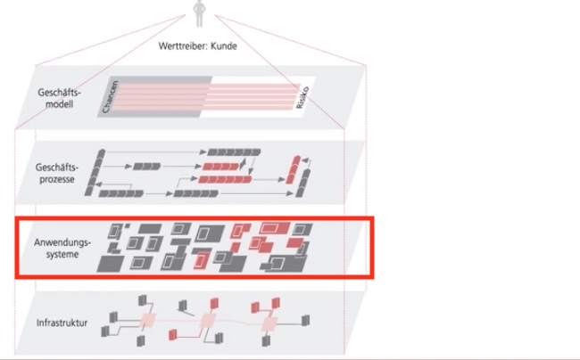
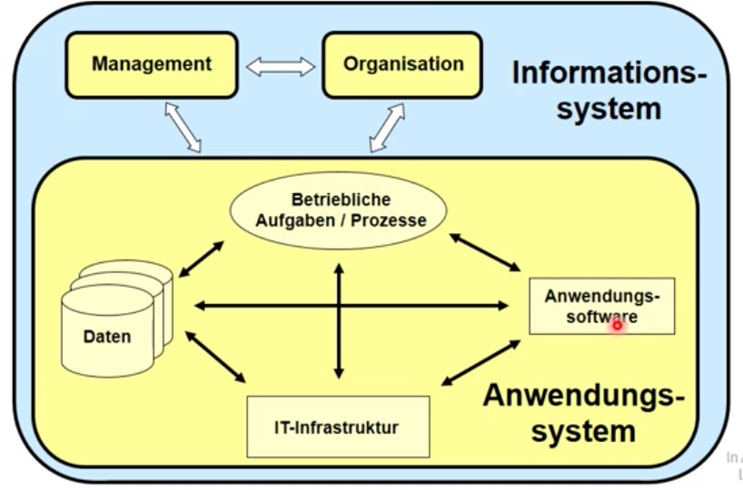

# 22.11.2021 betriebliche Anwendungsysteme

Einordnung der Anwendungssysteme:

### Betriebliches Informationssysteme

> **Informationsysteme:** (IS) soziotechnische Systeme (mensch-machine) zum Ziel der Bereitstellung von Information und Kommunikation

Komponenten von IS:

- **Mensch**: Anwender oder Gestalter
- **Technik**: Einrichtung zur Unterstützung der menschen
- **Aufgabe**: situationsbedingte Ausführung von Tätigkeiten
    - stellt Anforderungen an Fähigkeit von Technik und Mensch

Grade der Automatisierung

1. Vollautomatisiert: technisches System
2. Teilautomatisiert: soziotechnisches System **<- hier IS**
3. manuell: soziales System

*Anwendungsystem* = Subsystem Aufgabe + Technik

Ziele von IS:

- Effizienzsteigerungen
- neue Produkte, Leistungen, Geschäftsmodelle
- Kunden / Lieferantennähe

### Anwendungssysteme

> **Anwendungsystem:** Softwaresystem zur Durchführung von Aufgaben in unterschiedlichen Unternehmensbereichen

Unterscheidung AWS und IS

Ziele von AWS:

- Unterstützung konkreter betrieblicher Anwendungen
- Lösungen für fachliche Probleme (BSP: Lohnkalkulation)

#### Daten in AWS

AWS helfen bei benutzerfreundlicher Darstellung von Datenbanken

Systematisierung von Daten nach:

- **Veränderbarkeit**: Stammdaten (Kunden,...) vs Bewegungsdaten (Käufe)
- **Darstellung**: grafisch vs alphanumerisch
- **Zeitbezug:** historisch, aktuell, zukunft

### Beispiel Uni-Bib

Schnittstellen:

- Scanner für Ausweise
- Rechner für Bestandsuche
- OPAC-Software 
- Ausweise
- Drucker, Scanner

Daten:

- **Stammdaten:** Nutzer, Bücher, Standorte, ...
- **Bewegungsdaten:** Entleihungen
- **Historische Daten:** Nutzerhistorie, Buchhistorie
- **Aggregierte Daten:** Anzahl Entleihungen pro Monat

