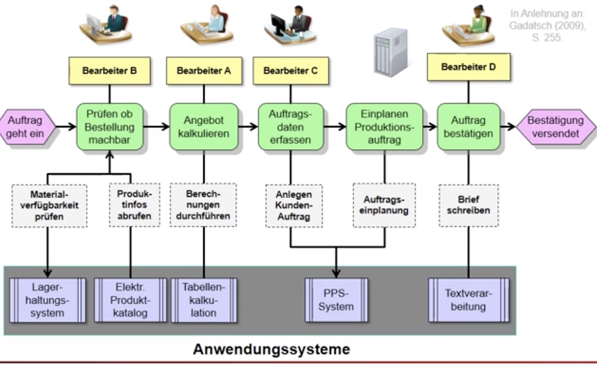
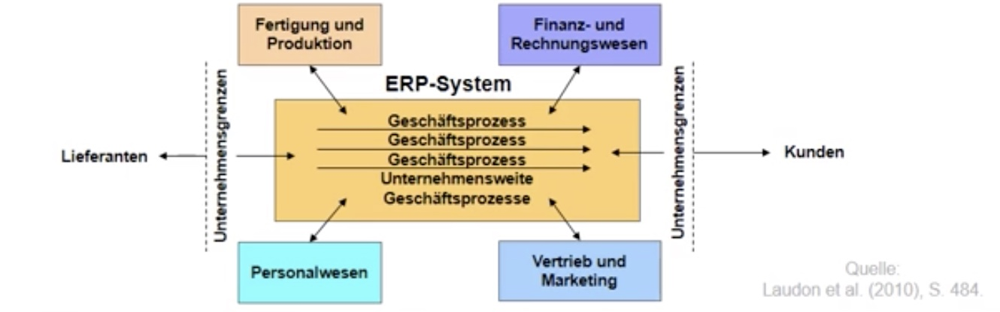
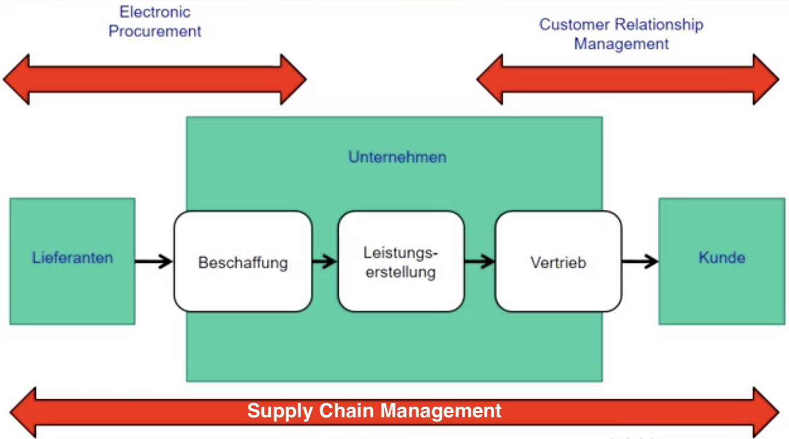
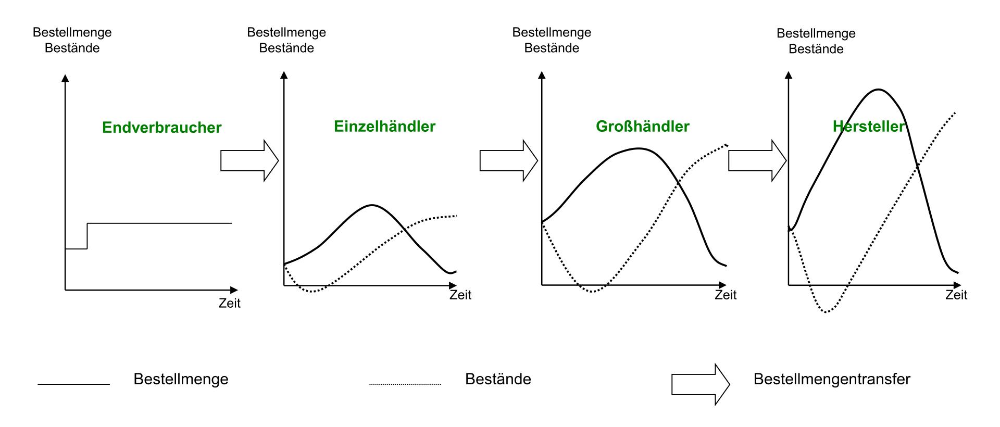

# 25.11.21 Integration von AW-Systemen

klassischer Ablauf von AW-Systemen:

in diesem Prozess gibt es viele Informationsflüsse, bspw:

- Reservierung von Beständen für Produktion B-> C
- Mitteilung des Angebotspreises von  A-> D

=> macht viel Redundanz, schwierige Übertragung Daten, ...

Lösung: **Integration** über zentrale Datenbank

> **Integration:** *Herstellung einer Einheit*, hier Entgegenwirken gegen Fraktionalisierung der Systeme

Ziele:

- Überwindung Grenzen 
- Reduzierung manueller Arbeit

### Innerbetriebliche Integration

mit *ERP-Systemen*

> **Enterprise-Resource-Planing-Systeme (ERP):** integrierte betriebswirtschaftliches Softwarepaket 

- Organisation von Geschäftsprozessen in allen Abteilungen
- besteht aus mehreren Teilsystemen (Modularität)
- im Gesamtsystem bestens integriert
- gemeinsame Datenbasis

*Risiko*: 

- Abhängigkeit von einem Anbieter
- Eigenheiten des Unternehmens können verloren gehen!

#### Beispiel ERP (von SAP)

- Datenanalyse
- Finanzmanagement
- Personalmanagement
- ...

=> viele branchenunabhängige Kernanwendungen + spezifische Module

### Unternehmensübergreifend

> **Supply Chain Management:** Planung,Durchführung, *Steuerung!* des Material/Informationsflusses entlang Lieferkette

#### Bestandteile

- Customer Relationship Management (CRM): Kommunikation mit Kunden

- Electronic Procurement: Beschaffung

#### Ziele

- enge Zusammenarbeit
- Abschaffung Friktion
- beste Gestaltung Material- / Informations-/ Geldflusses
- Verhinderung *Peitscheneffekt*

> **Peitscheneffekt:** verzögerte Weitergabe von Bestellungen entlang Lieferkette führen zu extremen Schwankungen in der Produktion

 

#### Strategien der Informationsteilung

1. *Auftrags-Informationen*: 
    - Prognosen anhand der Auftragsbasis (heute Standard)
2. *nachfragebezogene Informationen*: 
    - Echtzeit-Weiterleitung von Nachfragedaten
3. *Lagerinformationen*
    - lieferant bekommt automatisiert Zugriff auf Lagerdaten + Marketingmaßnahmen
    - Gegenzug vollst. Retourenrecht
    - genannt *Vendor-Managed-Inventory*

