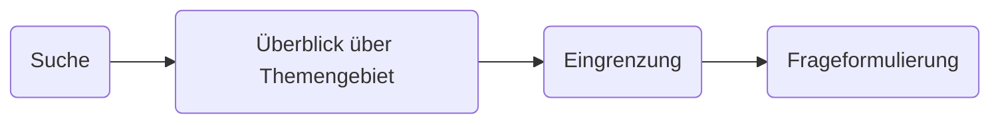

# 22.04.2022 Themenfindung

der Prozess der Themenfindung:

## Suche

Themensuche abhängig von:

- Anspruch + Zielsetzung der Arbeit
- Schwerpunkte der wiss. Arbeit
- Menge an Literaturauswahl

immer Absprache mit Betreuer!

### vorgegebenes Thema

toll, die schwere Arbeit fällt schonmal weg :)

- Interessante Unterthemen identifizieren
- Verknüpfungen mit bekannten Themen
- mögliche Gegenpositionen

### freie Wahl

achten auf:

- keine persönlichen Themen
- Quellenlage
- zu abstrakt

# Eingrenzung

Kategorien der Eingrenzung

- Temporal 
- geografisch
- Theorieströmungen
- Quellen 

immer Absprache mit Betreuern

## Fragestellung

Eigenschaften einer guten Fragestellung: *durch sie wird*

- Vielfalt des Themas,
- Erkenntnisgewinn,
- Inhaltlicher Schwerpunkte der Arbeit

*deutlich*

### Formulierung

| Art            | Beispielfrage                                                |
| -------------- | ------------------------------------------------------------ |
| *Erklärung*    | Warum ist der Alkoholkonsum bei Jugendlichen gesundheitsschädlich? |
| *Beschreibung* | Wie haben sich die Treibhausgas-Emissionen in Deutschland im letzten Jahrzehnt entwickelt? |
| *Prognose*     | Wie werden sich die Treibhausgas-Emissionen in Deutschland im nächsten Jahrzehnt entwickeln? |
| *Bewertung*    | Welche pädagogischen Konzepte haben sich in deutschen Kitas (nicht) bewährt? |
| *Gestaltung*   | Was muss konkret (z. B. in Deutschland) unternommen werden, um die Staatsverschuldung eines Landes zu reduzieren? |

## Titel

Grundsätze guter Titel:

- Einfach, klar, sachlich, selbsterklärend
- Titelformen:
    - Substantivausdrücke: "*Effekte von x auf y*"
    - Fragen: "*Hat x einen Effekt auf y?*"
    - Aussagen: *"x hat Effekt auf y"*
- max 10-12 Wörter
- untersuchte Beziehungen und theoretische Modelle deutlich werden lassen
    - Bsp:  *"Voting after the Bombings: A Natural Experiment on the Effect of Terrorist Attacks on Democractic Elections"*
    - diese Formulerung mit Doppelpunkt = oft genutzt

### Titelseite

- *Titel*, zentriert obere Hälfte
- *Autor*
- *Studiengang, Fach, Fachsemester*
- *Instiution, Name Dozenten*
- *Abgabedatum*

## Gliederung

beispielhafte Grobgliederung:

1. Einleitung
2. Begriffsdefinition
3. Hauptteil, hier beispielhaft aus einem VWL-Paper
    - *Data*
        - Quelle der Daten
        - mögliche Fehlerquellen
    - *Methods* 
        - das ökonomische Modell
        - Annahmen
        - Formeln
    - *Results*
        - Verbindung Daten + Modell
4. Fazit / *Conclusion*

## Digitalbibliotheken

- [Uni Halle](https://bibliothek.uni-halle.de/daten/discovery/)
- [Springer](http://www.springer.com/de/hilfe/digital-content/18654)
- [JSTOR](http://www.jstor.org/)
- [Google Scholar](http://scholar.google.de/schhp?hl=de)
