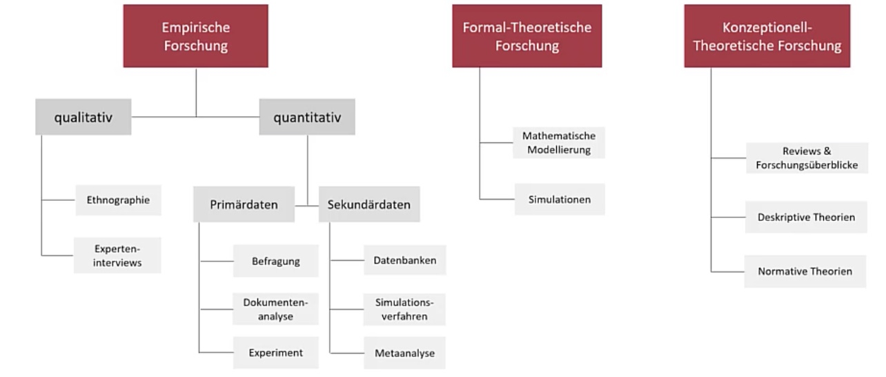

# 07.06.2022 positive Theorie

## Methoden der Sozialwissenschaften

- *Empirische Forschung* = Datenerhebung
- *formal-Theoretische Forschung* = Modelle
- *Konzeptionell-Theoretische Forschung* = verbale

Veranschaulichung:

> **Positive Ökonomik:** Theoretisch konsistente Aussagen über tatsächliches Verhalten
>
> - "objektive" Wissenschaft, wie Naturwissenschaften
> - Entwicklung von Theorien zur Erklärung von Phänomena

vs. Normative Ökonomik: Soll Aussagen und theoretisch begründete Empfehlungen

> **Theorie:** geschlossenes *Aussagensystem*, in dem Begriffe zueinander in Beziehung gebracht werden, durch Modellierung einer *Teilrealität* und *Komplexitätsreduktion*

Anforderungen an Theorien:

- Widerspruchsfreiheit
- intersubjektive falsifizierbarkeit

## Erkenntnisziele und Ebenen

Ziele Positiver Theorien: *Beschreiben, Verstehen, Erklären, Prognostizieren*

|            | Beschreiben                           | Verstehen                       | Erklären                           | Prognose                     |
| ---------- | ------------------------------------- | ------------------------------- | ---------------------------------- | ---------------------------- |
| *Zwecke*   | Begriffsbildung, Messung, Erfassung   | Konstruktion der subj. Realität | Antworten, Ursache-Wirkung-Zusamm. | Verhalten in Zukunft         |
| *Merkmale* | Definitionen, Zusammenhangsmaße       | Sprache, Symbole                | Problemabhängigkeit                | Annahmen , Gesetzmäßigkeiten |
| *Methoden* | quantitative M., deskriptive Theorien | qualitative M., Beobachtungen   | Quantitative M., Simulationen      | Szenarios                    |

Untersuchungsebenen:

- **Individuen**: bspw. Mikroökonomik, Verhaltensmodelle (Psychologie)
- **Gruppen / Organisationen**: Unternehmensethik
- **Gesellschaft / Märkte**: Makroökonomik, Marxsche Theorie

## Prinzipal-Agenten-Theorie

Theorie im Rahmen der *neuen Institutionen Ökonomik* (NIÖ)

> **NIÖ:** Untersuchung des Einflusses von *Institutionen* auf wirtschaftliche Entscheidungen, fragt nach optimaler Gestaltung von Institutionen

> **Institutionen:** System miteinander verknüpfter formaler und informeller Normen inkl. Durchsetzungen

Bestandteile der NIÖ:

- Transaktionskosten: *Coase, Williamson*
- Verfügungsrechte
- Vertragsbeziehungen

---

> **Principal-Agenten-Theorie**: Untersuchung der Interaktion zwischen Auftragnehmer:in (*Agenten*) und Auftraggeber:in (*Principal*)

Beispiel: Eigentümer:in und Manager:in eines Unternehmens

- Delegation der Entscheidungen von Eigentümer:in an Management
- Eigentum und Verfügungsgewalt divergieren
- Informationsasymmetrien 

=> gemeinsame und divergierende Interessen

PAT befasst sich mit der optimalen Entlohnung von Agenten für ihre Arbeit

### Modellierung des Beispiels

- Gewinn *Q* des Unternehmens hängt von Antrengung *e* des Managements ab: $Q=e$
- *e* ist Prinzipal unbekannt, *Q* ist bekannt
- Anstrenung verursacht Kosten bei Agenten: 
    - $c = \frac{k}{2} \cdot e^2$
- Prinzipal bietet Agent Anreize *w* an: 
    - $w = r+aQ$ (abhängig von Gewinn)

Überlegung des Agenten für Nutzenniveau *A*: $A = w - c(e)$
