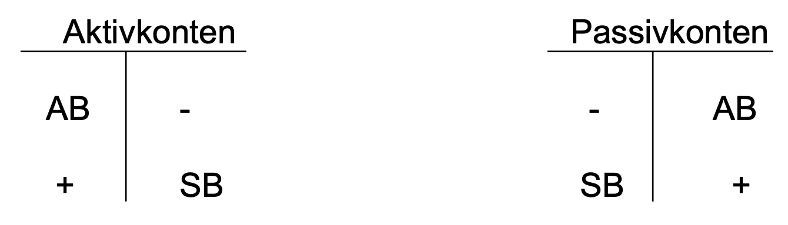

# **02.11.2021** Buchungen

weil Geschäfstfälle zu zahlreich, nicht Bestandteil der Bilanz, sondern auf *Konten*

> **Konto:** zu jeder Bilanzposition eröffnetes Konto mit Soll und Haben

- zu jeder Position auf Aktivseite: Aktivkonten
- zu jeder auf Passivseite: Passivkonten

**Aktivkonten:** Anfangsbestand AB + Zugang auf linker Seite, Abgang und Schlussbestand  SB rechts

Passivkonten genau andersrum

> **Bestandskonto** : führt einen in Bilanz ausgewiesenen Bestand an Vermögen / Kapital. 

- an Stichtag Anfangsbestand aus Bilanz übernommen

- Fortgeführt mit Zu/Abgängen

- in Jahresschlussbilanz aufgenommen

### Kontierungsregeln

LM S.52

Abhängig von Passivkonto / Aktivkonto beschreiben sich die Regeln (siehe Bild oben), Darstellung mithilfe des *Buchungssatzes*

>  **Buchungssatz**: drückt Kontenkorrespondenz aus (welche Konten nehmen Geschäftsfall auf) 
>
> auf Haben und Soll-Seite, dazwischen "an"

---

Beispiel-Geschäftsfall: `Vom Bankkonto werden 15.000 Euro abgehoben`

| Fragen                         | Antworten                |
| ------------------------------ | ------------------------ |
| Welche Konten werden berührt   | Kasse \| Bank            |
| Welche Charakter haben Konten? | Aktivkonto \| Aktivkonto |
| Zu oder Abgang?                | Zugang \| Abgang         |
| Wo steht der Zugang            | Soll \| Haben            |

**=\>** Buchungssatz: Kasse 15.000€ an Bank 15.000€ (Sollkonto an Habenkonto)

Buchungsatz ist meist wesentlich komplizierter!

---

