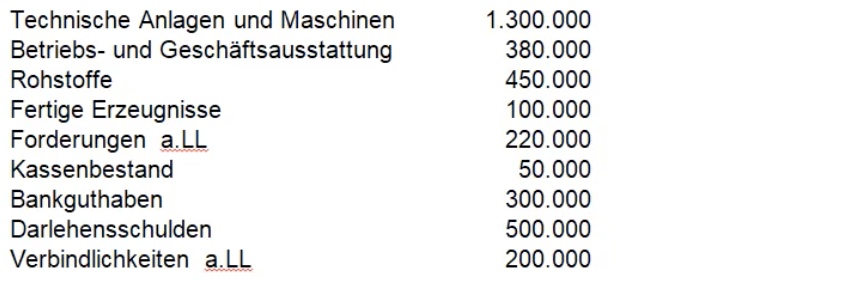

# 10.12.2021 Fallstudien 3

[https://skriptum.github.io/Fallstudien3](https://skriptum.github.io/vwl1/#/VL_Buchfuehrung/2021-12-10-Fallstudien3)

### 15 Inventar

Alle vermögenswerte, Betriebs und Geschäftsaustattung 

### 16 Bestandteile des Inventar

werden in Bestandsverzeichnis erfasst: 

1. Vermögen
2. Schulden
3. Eigenkapital

### 17 Zuordnung Vermögensposten

Vermögensposten der Inventur, geordnet nach steigender Flüssigkeit! 

| Anlagevermögen              | Umlaufvermögen        | Schulden                             |
| --------------------------- | --------------------- | ------------------------------------ |
| Gebäude                     | Rohstoffe             | Hypotheken                           |
| Grundstücke                 | Hilfstoffe            | Darlehensschulden                    |
| Fuhrpark                    | Betriebstoffe         | Verbindlichkeiten an Lieferanten     |
| Technische Anlagen          | Vorprodukte           | Verbindlichkeiten ggü Finanzbehörden |
| Maschinelle Anlagen         | Unfertige Erzeugnisse |                                      |
| BGA                         | Fertige Erezugnisse   |                                      |
| Wertpapiere (Kapitalanlage) | Forderungen           |                                      |
|                             | Bankguthaben          |                                      |
|                             | Kasse                 |                                      |

---

### Erstellung eines Inventars

Übungsaufgabe zur Erstellung eines Inventars:

18. Ordnen der Posten des Vorjahres
19. Einordnend des Folgejahres
20. Differenzbildung

#### Anlagevermögen

| Anlagevermögen     | Bestand Vorjahr | Bestand Folgejahr | Differenz    |
| ------------------ | --------------- | ----------------- | ------------ |
| Grundstücke        | 66.000          | 3.000             | -63.000      |
| Betriebsgebäude    | 973.000         | 995.000           | +22.000      |
| Verwaltungsgebäude | 800.000         | 780.000           | -20.000      |
| Fuhrpark PKW       | 444.000         | 379.000           | -65.000      |
| Furhpark LKW       | 70.000          | 172.00            | +102.000     |
| Technische Anlagen | 3.000.900       | 2.801.650         | -199.250     |
| Werkzeuge          | 6570            | 9.870             | +3.300       |
| BGA                | 32.560          | 28.790            | -25.534      |
| **Summe**          | **5.393.030**   | **5.169.310**     | **-223.720** |

#### Umlaufvermögen

| Umlaufvermögen               | Bestand Vorjahr | Bestand Folgejahr | Differenz    |
| ---------------------------- | --------------- | ----------------- | ------------ |
| Rohstoffe                    | 38.760          | 35.830            | -2.930       |
| Hilfstoffe                   | 6.890           | 9.870             | +2.980       |
| Betriebstoffe                | 12.000          | 13.200            | +1.200       |
| Unfertige Erzeugnisse        | 9.999           | 17.680            | +7.681       |
| Fertige Erzeugnisse          | 87.530          | 51.005            | -36.525      |
| Forderungen a L. : F Schmelz | 79.880          | 66.540            | -13.340      |
| Forderang Tauber OHG         | 3.330           | 19.670            | +16.340      |
| Bankguthaben                 | 7.340           | 188.000           | +180.660     |
| Kasse                        | 4.000           | 2.250             | -1.750       |
| **Summe**                    | **249.729**     | **404.135**       | **+154.406** |

Vorjahr `Summe Vermögen= 5.642.759 `

Folgejahr: `5.573.445`

#### Schulden

| Schulden                   | Bestand Vorjahr | Bestand Folgejahr | Differenz   |
| -------------------------- | --------------- | ----------------- | ----------- |
| Hypothekenschuld Sparkasse | 465.000         | 560.000           | +95000      |
| Handelsbank Grundschuld    | 2.990.000       | 2.871.300         | -118.700    |
| Stadsparkasse Darlehen     | 544.700         | 512.800           | -31.900     |
| Verbindl.  a LL            | 77.890          | 84.380            | +6.490      |
| **Summe**                  | **4.077.590**   | **4.028.480**     | **-49.110** |

#### Eigenkapital

- Vorjahr: `Vermögen - Schulden = 5.642.759 - 4.077.890 =` **1.564.869**
- Folgejahr: **1.544.965**
    - Differenz: *-2*0204

---

### 21 Bilanz - Inventar

| Bilanz           | Inventar                            |
| ---------------- | ----------------------------------- |
| Kurzschreibweise | lange Form der Bestandsaufnahme     |
| Staffelform      | Kontoform                           |
| Werte            | Mengen, Werte, Art der Bestandteile |
|                  |                                     |

### 22 Aufstellung einer Bilanz

Erstellen einer Bilanz aus diesen Werten: 

| Aktiva              | Wert          | Passiva           | Wert          |
| ------------------- | ------------- | ----------------- | ------------- |
| Anlagen + Maschinen | 1.300.000     | Darlehenschulden  | 500.000       |
| BGA                 | 380.000       | Verbindlichkeiten | 200.000       |
| Rohstoffe           | 450.000       | => Eigenkapital   | 2.100.000     |
| Fertige Erzeugnisse | 100.000       |                   |               |
| Forderungen         | 220.000       |                   |               |
| Bankguthaben        | 300.000       |                   |               |
| Kassenbestand       | 50.000        |                   |               |
| **Gesamt**          | **2.800.000** |                   | **2.800.000** |

=> gutes Verhältnis Eigenkapital / Fremdkapital (75%)

Eigenkapital deckt Analgevermögen ( *Investierung* ) 

### 23 weitere Übung zur Bilanzaufstellung

| Aktiva                   | Wert        | Passiva                | Wert       |
| ------------------------ | :---------- | ---------------------- | ---------- |
| **Anlagevermögen:**      |             | **Fremdkapital**:      |            |
| - Grundstücke + Bauten   | 3.200.000   | - Darlehenschuld       | 700.000    |
| - Fuhrpark               | 220.000     | - Hypothekenschulden   | 1.600.000  |
| - BGA                    | 280.000     | - Verbindlichkeiten    | 500.000    |
| - Anlagen+ Maschinen     | 1.100.000   | => gesamt Fremdkapital | *2.800.00* |
| => gesamt Anlagevermögen | *4.800.000* |                        |            |
| **Umlaufvermögen**:      |             | **Eigenkapital**       |            |
| - Rohstoffe              | 850.000     | - Eigenkapital         | 5.100.000  |
| - Hilfstoffe             | 450.000     |                        |            |
| - Betriebstoffe          | 100.000     |                        |            |
| - Fertige Erzeugnisse    | 450.000     |                        |            |
| - Forderungen            | 400.000     |                        |            |
| - Bankguthaben           | 800.000     |                        |            |
| - Kasse                  | 50.000      |                        |            |
| => gesamt Umlaufvermögen | *3.100.000* |                        |            |
| **Summe**                | **7900**    |                        | **7900**   |

Bilanzkennzahlen:

- finanzielle Unabhängigkeit: Eigenkapital / Gesamtkapital = 5.1m / 7.9m = 64% = gut!
- Investierung: Eigenkapital / Anlagevermögen = 5.1 / 4.8 > 1 = gut!

