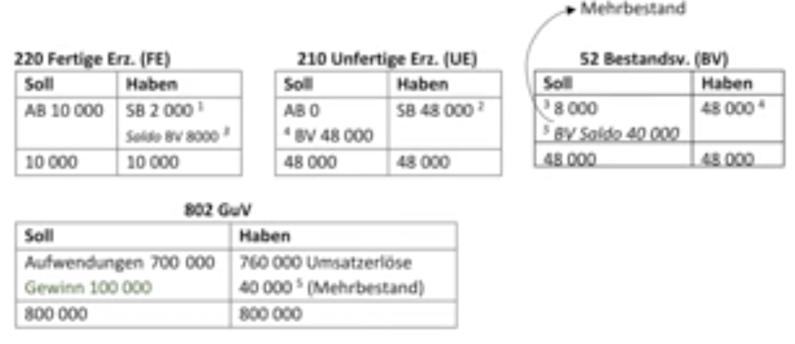

# 12.01.2022 Bestand von Erzeugnissen

Video 27

- Einlagerungen von Fertige Erzeugnisse (*FE*) und unfertige Erzeugnisse (*UE*) bei Überproduktion => **Bestandsveränderung**
- muss bei Jahresabschluss berücksichtigt werden
- und nur bei Jahresabschluss! 
- **vermutlich nicht klausurrelevant**


### Beispiel Motorenwerk


#### Erstes Jahr:

- Produktion von 2000 Motoren zu Aufwand 1000€
- Verkauf von 2000 Motoren zu 1500€
- keine Einlagerung

=> dann im GuV am Ende:

| Soll              | Haben               |
| ----------------- | ------------------- |
| 2.000.000 (2k*1k) | 3.000.000 (2k*1,5k) |
| 1.000.000 Gewinn  |                     |
| **3m**            | **3m**              |


#### Zweites Jahr: 

- Produktion 2000 Motoren
- Verkauf 1800 zu gleichem Preis = **Bestandserhöhung**

| Soll                   | Haben                    |
| ---------------------- | ------------------------ |
| 2.000.000€ (2000*1000) | 2.700.000€ (1.800*1500)  |
| 900.000 Gewinn         | 200.000 (200 Stück*1000) |
| **2.9m**               | **2.9m**                 |

=> **Bestandserhöhung** als Leistung auf Haben-Seite zu *Produktionskosten!*


#### Drittes Jahr

- Produktion 2000
- Verkauf 2100 (100 aus dem Lager) = **Bestandsminderung**

| Soll                     | Haben             |
| ------------------------ | ----------------- |
| 2m                       | 3,15m (2100*1500) |
| 0,1m (Bestandsminderung) |                   |
| *1.05m Gewinn*           |                   |
| **3.15m**                | **3.15m**         |

**Bestandsminderung** als Aufwand auf Soll-Seite zu Produktionskosten!


### Buchung

- wird getrennt auf `52 Bestandsveränderungen` gesammelt
- am Ende wird verrechnet, dieses Saldo in GuV eingetragen

Bestandsmehrungen: *Haben-Seite*

```
220 Fertiger Erzeugnisse
an 52 Bestandsveränderungen
```

Bestandsminderungen: *Soll-Seite*

```
52 Bestandsveränderungen
an 220 FE
```


Abschlussbuchungen:

```
a) Minderbestand
802 GuV 
an 52 Bestandsveränderungen

b) Mehrbestand
52 Bestandsveränderungen
an 802 GuV
```


### Weiteres Beispiel Fahrradfabrik

Video 28



Buchungssätze: 

1. 801 SBK an 220 FE.    2000
2. 801 SBK an 210 UE    48.000
3. 52 BV an 220 FE         8000
4. 210 UE an 52 BV        40000
5. 52 BV an 802 GuV


**MERKE:** **NIE** auf 220, 210, 52 buchen für normale Buchugnen ! 


### Hauptabschlussübersicht

> **Hauptabschlussübersicht**: Tabelle (LM S.168) zur Vorbereitung des Abschlusses 

- zum Probeabschluss
- Kontrolle der rechnerischen Richtigkeit
- Übersicht über Umsätze aller Konten = entscheidungsrelevant


**offensichtlich nicht klausurelevant**


