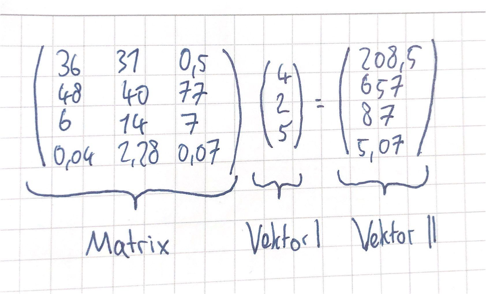
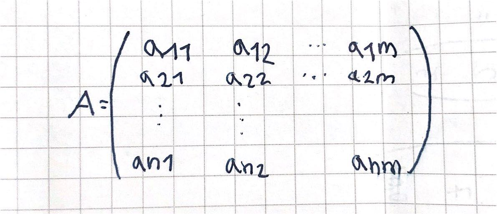
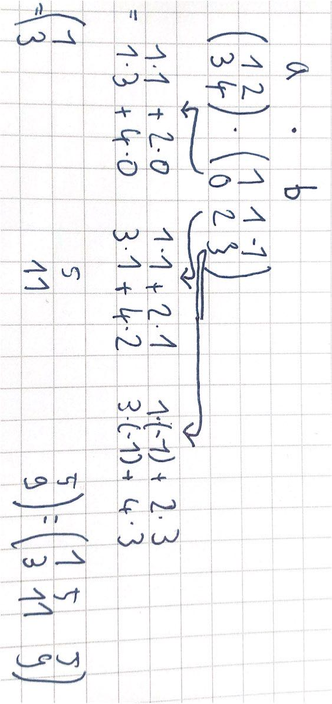

# 14.10.21 Matrizen

| **Beispiel** mit Lebensmitteln | Schoko | Erdnuss | Gummibärchen |
| ------------------------------ | ------ | ------- | ------------ |
| Fett                           | 36     | 31      | 0,5          |
| Kohlenhydrate                  | 48     | 40      | 77           |
| Eiweis                         | 6      | 14      | 7            |
| Salz                           | 0,04   | 2,28    | 0,07         |

`Frage: wie viel (fett, ..., salz) haben 400g Schoko, 200g Erdnüsse und 500g Gummis zusammen?`
$$
Fett: \\
Portionen(100g):v = \left(\begin{array}{c} 4 \\ 2 \\ 5 \end{array}\right) ,
fett= \left(\begin{array}{c} 36 \\ 31 \\ 0,5 \end{array}\right)
\\
\implies <v,fett> = 4*36 + 2*31 + 5*0,5 = 208,5
$$

`wenn man das für alle bestandteile wiederholt ->` **Matrix**

- Zeilenlänge der Matrix muss = Spaltenlänge des Vektor 1
- Spaltenlänge Matrix = Spaltenlänge Vektor 2

Matrizennotation:

> Definition: rechteckiges Schema mit n Zeilen und m Spalten mit Elementen $a_{ij}$  

Merke:

-  1ter Index = Zeile bis *m* , Indexbezeichnung *i*
- 2ter = Spalte bis *n*, Indexbezeichnung *j*

$y_i = a_{i1} * x_1 + a_{i2} * x_2 + ... + a_{im} * x_m$ = mathematische Schreibweise von A * x = y

Matrix beschreibt *lineare*  Abbildung von $\mathbb{R}^m \rightarrow \mathbb{R}^n  $

**Merke zum Rechnen**: $A*e_j$ = *j*-te Spalte von A (Einheitsvektoren)

Eigenschaften der Matrix: 

- *Linearität:* multi von Vektor und Matrix = lineare Abbildung 
  
    - Beispiel: Verdoppelt man Produktion, doppelt so viele Rohstoffe
    
        $Ax = y \\ A(2x) = 2y = 2(Ax)$ 

#### Transponierte Matrix

> **Transponieren** = Vertauschen von Zeilen und Spalten einer Matrix

Beispiel: 
$$
\left( \begin{array}{rrr}
1 & 2 & 3 \\ 
0 & 1 & 5 \\
\end{array}\right)^T = 
\left( \begin{array}{rrr}
1 & 0  \\ 
2 & 1  \\
3 & 5  \\ 
\end{array}\right)
$$
**Bemerkungen**: 

- Doppelt Transponieren -> Ursprungsmatrix

- wenn *A* quadratisch und $A = A^T \implies$ A ist *symmetrisch* 

    - Beispiel: $
    \left( \begin{array}{rrr}
        1 & 5 & 7 \\ 
        5 & 2 & 6 \\
        7 & 6 & 3 \\ 
        \end{array}\right)
    $
    
- da Vektoren = (n,1)-Matrizen: Transponierung von Vektor =\>  Spaltenvektor wird Zeilenvektor

- *Nullmatrix*= matrix nur aus Nullen

- *Einheitsmatrix I*= Matrix aus Eigenvektoren $\left( \begin{array}{rrr}
          1 & 0 & ... & 0\\ 
          0 & 1 & ... & 0 \\ 
          \vdots & \vdots &  \ddots\\
          0 & 0  &  & 1 \\ 
          \end{array}\right)$

​    

**Rechenoperationen:**

- Addition / Subtraktion : elementweise Addieren  / subtrahieren *(gleiche Dimension benötigt!)*

    - **Note:** 2 Matrizen sind gleich wenn *A - B = 0*
- Multiplikation mit Skalar: elementweise multiplizieren

**Matrizenmultiplikation**
$$
\text{Notation: }C=AB \ mit \ c_{i,j}=\sum_{l=1}^ka_{i,l}b_{l,j}
$$

   - Beispiel: 

Bemerkungen

- **nötig**: Anzahl Spalten A = Anzahl Zeilen B (*verkettet*) 

- Produkt C : Anzahl Zeilen wie A , Anzahl Spalten wie B

> **Achtung:** $A*B \neq B*A $(*nicht kommutativ*)
> aber *A(BC) = (AB)C*  (*assoziativ*)

