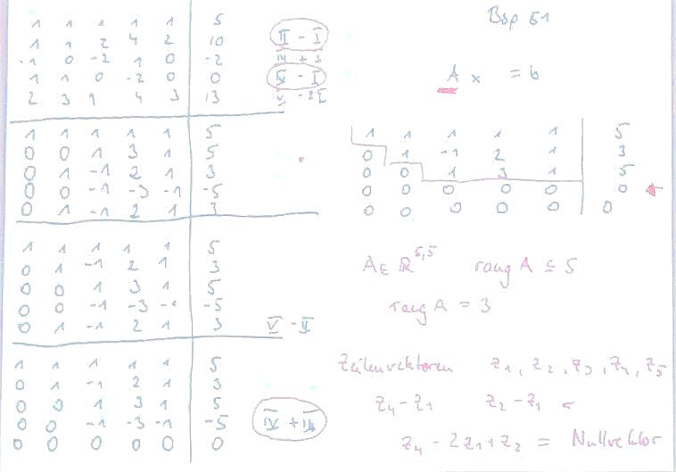
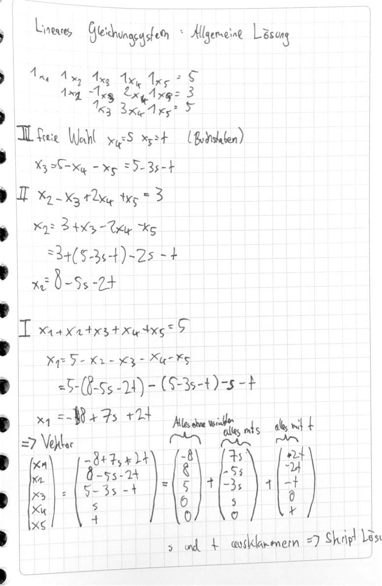
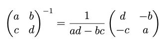
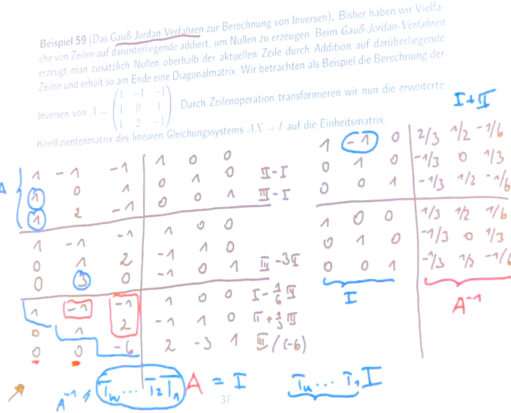

# 25.10.21 Inverse

> **Rang:** Anzahl Zeilen einer Matrix die linear unabhängig sind,
>
> = Anzahl Stufen übrig

Beispiel 51 Skript:

und dazugehörige Lösung des linearen Systems :

=> Lernen: Allgemeines System in beide Richtungen: lösen und nachweisen, dass es unabhängig ist 

### Matrixinverse

>  **Definition:** zu einer Matrix A mit *rang(A)=n*  ( kann) existiert eine *Inverse* Matrix $A^{-1}$ 

mit $A^{-1} A = I$ (Einheitsmatrix)

existiert eine Inverse so heißt quadratische Matrix *regulär*, wenn nicht *singulär*

Bildung der Inversen bei 2x2 Matrix:

**Merke:** wenn *ad-bc = 0*, dann funktionierts natürlich nicht!

bei größeren Matrizen: *Gauß-Jordan-Verfahren:*

- alles unterhalb der Diagonalen Nullen erzeugen (links nach rechts)
- alles oberhalb der Diagonalen nullen

3x3 Matrix Uff: 

[Videoerklärung](https://www.youtube.com/watch?v=MwwhXN8aHr8) von Daniel Jung

=\> Anwendungsbeispiel : [Leontief-Modell](https://www.youtube.com/watch?v=YdFON0-Je6U)

