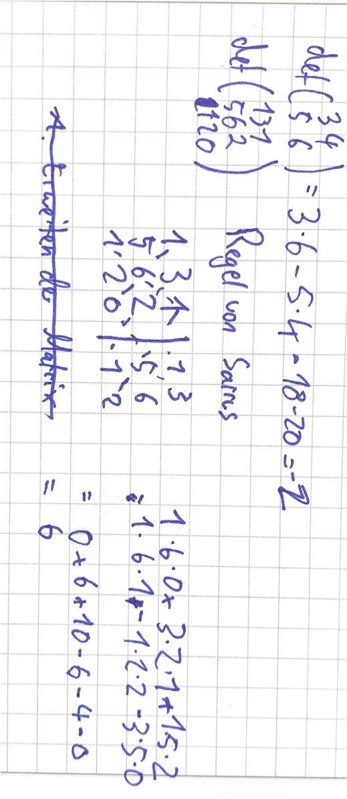

# 28.10.21 

[Daniel Jung Video](https://youtu.be/XDjaoEz-7aA)

### Determinanten

Die Determinante spannt eine Parallelogram / Raum auf.

Zusammenfassung von Vektoren spaltenweise in eine Matrix mit *n x n*

Berechnung von Determinanten

Beispielrechnung: 

Regel von Sarrus bei n=3:

- Erweitern der Matrix durch wiederholen der ersten beiden Spalten
- 3 Diagonalen nach rechts unten ausrechnen
- 3 Diagonalen nach links unten ausrechnen mit *-* als Vorzeichen
- zusammenrechnen

Regeln der Determinanten

- skaliert man Spalte mit *alpha*, dann auch Determinante mit *alpha*
- zwei Spalten vielfache voneinander -> Det = 0 (weil beide Vektoren in gleiche Richtung zeigen = keine Fläche)
- Spalte einer Matrix nur Nullen -> Det = 0
- Wert Determinante ändert sich nicht, wenn Vielfaches einer Spalte auf andere addiert wird
    - 

###  Elementarmatrizen

sind quasi Matrizen zur Beschreibung der Gaußschen Operationen

Beispielsweise:

- Additionsmatrizen $R_{ij}$ : addiert *alpha*-fache der i-ten Zeile auf j-te 
- Vertauschungsmatrizen : Vertauschen von i-ter und j-ter Spalte
    - 
- Skalierungsmatrizen: Skalieren der i-ten Zeile mit *alpha*
    - 

Beispielrechnung: 

### wichtige Sätze zu Determinanten

- Determinantenmultiplikationssatz: *det(AB)* = *det(A) \* det(B)*, falls man irgendwas schon weiß!

- Transponieren ändert Determinante nicht 

praktische Sätze, die alle das gleiche bedeuten: 

- Rang(A) = n
- die Inverse $A^{-1}$ existiert
- Ax = b ist lösbar
- det(A) $\neq$ 0 

=> erlaubt, Sachverhalt anders auszudrücken und Eigenschaften abzuleiten!

### Berechnung von Determinanten

Mit Laplace Entwicklungssatz: für Matrizen n>3

Beispielrechnung: 