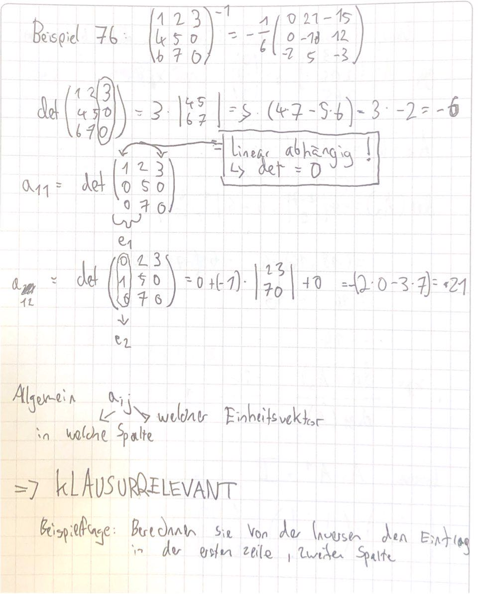
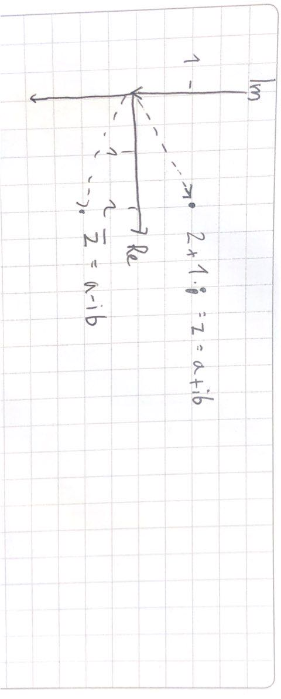

# 01.11.2021 Determinante 2

bei rechter oberer Dreiecksmatrix: $\begin{array}{rrr} 
1 & 4 & 5 \\ 
0 & 6 & 2 \\ 
0 & 0 & 4 \\ 
\end{array}$ 

**=>** Determinante ist Produkt der Diagonalelemente

`praktisch falls man schon Gauß-Verfahren angewendet hat und Stufenform hat!`

### Cramersche Regel

Beispiel :  $ a_{11} x_1 + a_{12} x_2 = b_1 \\ a_{21}x_1 + a_{22}x_2 = b_2$

wenn man jetzt $x_1$ ausrechnen will, dann 
$$
x_1 = \frac{det 
\begin{array}{rrr} 
b_1 & a_{12} \\
b_2 & a_{22}
\end{array}}{det \begin{array}{rrr} 
a_{11} & a_{12} \\
a_{21} & a_{22}
\end{array}}
$$
**Heißt**: wenn man ein LGS hat, kann eine Lösung der Qoutient von zwei Determinanten sein

Außerdem: (Satz 74) bei *Ax=b* ist $x_k = \frac{det(A_k)}{det(A)}$ 

die Matrix $A_k$ ist A mit der k-ten Spalte ersetzt durch *b*. 

**Matrix-Inverse:** wenn wir ein Element der inversen Matrix suchen, dann Anwendung der Cramerschen Regel

$a_{ij}^{-1} = \frac{det([a_1,...,e_j,...,a_n])}{det(A)}$ (in A ersetzen der i-ten Spalte mit dem j-ten Einheitsvektor)

Beispielrechnung: wir suchen die Inverse einer beispielhaften Matrix: Lösungen auf rechter Seite.

##  Komplexe Zahlen

Einführung der *imaginären Einheit i*. für *i* gilt $i^2 = -1$ 

Der Zahlenraum wird bezeichnet als $\mathbb{C}$ Komplexe Zahlen

Funktionen komplexer Zahlen:

- jede algebraische Gleichung lösbar
- einfacher Beweis von Additionstheoreme

jede komplexe Zahl *z* ist: $z = a + ib$ mit *a* als **Realteil** und *b* **Imaginärteil** 

Veranschaulichung von z und $\overline{z} = a-ib$

Operationen:

- Addition: Vektoraddition
- Betrag: Abstand zum Ursprung
- Multiplikation: Drehung um Ursprung
- Konjugieren: Spiegeln an reelle Achse

