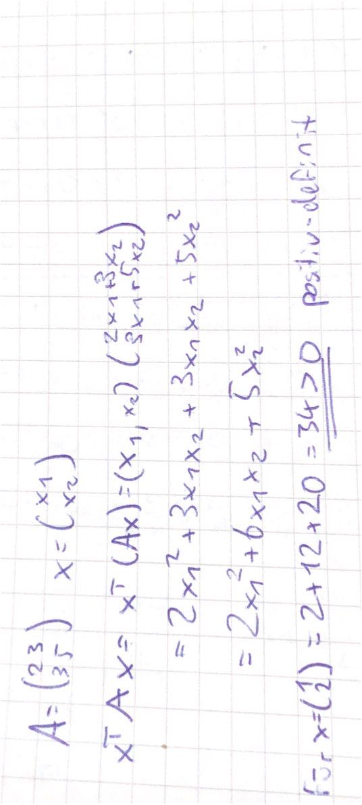
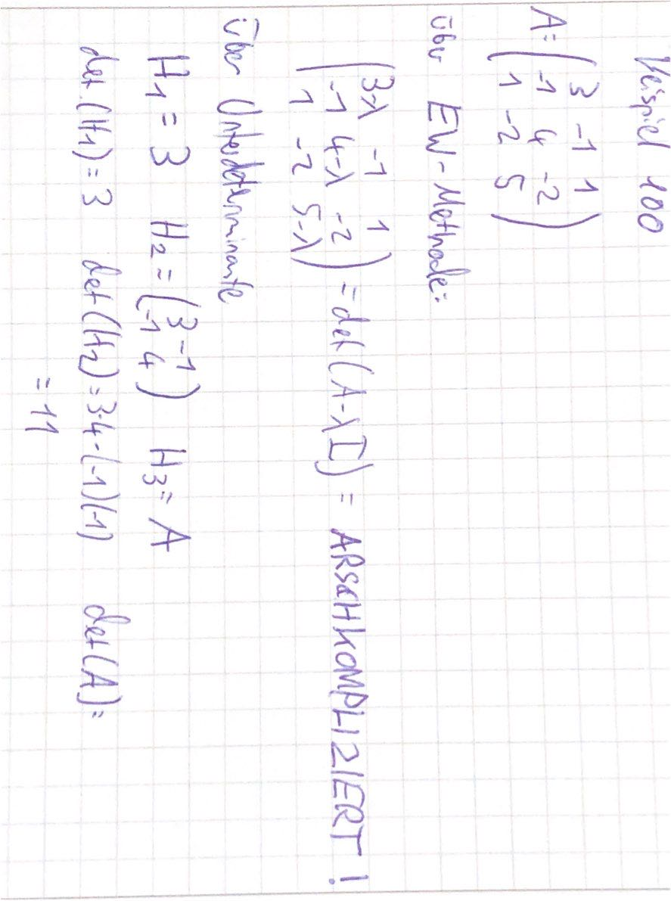
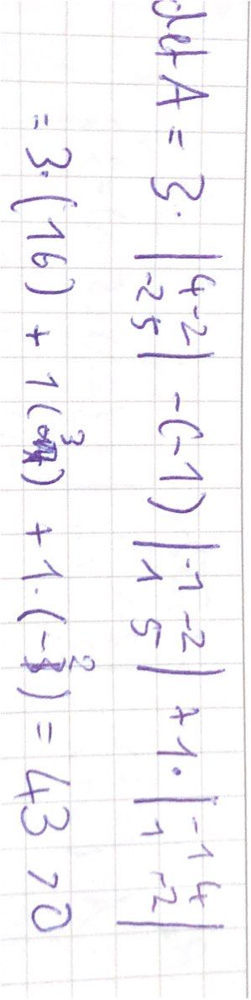

# 2021-11-15 Quadratische Formen

### Quadratische Formen

> **Quadratische Formen:** Sei *A* eine quadratische Matrix und *x* ein beliebiger Vektor, dann: $x^T Ax$ ist *quadratische Form*

Maitrix heißt:

- *positiv-definit:* wenn $x^T Ax > 0$
- *Positiv-semidefinit*: $x^T Ax \geq 0$
- *Negativ-definit*: $x^T Ax < 0$
- *Negativ-semidifinit:* $x^T Ax \le 0$
- *Indefinit*: irgendwie random

nützlich für lokale Extrema etc, wie bei Analysis in Schule

Beispiel: 

#### Eigenschaften:

1. ist *A* positiv-definit => *-A* ist negativ-definit
    - Beweis: $x^T (-A)x = -x^T Ax$ 
2. **Diagonalmatrix**: wenn alle Diagonaleinträge positiv sind => *positiv-definit*
    - Beweis (mit Einheitsvektoren): $e_1^T D e_1 = D_{11}$ und das ist per definition größer als 0
3. **symmetrische Matrix**: wenn Eigenwerte positiv => *positiv-definit*
4. **symm. Matrix:** (Hesse-Determinanten-Satz) : wenn Unterdeterminanten positiv, dann *positiv-definit* 
5. **symm. Matrix:** nur wenn Unter-Determinanten abwechelndes Vorzeichen => *negativ-definit*

Beispiel 100: Berechnung mit zwei Wegen zu Eigenschaft 4

alle Unter-Determinanten > 0 => positiv-definit

