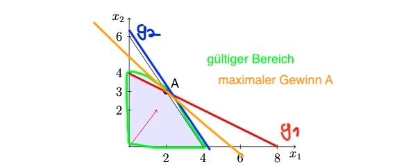
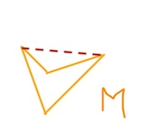

# 25.11.2021 Graphische Lösung

### Beispiel 108

Produktion von zwei Produkten $x_1,x_2$ 

- $x_1, x_2 \ge 0$ 
- Gewinn $G(x_1,x_2) = 3 x_1 + 4 x_2$
- Beschränkungen : $\frac{1}{4}x_1 + \frac{1}{2}x_2 \le 2$ und $\frac{3}{4}x_1 + \frac{1}{2}x_2 \le 3$

=> System von Gleichungen

**merke:** Optimum liegt in Ecke von zulässigem Bereich an Schnittpunkt *g1, g2*

Berechnung: 

 

### Beispiel 109

### Konvexe Menge

> **Konvexe Menge:** Menge *Z* heißt konvex, wenn *Verbindungsstrecke* von Punkten $x,y \in Z$ vollständig in *Z*

> **Verbindungsstrecke:** im n= 2: $\alpha_1 x + \alpha_2 y$ mit $\alpha_1 + \alpha_2 = 1$ 
>
> allg. für *m* Vektoren $x_i$:  $\sum_{i=1}^m \alpha_i x_i$ mit $\sum_{i=1}^m \alpha_i = 1$   =  *Konvexkombination*

jeder Punkt in konvexer Menge durch *Konvexkombination* darstellbar

Beispiele:

- Dreiecke
- $\mathbb{R}^n$, da es eine Fläche / Raum beschreibt
- Gegenbeispiel: Viereck mit einem Winkel > 180°

Eigenschaften

- Durchschnitt zweier konvexer Mengen  *A, B* ist konvex ($A \cap B$)

> **konvexe Hülle:** die Hülle einer nicht-konvexen Menge, die alle Verbindungstrecken hinzugefügt hat (also dann konvex ist)

Beispiel: ein nicht-konvexes Viereck M und die Hülle dazu:

> **Polyeder:** eine durch lineare Ungleichungen beschränkte Menge; immer konvex!

ein beschränktes Polyeder ist *Polytop* (beschränkt = endliche Menge)

| Polyeder (unbeschränkt)                         | Polytop (beschränkt)                            |
| ----------------------------------------------- | ----------------------------------------------- |
|  |  |

