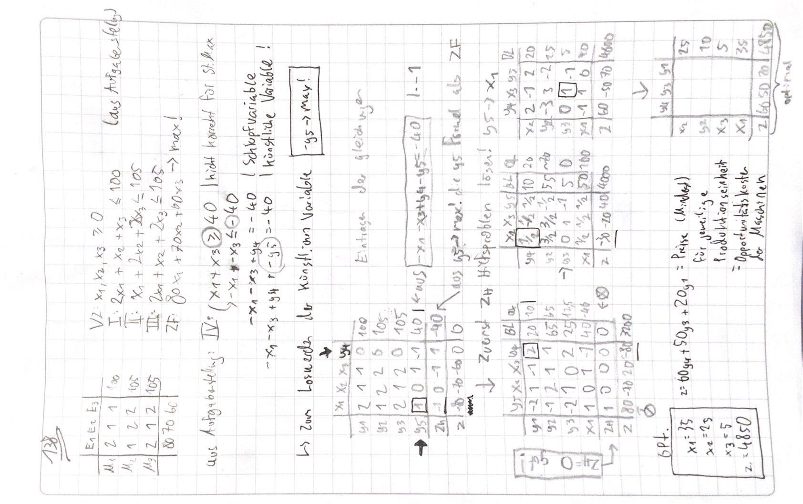
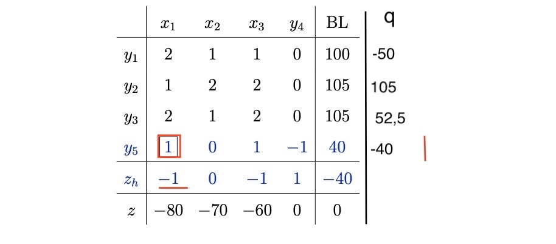
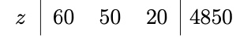

# 13.12.2021 komplexer Simplexalgorithmus

- bei nicht Standard-Maximum-Problemen muss eine zulässige Ecke gefunden werden
- in der Praxis über *künstliche* Variablen

BSP 138:

Einführung der küsntlichen Variablen:

1. nicht-erlaubte 4. Ungleichung: $IV:x_1+x_3 \ge 40$
2. Umformung  $IV*(-1):-x_1-x_3 \le -40$
3. Schlupfvariable: $-x_1-x_3+y_4 = -40$
4. künstliche Variable (negativ!) $-x_1-x_3+y_4 -y_5 = -40$
5. Umstellung nach küsntl. Variable: $-y_5 = x_1+(0*x_2)+x_3-y_4 -40$
    - wenn hier alle Variablen 0, dann $-y_5 = -40 \to y_5 = 40$ 
    - also Ziel = Minimierung *y5*
6. Eintragung ins Tableau als Zeile: $y_5 || \ 1\ |\ 0\ |\ 1\ |-1||\ 40$
7. Als Hilfszielformulierung $z_h$das negative der Spalte eintragen
8. als erstes das Hilfsziel lösen! 
    - also das negativste elemenet nehmen, q bilden, Pivotelement ...

**Darstellung des Tableaus:** 

Interpretaion des Endergebnises:

- Alle >= 0 = **optimal**
- keine 0 = **eindeutig**
- $z = 4850-(60y_4+50y_3+20y_1)$ 
    - die y-Koeffizienten sind die Opportunitätskosten der Produktion
    - steigende Opportunitätskosten = sinkender Gewinn 

