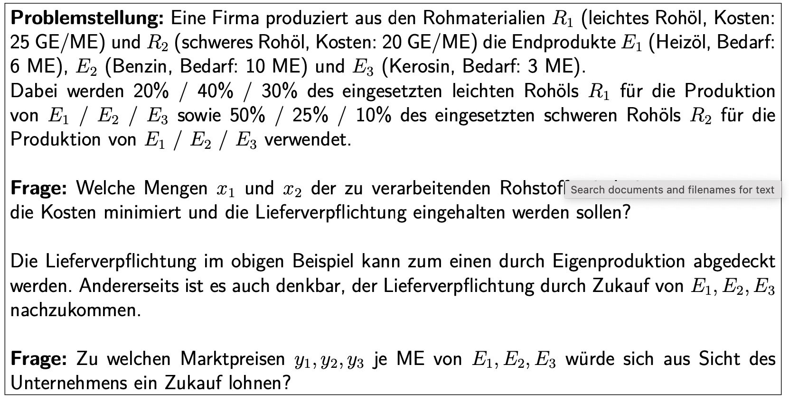
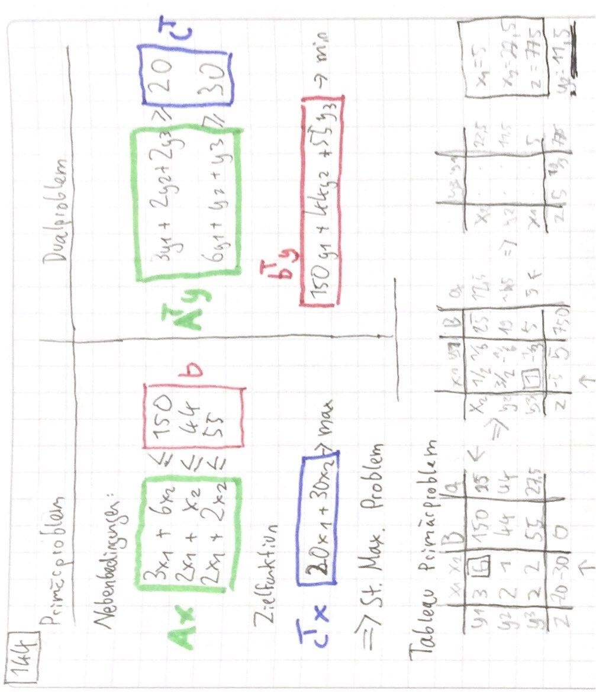

# 10.01.2022 Wiederholung + Dualität

### Wiederholung

> **Lineares Optimierungsproblem (LOP):** System von Gleichungen und Ungleichungen

besteht aus:

- Vorzeichen-Bedingung
    - Bsp.: $x_1,x_2 \ge 0$
- Nebenbedingungen
    - $3x_1 - x_2 \le 2$
    - Umformung $*-1: -3 x_1 + x_2 \le 2$
- Zielfunktion 
    - $-3 x_1 + 4x_2 = min!$
    - Umgeformt $*(-1): 3x_1 + 4 x_2 = max!$

Lösung der LOPs: **Simplexalgorithmus** 

einfach mit: *Standardmaximumproblem*

- VZ: $... \ge 0$
- NB: $Ax \le b$
- ZF: $... = max!$
- und $b \ge 0$ (alle Komponenten des Vektors *b*)

sonst *Umformung* und schwierige Bestimmung der Anfangsecke

### Dualität

anhand Einführungsbeispiel mit Ausgangstoffen $R_1,R_2$ und Endprodukten $E_1,E_2,E_3$ 

#### Primalproblem

- VZ: $R_1,R_2 \ge 0$
- NB: (Lieferverpflichtungen)
    - $0.2 R_1+0.5R_2 \ge 6 E_1$  
    - $0.4R_1 + 0.25 R_2 \ge 10 E_2$
    - $0.3 R_1+0.1 R_2 \ge 3 E_3$
- ZF: $25 R_1+20R_2 = min!$

#### Dualproblem

**Alternativ:** Einkauf von Endprodukten: `bis zu welchem Preis ist das sinnvoll? `

Variablen sind Preise von $E_1,E_2,E_3$ : $y_1,y_2,y_3$

- VZ: $y_1,y_2,y_3 \ge 0$ (logisch)
- ZF: anhand der obigen Lieferverpflichtungen der Produkte 
    - bspw. $6 E_1$ zum Preis von $y_1$
    - $ZF = 6y_1+10y_2+3y_3$
- NB: die Preise sollen niedriger sein als bei eigener Produktion
    - $0.2y_1+0.4y_2+0.3y_3 \le 25$
        - Erklärung: Beispiel Verteilung von Rohstoff $R_1$ auf Endprodukte inklusive Preis (25GE/ME)
    
    - $0.5 y_1+0.25 y_2+0.1 y_3 \le 20$
    

#### Zusammenhänge

|        | Nebenbedingungen | Zielfunktion | Vorzeichen |
| ------ | ---------------- | ------------ | ---------- |
| Primal | $Ax \ge b$       | $c^Tx = min$ | $x\ge 0$   |
| Dual   | $A^Ty \le c$     | $b^Ty = max$ | $y \ge 0$  |

 

### Beispiel 144

Beispiel mit Produkten $x_1, x_2$ und Maschinen $y_1 , y_2 , y_3$ 

- da $y_2 \neq 0$, heißt, es gibt hier "*kostenlose Kapazität*" , die man noch vermieten könnte, ohne Profit zu schmälern
- die anderen Maschinen sind vollausgelastet!

Optimallösung aus unterster Zeile *z*: 
$$
5 y_3 + 10/3 y_1 + z = 775 \\
\to z = 775 - 5 y_3 - 10/3 y_1
$$
=> Bei Vermietung aller Maschinen fällt Profit (775) um je $u_1^* = 10/3$ , $u_3^* = 5$  un $u_2 = 0$

$u_1, u_2, u_3$ sind Schattenpreise / Opportunitätskosten und **Mindestpreise** der Vermietung, und werden **Dualvariablen!**

