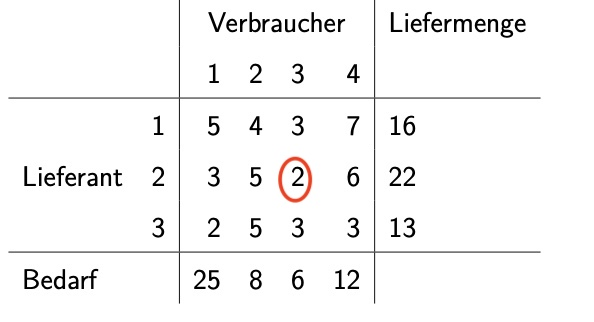
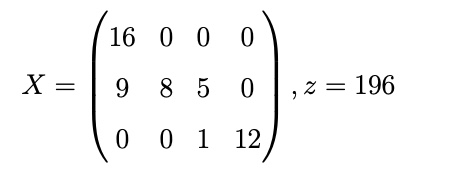

# 17.01.2022 Transportoptimierung

> **Transportprobleme:** besondere Art von Linearen Optimierungsproblemen mit gleichen Voraussetzungen

Eigenschaften

- Kunde $j$ will Menge $b_j$ 
- Lieferant $i$ kann Menge $a_i$ liefern
- $c_{ij}$ = Kosten des Transports von Lieferant $i$ an Kunde $j$ 
- Kunde kann mehrere Lieferanten haben, Lieferant mehrere Kunden

Suche: Transportmenge $x_{ij}$ für Transport $i \to j$ mit **minimalen** Kosten

#### Beispiel 155: 

Beispiel: Lieferkosten $c_{23}$ für Lieferant 2 an Verbraucher 3 pro Einheit: **2**

Voraussetzung: Gesamtbedarf = Gesamtliefermenge = 51 (dieses Beispiel) = *ausgeglichen*

- sonst zusätzliche Kunden / Lieferanten, die kostenlos abnehmen

! Transportproblem ist **immer lösbar !**

ist eigentlich Simplexverfahren, aber ohne Umformung in St. Max. Problem

### zulässige Basislösung bestimmen

- Kostenmatrix des TP: $C = (c_{ij}) \in \mathbb{R}^{n,m}$
- Mengenmatrix des TP: $X = (x_{ij}) \in \mathbb{R}^{n,m}$

Menge an Basisvariablen = $m+n-1$ = hier 6

- Basisvariable = Ergebnisse in der Mengenmatrix verschieden 0
- wenn mehr: irgendwas falsch
- wenn weniger: ausgeartet

mithilfe der **Nordwesteckenregel**: von oben links versuchen maximale Liefermengen einzusetzen

Ergebnis: 

**merke:** 

- die Matrix hat 6 Einträge verschieden 0 = *Basisvariablen*
- Kosten *z* = X*C 

oder mithilfe der **Methode des Matrixminimum**

### Anfangslösung verbessern

- Bestimmung der Variablen, die in die Basislösung getauscht werden :  **Potentiale**
- Art des Tauschs: **Austauschkreis** 

