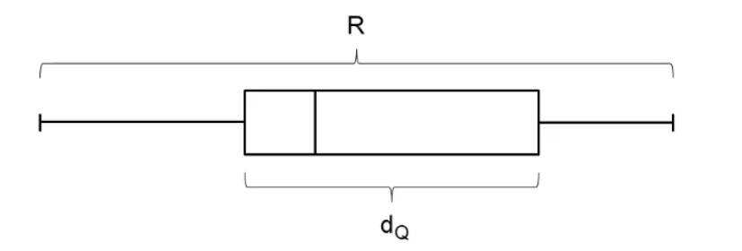

# 22.11.2021 Streuungsmaße

Darstellung der Variationsbreite von Beobachtungen

immer positiv

### einfache Streuungsmaße

- Spannweite (Gesamtbreite der Häufigkeitsverteilung): $R = x_{ (n) } - x_{ (1) }$
- Interquartilabstand: $d_Q = x_{0.75} - x_{0.25}$ 

### Streuungsmaße mit Lagebezug

#### MAD 

Median der absolute Abweichung vom Median

MAD $ = med\{ |x_i - x_{med}|, i= 1,\dots,n \}$

#### Standardabweichung

Mittelwert der (quadrierten) Abweichung vom Mittelwert

Voraussetzung: kardinal skaliertes Merkmal X

Berechnung:

1. Abweichung von $x_i$ von $\bar{x}$ und ihr Quadrat $(x_i - \bar{x})^2$ 
2. Mittelwert der Abweichung: $\frac{1}{n} * \sum^n_{i=1} (x_i - \bar{x})^2 = \tilde{s}^2$ = `Varianz` 
3. Quadratwurzel aus Varianz: $\sqrt{ \tilde{s}^2 }$ = `Standardabweichung`

vereinfachte Berechnung mithilfe von *Verschiebungssatz* (Formel S.8) = $\left( \frac{1}{n} \sum^n_{i=1} x_i^2 \right) - \bar{x}^2$

#### Variationskoeffizient

unabhängig von Maßstab / Einheiten

Berechnung: $v = \frac{\tilde{s}_x}{\bar{x}}$ (mit $\bar{x}$ > 0)

### Verhalten bei Transformation

Ausgangssituation mit Werten $x_i$ *und* Transformation mit $y_i = a * x_i + b$ 

Dann:

- Das additive *b* ist unwichtig (weil nur Verschiebung)
- Varianz: $\tilde{s}_y^2 = a^2 * \tilde{s}^2_x$
- Standardabweichung: $\tilde{s}_y = |a| * \tilde{s}_x$

#### z-Standardisierung

spezielle Transformation bei Kenntnis besonderer Kenngrößen

Berechnung: $z_i = \frac{x_1 - \bar{x}}{\tilde{s}_x }$

Folge: $\bar{z}$ = Mittelwert = 0 ; $\tilde{s}^2_z$ = Standardabweichung = 1

#### 

### Schwankungsbereiche

Arithm. MIttel + Standardabweichung = Konstruktion von Schwankungsbereichen

1. Intervall: $\bar{x} \pm 1*\tilde{s}$ enthält **68%** aller Beobachtungen
2. Intervall: $\bar{x} \pm 2*\tilde{s}$ enthält **95%** aller Beobachtungen
3. Intervall: $\bar{x} \pm 3*\tilde{s}$ enthält **99%** aller Beobachtungen

