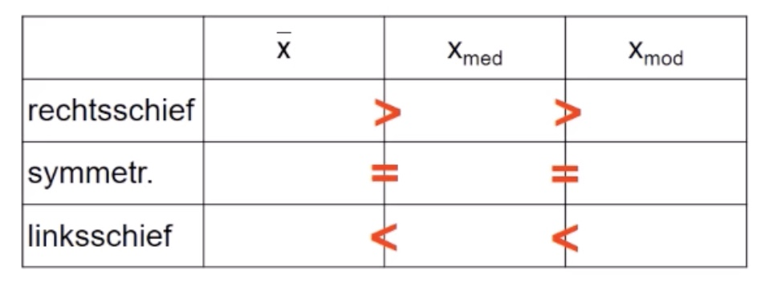
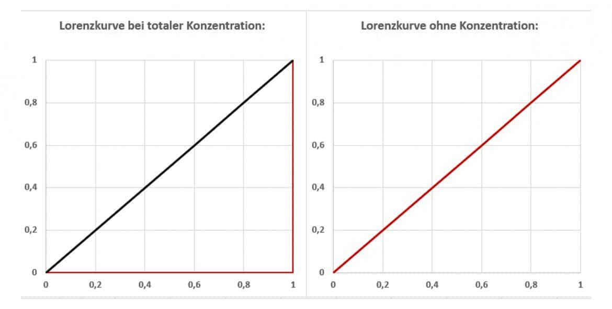
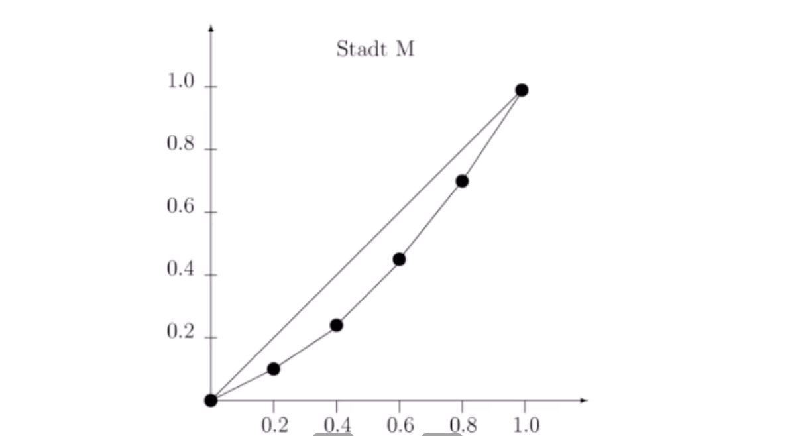

# 29.11.2021 Schiefemaße + Konzentrationsmaße

## Schiefe

Charaktersierung der Symmetrie einer Häufigkeitsverteilung

Kategorien: 

- *links / rechts*
- *schief / steil*

Beispiel: *linksschief + rechtssteil* = Anstieg auf linker Seite, starker Abfall rechts

Daumenregel: 

### Schiefekoeffizient

$$
g_m = \frac{
\frac{1}{n}*\sum_{i=1}^{n} (x_1 - \bar{x})^3
}
{\left(
\sqrt{\frac{1}{n}*\sum_{i=1}^{n} (x_1 - \bar{x})^2}
\right)^3}
$$

- Symmetrisch: $g_m = 0$
- rechtschief: $g_m > 0$
- linksschief: $g_m < 0$ 

## Konzentration

`wie sind Ausprägungen auf Objekte verteilt?` Oder: wer hat wieviele Kekse? :cookie:

### Lorenzkurve

graphische Darstellung der Konzentration

Voraussetzung: Urliste X kardinal skaliert

1. $x_{(1)},...,x_{(n)}$ ordnen
2. $f_i = \frac{1}{n}$ berechnen

Lorenzkurve = Graph durch $(u_0,v_0),...,(u_n,v_n)$ mit

- x-Achse: kumulierter Anteil der Merkmalsträger 
    - $u_q = \sum_{i=1}^q f_i$  , also q-te Koordinate auf u-Richtung i
- y-Achse: kumulierter Anteil der Merkmalsmenge
    - $v_q =  \sum_{i=1}^q \tilde{v}_i$ mit $\tilde{v}_q = \frac{x_{(q)}}{\sum xi}$

Eigenschaften der Lorenzkurve:

- monoton wachsend
- Konvex (nach unten hängende Wölbung)

Ausmaß der Konzentration: Fläche zwischen Hauptdiagonale und Lorenzkurve => **Gini-Koeffizient**

### Gini-Koeffizient

G = Fläche zwischen Diagonale und Lorenzkurve / Fläche zwischen Diagonale und Achse

Formal: $G = \sum(u_{i-1}+u_i) * \tilde{v}_i - 1$

Eigenschaften:

- Obergrenze variiert mit *n*

---

#### Beispiel

Monatlicher Umsatz von 5 Möbelhäusern in einer Stadt

| Haus   | Umsatz | $q$  | $f_q$ | $u_q$ | $x_{(q)}$ | $\tilde{v}_q$ | $v_q$       |
| ------ | ------ | ---- | ----- | ----- | --------- | ------------- | ----------- |
| 1      | 60     | 1    | 0.2   | 0.2   | 20        | 20/200        | 20/200=0.1  |
| 2      | 50     | 2    | 0.2   | 0.4   | 30        | 30/200        | 50/200=0.25 |
| 3      | 40     | 3    | 0.2   | 0.6   | 40        | 40/200        | 90/200=0.45 |
| 4      | 30     | 4    | 0.2   | 0.8   | 50        | 50/200        | 140/200=0.7 |
| 5      | 20     | 5    | 0.2   | 1.0   | 60        | 60/200        | 1           |
| $\sum$ |        |      |       |       | **200**   |               |             |

1. $q \to f_q$ : Kumulieren
2. $u_{q}$ = in dem Fall das Gleiche wie *f*
3. $x_{(q)}$ = absteigend sortierte Merkmale und summieren
4. $\tilde{v}_q = x_{(q)} / Summe$
5. $v_q = kum \ \tilde{v}_q$

Lorenzkurve: 

Gini-Koeffizient = 0.2

---

### Absolute Konzentrationsmaße

öndert sich abhängig von der Anzahl der betrachteten Objekte

#### Herfindahl-Index

- Berechnung: $H = \sum \tilde{v}^2_i$
- mögliche Werte: 1/n < H < 1
- Nutzung: Marktanalyse H > 0.25 = extreme Marktkonzentration

