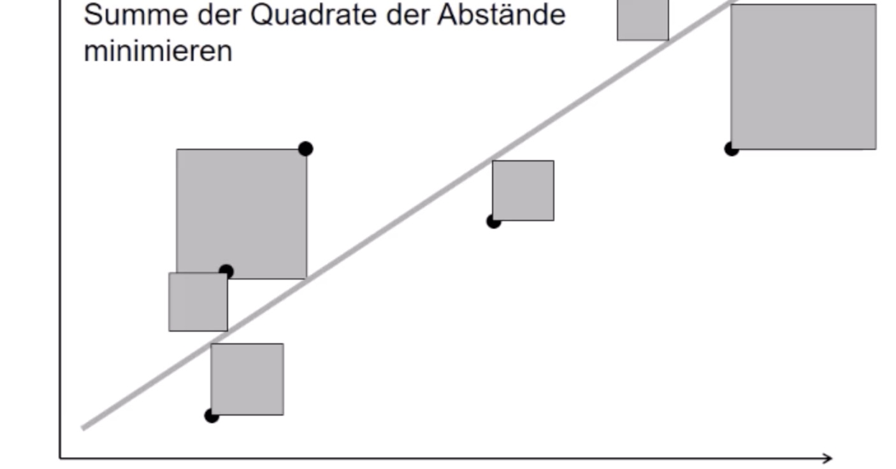
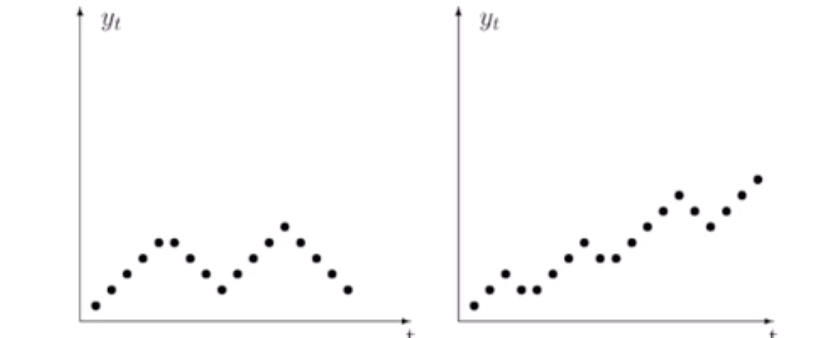
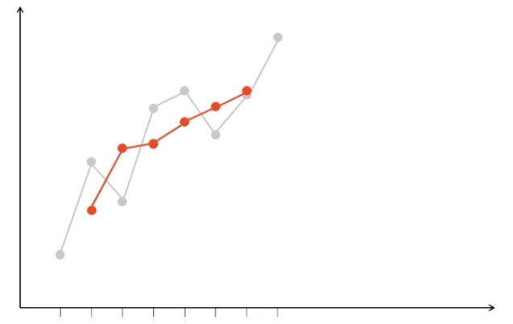

# 18.01.2022 Regression + Zeitreihen

### Einfaches lineares Regressionsmodell

> **Regressionsmodell:** statistische Analyse für Untersuchung von Wirkungszusammenhängen

für angenommenen *linearen* Zusammenhang zwischen *x, y*  
$$
Notation: y = a * x + b + \epsilon
$$

- *y* : Zielgröße
- *x* : Einflussgröße
- $\epsilon$ : zufällige Störgröße
- *a,b* : Regressionskoeffizenten (Parameter der Regressionsfunktion)

Bestimmen der Koeffizenten mit verschiedenen Methoden

### Kleinste-Quadrate-Methode $\bold{R^2}$ 

teste verschiedene Geraden und minimiere die Abstände zur Gerade

Formeln:
$$
\hat{a} = \frac{
\sum x_i * y_1 - n * \bar{x} * \bar{y}
}{
\sum x_i^2 - n * \bar{x}^2
} \\
\hat{b} = \bar{y} - \hat{a}*\bar{x}
$$

- Prognosen: $\hat{y} = \hat{a} *x+\hat{b}$
- Residuen: $\hat{\epsilon}_i = y_i - \hat{y}_i$

Werte mit ^ bezeichnen berechnete Ergebnisse 

#### Beurteilung der Modellqualität

Bestimmtheitsmaß $R^2 = \frac{(s_{\bar{Y} })^2 }{(s_Y)^2 }$ 

- Varianz der berechneten durch Varianz der beobachteten Werte
- also R^2 = Anteil erklärter Streuung an Gesamtstreuung 
- Wertebereich 0 < R < 1

## Analyse zeitlicher Verläufe

zwei Methoden:

1. *Zeitreihenanalyse* : Verlauf der zeitlichen Entwicklung
2. *Indexrechnung* : Vergleich zweier Zeitpunkte

### Zeitreihen

Merkmal Y beobachtet $y_1,...,y_t$ zu Zeitpunkten *t = 1,...,T*

Beispielhafte Muster: 

zyklische Schwankung (*links*) und zyklisch + Aufwärtstrend (*rechts*)

Zeitreihe = meist aus mehreren Komponenten:

- Trend -> langfristig, g
- Saison -> kurzfristig, s
- Zufall, irregulär, $\epsilon$

Ziel: Trennung der Komponenten

Arten der **Komponentenmodelle**

- **additives** Modell: $y_t = g_t + s_t + \epsilon_t$
- **multiplikatives** Modell: $y_t = g_t * s_t * \epsilon_t$
    - logarithmiert: $log(y_t) = log(g_t) + log(s_t) + log(\epsilon_t) $

#### Lineares Trendmodell

- analog zur Regression mit Zeit: $ y_t = a * t + b + \epsilon_t $
- resultiert in Trendgerade 

#### Glättung mit Moving-Average

gleitender Durschschnitt zur Glättung von Werten

- berechne für jeweils 3 Werte Durchschnitt
- platziere Durchschnitt in Mitte der 3 Werte
- wiederhole für nächste 

