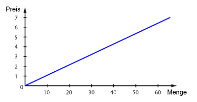
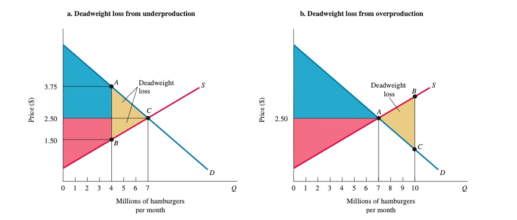

# Volkswirtschaftslehre Grundlagen

## Überblick

* [Allgemein](#allgemein)
  * [Unterbereiche](#unterbereiche)
  * [Methoden](#methoden)
  * [Begriffe](#begriffe)
  * [Grundfragen](#grundfragen)
* [Mikroökonomik](#mikro%C3%B6konomik)
  * [Vorteil](#vorteil)
  * [Produktionsmöglichkeitskurve](#produktionsm%C3%B6glichkeitenkurve)
  * [Märkte](#m%C3%A4rkte)
    * [Nachfrage](#nachfrage)
    * [Angebot](#angebot)
    * [Gleichgewicht](#marktgleichgewicht)
  * [Wohlfahrt](#wohlfahrt)
  * [Haushalte](#haushalte)
    * [Nutzen](#nutzen)
    * [Effekte](#effekte-einer-preis%C3%A4nderung)
    * [Güterarten](#g%C3%BCterarten)
  * [Unternehmen](#unternehmen)
    * [Technologiewahl](#technologiewahl)
    * [Transaktionskosten](#transaktionskosten)
  * [Externalitäten/Marktversagen](#marktversagenexternalit%C3%A4ten)
* [Makroökonomik](#makro%C3%B6konomik)
  * [Volkseinkommen](#volkseinkommen)
  * [Arbeitslosigkeit](#arbeitslosigkeit)
  * [Inflation](#inflation)
  * [WIrtschaftswachstum](#wirtschaftswachstum)
  * [Eintwicklungsländer](#entwicklungsl%C3%A4nder)
* [Forschungstrends](#forschungstrends)
* [Lesematerial](#lesematerial)

## Allgemein

### Unterbereiche

1. **Mikroökonomik**
   * Entscheidugngsprobleme auf individueller Basis
   * Koordintionsvorgänge
   * Fokus: Haushalte, Unternehmen
2. **Makroökonomik**
   * gesamtwirtschaftliche Vorgänge
   * Aggregat von Preisen, Indivuduen, Firmen zu Märtkten
   * Fokus: Preise, Beschäftigung, Inflation
3. **Verhaltensökonomik**
   * "neueres" Fach der VWL
   * psychische Verhaltensmuster hinter Entscheidungen
4. ...

### Methoden

* *Positive Ökonomik*: "Wie die Welt ist"
* *normative Ökonomik*: "Wie die Welt sein sollte"
* Modell: formale Aussage einer Theorie über den Zusammenhang zwischen Variablen
* Variable: Messung, die sich über Zeitraum verändern kann

### Begriffe

> **Kapital:** Produkt, die für Produktion neuer Güter eingesetzt werden
>
> **Produktionsfaktor:** Faktoren, die in produktionsprozess einfließen
>
> **Produktion:** Verwandlung Input -> Output
>
> **Ressourcen:** Inputs von Natur gegeben / von früheren Generationen geschaffen
>
> **Produkte:** Objekte, die Nutzen generieren

### Grundfragen

1. Was wird produziert?
2. Wie wird es produziert?
3. Wer produziert es?

# Mikroökonomik

## Vorteil

* *absoluter Vorteil:* Prduzent hat niedrigere Stückkosten als Konkurrent
* *relativer Vorteil:* Produzent hat niedrigere Opportunitätskosten pro Einheit als Konkurrent

> **Ricardos Theorie des komparativen Vorteils:** Spezialisierung und Handel verbessert Wohlfahrt aller Teilnehmer eines Marktes, selbst wenn einer den absoluten Vorteil hat

=> Handel ist förderlich, aufgrund starker positiver Wohlfahrtseffekte, kann aber zu kurzfristiger Umverteilung führen

## Produktionsmöglichkeitenkurve

> **Production Possibilities Frontier (PPF):** zeigt alle Kombinationen von zwei Gütern, die von Individuen/ Unternehmen / Gesellschaft produziert oder konsumiert werden können

Eigenschaften:

* negative Steigung
* zeigt Opportunitätskosten
  * wieviel von einem aufgeben, um anderes zu bekommen
* Punkte außerhalb der Linie = unerreichbar
* punkte innerhalb der Linie = ineffizient
* Wert der Steigerung = *MRT*

> **Marginal Rate of Transformation (MRT):** lokale Steigerung der Kurve an einem Punkt

## Märkte

### ökonomische Systeme

| Marktwirtschaft | Planwirtschaft | | -------------------------------------------- | ------------------------------------------------ | | Individuen folgen Eigenzielen, preisgeleitet | Zentralregierung setzt Einkommen, Output, Preise |

=> reale Systeme immer Mischform

### der Markt

> **Markt:** Institution zum Kaufen / Verkaufen; basierend auf Preismechanismus

* *Einheiten:*
  * **Unternehmen**: Organisation, die Ressourcen in Produkte umwandelt
  * **Haushalt:** Konsumenten von Produkten; Arbeitnehmer; Kapitalgeber
* *Arten:*
  * **Faktormarkt**: Märkte, auf denen Ressourcen gehandelt werden
    * Arbeitsmarkt, Kapitalmarkt, Ölmarkt, ...
  * **Produktmarkt:** Markt, auf dem Waren und Dienstleistungen getauscht werden

### Nachfrage

> **Gesetz der Nachfrage:** Nachfrage nach Produktfällt bei steigendem Preis

Einflüsse auf Nachfrage:

* Preis des Produktes
* verfügbares Haushaltseinkommen
* Preis der Alternativen
* Erwartung Vermögensentwicklung

Darstellung mit Nachfragekurve (hier auch aggregierte Nachfrage):

* immer blau!
* negative Steigung
* schneidet X wegen Grenznutzen
* schneidet Y wegen Einkommensgrenze

### Angebot

> **Gesetz des Angebots:** positive Beziehung Preis <--> Menge

Einflüsse:

* Preis des Produktes im Markt
* Preis verwandter Produkte
* Herstellungskosten

Darstellung mit Angebitskurve

* immer rot
* positive Steigung

### Marktgleichgewicht

> Zustand, in dem Angebot = Gleichgewicht

* Überhangsnachfrage: Zustand, in dem nachgefragte Menge > Angebot übersteigt
* Überhangsangebot: Zustand, in dem der angebotene Menge Nachfrage übersteigt
* => beides führt zu Rekalibrierung => neuem Preis

> **Preismechanismus:** Prozess der Anpassung des Preises in freien Märkten

alternative Mechanismen der Verteilung:

* *Preisobergrenze:* führt zu Überhangnachfrage
* *Schlangestehen:* => verlorene Lebenszeit, Schwarzmarkt
* *Rationierung* => Mangel, Korruption

## Wohlfahrt

> **Wohlfahrt:** Nutzen aller Individuen in einem aggregierten Markt

| Konsumentenrente | Produzentenrente | | ------------------------------------------------------------ | ------------------------------------------------------------ | |  |  | | Differenz zwischen Höchstbetrag, den man bereit ist zu zahlen und Marktpreis | Different zwischen Produktionskosten und Marktpreis einer Firma | | Beispiel: ich würde 5€ für Döner zahlen, er kostet aber nur 3 = 2€ Rente (Profit) für mich | Döner kostet 3€, Produktion aber nur 2€ = 1€ Profit = Rente |

$Gesamtwohlfahrt = Konsumentenrente + Produzentenrente$

Wohlfahrtsverlust: bei fehlendem Marktgleichgewicht wie bei *Preisgrenzen, Minimumpreisen*, etc

## Haushalte

jeden Tag treffen Haushalte Entscheidungen aufgrund von Budgetbeschränkungen

> **Budgetbeschränkung:** Grenzen, die den Entscheidungen eines Haushaltes gesetzt sind

Notation: $P_X \* X + P_Y \* Y = I$

* $P_X$ = Preis von Gut X
* $X$ = Gut X
* $I$ = Einkommen (Income)

Menge aller für Haushalt möglichen Güterkombinationen = Opportunitätsmenge

Auswirkungen einer Preissenkung:

* Ausweitung der Opportunitätsmenge
* andere Güter werden *"relativ"* billiger
* 

### Nutzen

> **Nutzen:** erzeugte Zufriedenheit bei Konsumenten durch ein Produkt

es gilt das *Gesetz des abnehmenden Grenznutzens*

> **Grenznutzen:** zusätzliche Zufriedenheit durch Konsum einer weiteren Einheit eines Produktes

Haushalte agieren *nutzenmaximierend* => beste Streuung der Ausgaben für optimale Kombination

| Gesamtnutzen | Grenznutzen | | ----------------------------------------------- | ----------------------------------------------- | |  |  | | Gesamtnutzen steigt immer weiter | der Grenznutzen nimmt aber ab! |

### Effekte einer Preisänderung

* ein Preisrückgang führt *ceteribus paribus* zu mehr Nutzen, da Haushalt "reicher"
  * **Einkommenseffekt**
* außerdem wird das Produkt in Relation zu anderen billiger und somit verlagert sich mehr Konsum auf dieses Produkt
  * **Substitutionseffekt**

Anwendung auf den Arbeitsmarkt:

* auf arbeitsmarkt Zielkonflikt für Haushalte: Freizeit vs. Arbeit
  * Opportunitätspreis der Freizeit = Lohnsatz
* Was passiert bei Lohnerhöhung?
  * **Substitutionseffekt** => Freizeit wird "teurer" => *mehr Arbeit*
  * **Einkommenseffekt** => Wir können uns mehr Freizeit leisten => *weniger Arbeit*
  * reeller Effekt abhängig von Individ. Präferenzen

### Güterarten

Güter lassen sich in 3 Arten einteilen anhand der Effekte, die auf sie wirken

* *Normales Gut*: steigendes Einkommen -> mehr gekauft
* *Inferiores Gut:* steigendes Einkommen -> weniger gekauft
  * *Giffen Good*: eigentlich inferior, aber wenn Einkommen **sinkt** -> mehr kaufen

Auswirkungen einer Preissenkung:

| Gut | Einkommenseffekt EE | Substitutionseffekt SE | Wirkrichtung | Ergebnis | | ----------------- | ------------------- | --------------------------- | ----------------- | ----------------------------- | | *Normale Güter* | mehr kaufen | weniger kaufen | $SE + EE \\to$ | kaufen mehr | | *Inferiore Güter* | Mehr kaufen | weniger kaufen | $SE \\to \\gets EE$ | $SE > EE$ = weniger | | *Giffen Güter* | mehr kaufen | **deutlich** weniger kaufen | $SE \\to \\gets EE$ | $SE >> EE$ = deutlich weniger |

## Unternehmen

> **Unternehmen:** Organisation, die Ressourcen (Inputs) zu Produkten (Outputs) umwandelt

**Ziel**: maximale Gewinne:

* bei perfektem Wettbewerb haben Unternehmen keinen Einfluss auf Preis / Nachfrage
* kostenminimierendes und profitmaxierendes Verhalten

Zeithorizonte eines Unternehmens:

* **kurzfristig:** feste Produktionsgröße (bspw. Anzahl Maschinen) + keine Neueuntritte in Markt
* **langfristig:** keine festen Produktionsfaktoren + Neueintritte

### Technologiewahl

Unternehmen suchen optimale Produktionsmethode für Kostenminimierung

Arten der Technologie:

* *Kapitalintensiv*: braucht viel Geld und wenig Arbeiter (Softwarefirmen)
* *arbeitsintensiv:* viele Arbeiter und wenig Geld (Restaurants)

Problem aller Technologien: *Gesetz des abnehmenden Ertrags*:

> **Gesetz des abnehmenden Ertrags**: zusätzliche Einheiten variablen Inputs auf festen Input => sinkende Grenzproduktivität

* Bsp.: 2 Köche und 2 Öfen = produktiv; 2 Köche und 10 Öfen = unproduktiv

> **Grenzprodukt: (Marginal Product)** zusätzlicher Output, der durch Erhöhung eines Inputs realisert werden kann

Durchschnittsprodukt = $\\frac{Gesamtprodukt}{Anzahl \\ Einheiten}$

### Transaktionskosten

> **Transaktionskosten:** fallen an, wenn ein Geschäft abgeschlossen wird. je unübersichtlicher der Markt, desto höher die Kosten

* *ex-ante*: vor Abschluss, bspw. Maklerkosten
* *ex-post*: nach Abschluss, bspw. Transportkosten

## Marktversagen/Externalitäten

> **Externalitäten:** Handlung einer Partei, die zu Kosten / Nutzen anderer Parte führt

* Bspw. Fabrik verpestet Fluss von Fischern
  * *Problem*: Fluss ist ein *Allmendegut*
  * *Lösungsansätze*: Verhandlungen (Fischer / Fabrik); Umweltgesetze, Steuern

Arten von Gütern der Öffentlichkeit: 

Probleme öffentlicher Güter: *Trittbrettfahrer* (warum zahlen, wenn du es mir nicht wegnehmen kannst?)

# Makroökonomik

befasst sich mit Determinanten des Volkseinkommens und aggregierten Preisen/ Verbrauch

Bestandteile:

* Unternehmen
* Haushalte
* Staat
* Rest der Welt

### Der Staat

politische Möglichkeiten eines Staates:

| Finanzpolitik | Geldpolitik | | ------------------------------------------------------------ | ------------------------------------------------------------ | | Mittel der **Regierung** zur Anpassung der Ausgaben / Steuern | Mittel der **Zentralbank** zur Steuerung der Geldmenge / Zinssätze | | Mittel: Verschulden + Investieren oder Sparen und Steuern senken | Mittel: Festsetzung der Zinssätze, Kauf + Verkauf Staatsanleihen |

## Volkseinkommen

Messung mit *BIP*

> **Bruttoinlandsprodukt (BIP):** gesamter Marktwert der Endprodukte / Dienstleistungen, die in einer Periode in einem Land produziert werden

* ermittelt vom statistischen Bundesamt
* keine Transaktion, Spenden, Schwarzarbeit,...

Darstelllung des Volkseinkommens über Zeit anhand des Konjunkturzyklus: 

## Arbeitslosigkeit

> **arbeitslos:** Person, 16 Jahre oder älter und auf der Suche nach Arbeit

Unterschied zwischen arbeitslos und nicht erwerbstätig! (*Rentner haben keine Arbeit, suchen aber auch keine = nicht erwerbstätig*)

Kategorien:

* natürliche Arbeitslosigkeit
  * **friktionsbedingt:** zwischen zwei Jobs
  * **strukturell:** aufgrund der Wirtschaftsstruktur fehlende Jobs
* **konjunkturelle Arbeitslosigkeit:** aufgrund der aktuellen Wirtschaftslage

## Inflation

> **Inflation:** allgemeiner Anstieg des Preisniveaus über einen Zetraum, gemessen mit *CPI/VPI*

* CPI = Consumer Price Index, Messung der Preise anhand eines repräsentativen Warenkorbs

Folgen:

* milde Inflation (\~2%) = gut, führt zu Ausgabenfreude der Konsumenten
* starke Inflation: schadet, insbesondere Arbeitnehmern und hilft Schuldnern

## Wirtschaftswachstum

Geschichte:

* Beginn um 1750 in England augrind industrieller Innovationen
  * erstes Land mit Wandel von Agrargesellschaft zu städtischer Industriegesellschaft
* Insb. im 20Jhd extremes Auseinanderentwickeln der Staaten
  * *"The Great Divide"*

Voraussetzungen für Wachstum:

* investierfreudiges Kapital
* stabile Institutionen
* Vorhandensein von Technologie

Quellen des Wachstums:

* **Arbeit:** steigende Erwerbsrate + Bevölkerungswachstum
* **Kapital:** steigende Ersparnisse + ausländische Investitionen
* **Qualität der Arbeit**: bessere Bildung der Arbeitnehmer (universitär, etc)
* **Qualität des Kapitals**: neue Technologien + Innovationen

## Entwicklungsländer

#### Probleme

* *Kapitalflucht*: Gled fließt außerhalb des Landes
* *Brain Drain*: gebildete verlassen Land und gehen in reichere Länder
* *Korruption*: behindert freies Marktgeschehen
* *fehlendes staatliches Gewaltmonopol:*
  * keine Rechtsgrundlage
  * keine Durchsetzung von Verträgen

#### Strategien

| Importsubstitution | Exportförderung | | ----------------------------------------------- | -------------------------------------------- | | Ersetzen der Importe durch heimische Produktion | Steigerung der Exporte der Industrie | | Durch Subventionen des industriellen Sektors | durch Wettbewerbsmaßnahmen wie Steuersenkung |

#### Armut

* **relative Armut**: Haushaltseinkommen weniger als 60% des mittleren Einkommens (abhängig von Land)
* **absolute Armut**: Haushaltseinkommen weniger als 3.10$ pro Tag (Weltbank legt fest)
* **extreme Armut**: Haushaltseinkommen weniger als $2 pro Tag (Weltbank legt fest)

aufgrund fehlender Startmöglichkeiten kann nie Wachstum indziert werden = Teufelskreis

# Forschungstrends

welche Forschungstrends gibts in der aktuellen Volkswirtschaftslehre?

### Experimente

* **natürliche Experimente**: die "Natur" entscheidet darüber, welche Gruppe man zugeteilt wird
  * bspw. dein Wohnort in einem oder anderen Bundesland und dann wird zwischen Bundesländern unterschieden
* **Randomisierte Kontrollstudie:** zufallsauswahl der Gruppenzuteilung

=> Nobelpreis der letzten beiden Jahre

# Lesematerial

### Mindestlohn - IFO:[Link](https://www.ifo.de/DocDL/sd-2020-04-knabe-schoeb-thum-etal-mindestlohn-2020-04-15.pdf)

* IFO-Institut: eher konservative monetaristische Ansichten aus München
* hatte vor Einführung prognostiziert, dass der MIndestlohn 1. Million Arbeitsplätze kostet
  * komplett daneben mit Schätzung
* Versucht mit Paper ("verzweifelt") Position zu erklären

Mindestlohn ist schlecht, weil:

* hat Arbeitsplätze gekostet (wenn auch nicht so viele wie vorausgesagt)
* zwang Arbeitnhemer im Niedriglohnbereich zu Arbeitszeitreduktion
  * das hat Jobverluste aufgefangen
* er wird viel umgangen, deswegen ist nicht so viel passiert
* Mindestlohn ersetzt nur Grundsicherung, führt nicht zu Einkommensteigerungen
  * WTF: Was ist das bitte für nen Argument, ist doch wünschenswert dass Leute nen guten Lohn statt Hartz IV bekommen (meine Meinung)!

### Mindestlohn - DIW : [Link](https://www.diw.de/de/diw_01.c.824335.de/nachrichten/ist_ein_mindestlohn_von_zwoelf_euro_sinnvoll.html)

* DIW: eher progressives Institut aus Berlin

Mindestlohn ist gut, weil:

* erhöhte Löhne von mehr als 5 Millionen Arbeitnehmern (15% der AN)
* Einkommens und Lebensqualitätssteigerung
* insbesondere Ostdeutschland hat massiv profitiert
* Reduzierung von Ungleichheit
* gute Konjunkturpolitik