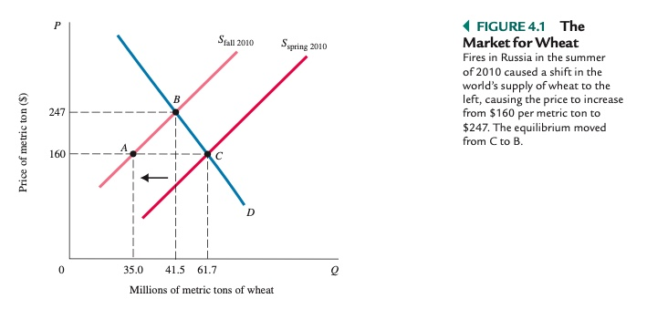

# 12.11.2021 Marktmechanismus

### Preissystem

> **Preisrationierung**: Prozess der Anpassung des Preises in freien Märkten bei Mangel/Überschuss auf dem Markt

Beispielhafte Preisanpassung in Russland

es gibt auch alternative Rationierungsinstrumente als den Preis!

oft von Regierungen eingesetzt, meist jedoch kostspielig und mit unintendierten Nebenfolgen

#### alternative Verteilungsmechanismen

| Mechanismus         | Definitionen                                                 | Effekt                                                       |
| ------------------- | ------------------------------------------------------------ | ------------------------------------------------------------ |
| **Preisobergrenze** | OPEC-Beispiel: `Preisgrenze als Reaktion auf OPEC-Embargo`  | durch Obergrenze wurde noch weniger produziert als bei Preismechanismus, da Produzenten nicht zu dem Preis liefern wollen |
| **Schlangestehen**  | nicht preislicher Mechanismus, wer länger steht kriegt das Gut | verlorene Arbeit/Lebenszeit, Schwarzmarkt                    |
| **Rationierung**    | Regierung gibt Gutscheine, die Berechtigung zum Kauf haben   | Korruption, Mangel                                           |

### Renten

> **Konsumentenrente:** Differenz zwischen:
>  Höchstbetrag, den man bereit ist zu zahlen und  Marktwert

> **Produzentenrente**: Differenz zwischen Marktpreis und Produktionskosten einer Firma

Beispiel 

| Konsumentenrente                                             | Produzentenrente                                             |
| ------------------------------------------------------------ | ------------------------------------------------------------ |
|               |               |
| Beispielsweise an *Punkt(A)*, sind Menschen bereit, 4.5$ zu zahlen, müssen aber nur 2.5\$ zahlen => Rente von 2\$ | Beispielsweise an *Punkt(A)*, ist Firma bereit, für 1\$ zu produzieren, kriegt aber 2,5\$ Marktpreis => Rente von 1.5 \$ |

Darstellung der *Gesamtwohlfahrt*

> **Wohlfahrt (Welfare)**: aggregierte Renten von Produzenten und Konsumenten

#### Wohlfahrtsverlust

bei fehlendem Marktgleichgewicht gibt es einen *Wohlfahrtsverlust* (Deadweight Loss): Darstellung:

mögliche Ursachen: 

- Monopolmacht => Anreiz wenig zu produzieren zu hohen Preisen
- Preisober- / Preisuntergrenzen
- externalisierte Kosten

Wichtig für effizientes Funktionieren des Marktes: *Market Design* 

> **Market Design:** Analyse spezifischer Märkte und ihrer Funktionsweise sowie Verbesserung der Marktmechanismen 

### historische Märkte

- Kölner Großmarkt: geogr. + zeitliche Konzentration von ähnlichen Händlern 
    - Aggregation von Angebot + Nachfrage
    - wenig Informationsasymmetrie
    - Vorteile zur Marktkontrolle
- Amsterdamer Börse
    - zentralisiertes Parkett zum Kauf von Anteilen
    - beschränkte Handelszeit

