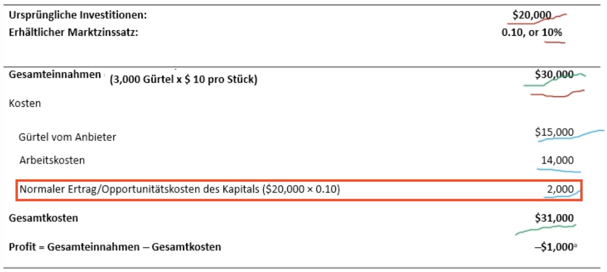
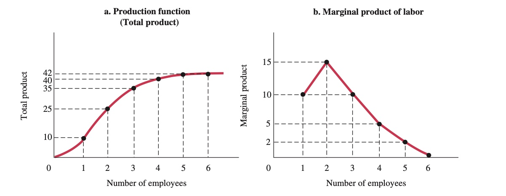
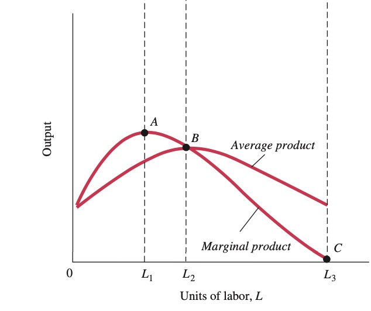

# 24.11.2021 Unternehmen + Produktionsprozess

> **Unternehmen:** Organisation, die Ware/Dienstleistung *produziert*

> **Produktion:** Prozess der Kombination+ Umwandlung von Inputs in Outputs

### Verhalten gewinnmaximierender Unternehmen

primäres Ziel von Unternehmen: `Maximale Gewinne`

bei Marktwettbewerb: keine Kontrolle über Outputpreise + perfekt elastische Nachfragekurve

Entscheidungen von Unternehmen:

- Wieviel **Output** anbieten
- Welche **Technologie**
- Wieviel **Input** nachfragen

Gewinn = Gesamteinnahmen - Gesamtkosten

- Gesamteinahmen : Quantität mal Preis des Produkts (_q * P_)
- Gesamtkosten: Opportunitätskosten + Produktionskosten 

wichtig auch: Alternative Rendite (Kapitalrendite) bei Anlage im Markt

Zeiträume eines Unternehmers:

- **Kurzfristig:** Fester Produktionsmaßstab + keine Neueintritte
- **Langfristig**: keine festen Produktionsfaktoren + Neueintritte

### Produktionsprozess

#### Optimale Produktionsmethode

> **Optimale Produktsionmethode:** Methode, die Kosten für ein Produktionsniveau minimiert

Abhängig von Outputpreis, Inputpreis, Produktionstechnologie

Arten der Produktionstechnologie

- kapitalintensive Technologie
- arbeitsintensive Technologie

Dargestellt mit *Produktionsfunktion* 

#### Gesetz abnehmender Ertrag

zusätzliche Einheiten variablen Inputs zu festem Input hinzugefügt => Abnehmen des Grenzproduktes des variablen Inputs 

Bsp.: bei 2 festen Köchen und 2 Öfen => neue Öfen helfen, aber nicht mehr soviel wie di ersten

> **Grenzprodukt:** zusätzlicher Output durch hinzufügen weiterer Einheit von Input

- Gesetz gilt immer kurzfristig

Grenzfunktion und Grenzertrag:

> **Durchschnittsprodukt**: durchschnittliche Produktionsmenge jeder Einheit/Arbeiter : $\frac{produzierte\ Einheiten}{Anzahl \ Arbeiter}$

|  | Durchschnittsprodukt "folgt" Grenzprodukt; hat Maximum im Schnittpunkt |
| ----------------------------------------------- | ------------------------------------------------------------ |

`! Produktion ist immer im Wechselspiel von Kapital und Arbeit !`

#### Technologiewahl

Kosten einer Technologien =  $(L * P_L)+(K*P_K)$ = Arbeit * Lohn + Kapital * Zinsen

Unterschiede bei Technologien: Einheiten von *K/L* genutzt

### Institutionenökonomik

alternativer Ansatz zur Betrachtung Unternehmen

- Unternehmen als Abkehr vom Markt , da Prozesse effizienter intern lösbar 
    - Bsp: Arbeiter nicht jedes mal neu einstellen, sondern Arbeitsvertrag
- Unternehmen als Wissensystem
    - spezifisches Wissen, wie man ein Gut produziert
    - Bündel von Routinen/ Kompetenzen

`=> mehr als Produktionsfunktion`

