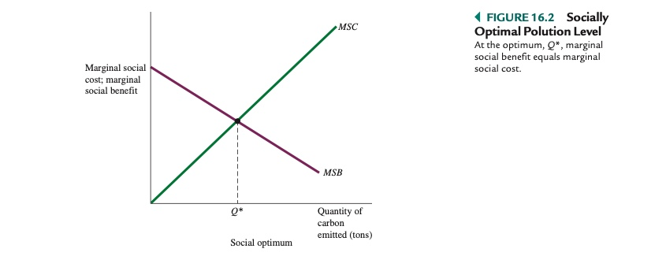

# 01.12.2021 Externalitäten und öffentliche Güter

### Externalitäten

> **Externalitäten**: Handlungen einer Partei, die zu Kosten/Nutzen für zweite Partei führen

Beispiel Fabrik: Fabrik verursacht Umweltschäden, schadet Anwohner, muss aber nix zahlen

> **Soziale Grenzkosten (SGK)**: Zusatzkosten der Gesellschaft durch Produktion zusätzlicher Einheit

SGK = Produktionskosten + externalisierte Kosten

> **Sozialer Grenznutzen: (SGN)** gesellschaftlicher Nutzen durch zusätzliche Einheit

*Optimale Verschmutzungsniveau: SGK = SGN*

#### Lösungsansätze zur Internalisierung

1. **Verhandlungen** über Entschädigungen von Partei 1 an Partei 2
2. **Umweltstandards** von staatlicher Seite
3. **Steuern / Subventionen** für Verschmutzer / Vermeider
4. **Verschmutzungsrechte** : Handel zwischen Firmen für Emmisionsrechte

### Öffentliche Güter

> **Kollektive Güter:** Güter, die nicht rivalisiert sind und nicht auschließbar

- *Rivalisierbar*: Anspruchnahme des Gutes beinträchtigt niemand anderen darin
- *nicht ausschließbar*: niemand kann von Genuss des Gutes ausgeschlossen werden

Beispiel: Radio, [Wikipedia](https://en.wikipedia.org/wiki/Public_good_(economics)#Common_examples_of_public_goods_include)

 Probleme bei öffentl. Gütern: *Trittbrettfahrer und Drop-in-the-Bucket-Problem*

>  **Trittbrettfahrerproblem**: niemand ist bereit, für von allen genutztes Gut zu bezahlen

> **Drop-in-the-Bucket:** Bereitstellung eines Gutes an sehr viele -> einzelner ist nicht bereit, zu zahlen

### Gemeinsame Ressourcen

> **Gemeinsame Ressourcen**: Ressource, die nicht *ausschließbar* ist, aber *rivalisierend*

Beispiel: saubere Luft, Atmosphäre

Problem: Übernutzung 

