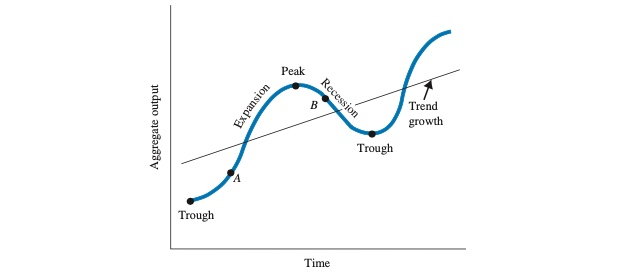
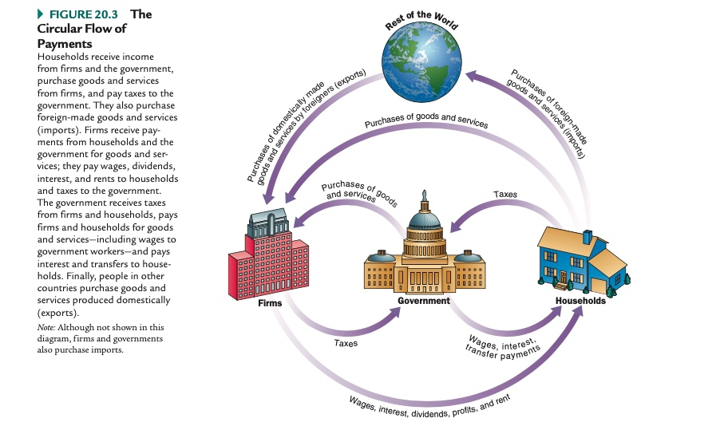

# 07.12.2021 Makroökonomik

### Einführung

> **Makroökonomie:** befasst sich mit Determinanten des Volkseinkommens und aggregierten Preisen / Verbrauch

- *aggregiertes Verhalten*: Verhalten aller Haushalte / Unternehmen
- *starre Preise*: Preise die sich nicht direkt anpassen

Themen der Makroökonomie:

1. Wachstum der Produktion
2. Arbeitslosigkeit
3. Inflation / Deflation

#### Wachstum der Produktion

Definitionen:

- *Konjunkturzyklus*: Zyklus der kurzfristigen Auf- und Abschwünge der Wirtschaft
- *Rezession*: Zeitraum der zurückgehenden Gesamtproduktion
- *Depression:* anhaltende Rezession
- *Expansion:* Zeitraum der zunehmenden Gesamtproduktion

`Geld + Fiskalpolitik hat Einfluss auf Konjunktur!` 

#### Arbeitslosigkeit

Interesse an der *Arbeitslosenquote*

> **Arbeitslosenquote:** prozentueller Anteil der Arbeitslosen an der Erwerbsbevölkerung

#### Inflation + Deflation

> **Inflation**: Anstieg des allgemeinen Preisniveaus

> **Deflation:** Rückgang des allg. Preisniveaus

### Komponenten der Makroökonomie

in Makro, Unterteilung der Wirtschaftsteilnehmer in 4 Gruppen

1. Haushalte (privat)
2. Unternehmen (privat)
3. Regierung (öffentlich)
4. Rest der Welt

Kreislauf der Makroökonomie: 

Unterteilung in 3 Märkte auch möglich:

- Gütermarkt
    - Staat und Haushalte kaufen von Unternehmen
    - Unternehmen kaufen untereinander
    - Handel mit Rest der Welt
- Arbeitsmarkt
    - Haushalte bieten ihre Arbeit an
- Geldmarkt
    - Haushalte versorgen Geldmarkt mit Mitteln für Rendite
    - Haushalte + Unternehmen nehmen Kredite auf
    - Regierung gibt Anleihen aus 

### Rolle des Staates

> **Finanzpolitik**: Mittel der Regierung zur Anpassung von Ausgaben. und Steuern 

aus der keynesianischen Ökonomie

Auswirkungen der Finanzpolitik:

- Einfluss auf Inflation + Zinssätze 
- Gesamtnachfrage
- Wechselkurs

> **Geldpolitik**: Steuerung der Geldmenge udn der Zinssätze durch die Zentralbank, um makroökonomische Ziele zu erreichen

Instrumente

- Änderung Zinsatz
- Regulierung Wechselkurse
- Verkauf / Kauf Staatsanleihen

### Geschichte der Makroökonomie

Makroökonomisches Wissen speist sich vor allem aus der Geschichte!

wichtige Zeitpunkte:

- *Große Depression*: wirtschaftlicher Abschwung der 1930er
- *Stagflation*: Zeit der hohen Inflation und hohen Arbeitslosigkeit in den 70ern

historische Arbeitslosenrate in den USA (1970 - 2014)

historische Inflationsrate USA 

=> zwei fette Balken = **Stagflation**

