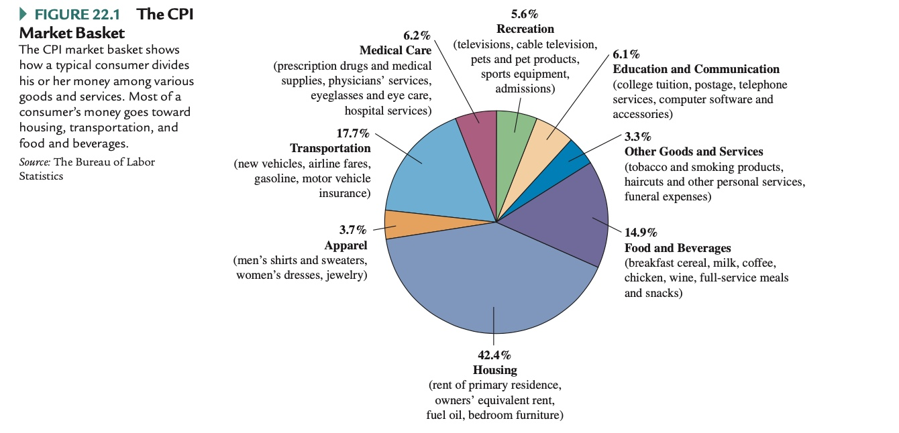

# 13.01.2022 Arbeitslosigkeit, Inflation und Wachstum

- wichtige statistische Daten über die Volkswirtschaft

### Arbeitslosigkeit

Verständis wichtig für gesellschaftliches Ziel der Vollbeschäftigung

> **Arbeitslos:** 16 Jahre oder älter ohne Beschäftigung *und* auf der Suche nach Arbeit

> **Nicht erwerbstätig:** Person ihne Arbeit, aber nicht auf Suche, wie Rentner, Studenten

- $Bevoelkerung = Erwerbsbevölkerung \ (Arbeitslose + Arbeiter) + nicht erwerbtstätige$
- $Arbeitslosenquote = \frac{Arbeitslose}{Erwerbstätige + Arbeitslose}$

```
Entmutige Arbeitnehmer:
wenn Arbeitslose keinen Job finden, entmutigt werden und einfach ausscheiden aus der Erwerbsbevölkerung
```


#### Kategorien

- **Natürliche Arbeitslosigkeit**: 2 Kategorien
    - **Friktionsbedingt:** "normale" Arbeitslosigkeit, Zeit zwischen zwei Jobs
    - **Strukturell:** Veränderungen der Wirtschaftsstruktur, Verschwinden einer Branche => struktureller Arbeitslosigkeit
- **Konjunkturell:** aufgrund Wirtschaftslage


### Inflation

Messung mit *CPI*

> **Consumer Price Index (CPI):** Indikator für Preisteigerungen anhand repräsentativen Warenkorbs

Warenkorb




#### Folgen der Inflation

milde Inflation (~2%) ist oke

- führt zu Preis *und* Gehaltsanpassungen und gleicht sich aus

starke Inflation (ab 5%)

- Verluste für AN , insb. Niedrigsektor, Gehälter halten nicht mit

> **Realzins:** Differenz  Inflationsrate | Zinsatz (= Erwartung Inflation)


Gegenteil der Inlfation = **Deflation** (sehr schlecht!)


