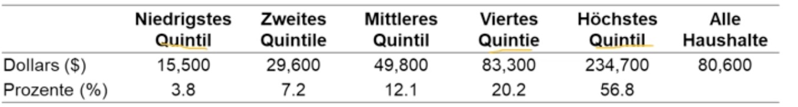
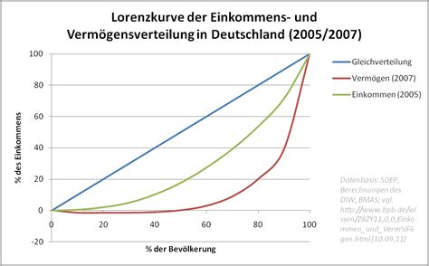

# 12.02.2022 Einkommen und Armut

### Quellen des Einkommens

- **Löhne und Gehälter**: rund 63% aus Löhnen und Zusatzleistungen
- **Vermögenseinkommen**:  rund 28% des persönlichen Einkommens
- **Transferzahlungen:** vom Staat gezahlte Hilfen = 9%

### Verteilung der Markteinkommen

> **Markteinkommen**: Lohn- und Vermögenseinkommen vor Steuern / Transfers

> **Einkommen vor Steuern:** Markteinkommen + Transfers
>
> **Einkommen nach Steuern:** abzüglich gezahlter Steuern

Aufteilung der Bevölkerung in Quintile

- oberste Quintil = 56,8 % des Markteinkommens
- unterste Quintil = 3,8% des Markteinkommens

Anteil der oberen Quintile steigt seit Jahren

### Lorenzkurve und Gini-Koeffizient

> **Lorenzkurve:** weit verbreitete Grafik der Einkommensverteilung, bei der auf x-Achse der anteil der Haushalte und auf y-Achse das Einkommen der Haushalte

> **Gini-Index:** Index für Grad der Ungleichheit zwischen 0 (Sozialismus) und 1 (Anarchokapitalismus)

### Ursachen der Ungleichheit

bei Einkommen

- **Erforderliche Qualifikationen und Humankapital**
    - unterschiedliche Jobs fordern unterschiedlich lange Ausbildung => höherer Lohn
- **Ausgleichende Lohnunterschiede**
    - risikoreiche Arbeitsplätze zahlen mehr als risikoärmere
- **Diskrimierung**
    - unterschiedliche Bezahlung trotz gleichen Jobs (Frau / Mann, schwarz / weiß)
- **Zusammensetzung der Haushalte**
    - mehr Arbeitende in Haushalt => höheres Haushaltseinkommen

Ursachen der Ungleichheit bei Vermögen

- Erben, Erben, Erben!

### Umverteilung

Argumente dafür

- **Normativ**: Ungleichheit ist ethisch schlecht
- **Utilitaristisch**: Ein Dollar ist für einen Armen mehr Wert als für einen Reichen
- **Rawlsche Gerechtigkeit:** Eine Gesellschaft ist nur so gerecht, wie sie zu den ärmsten Mitgliedern ist

### Mindestlohn

> **MIndestlohn:** niedrigster Lohn, den Unternehmen ihren Arbeitnehmern zahlen durften

- erster Lohn in Neuseeland im 18Jhd.
- seit 2015 in Deutschland

