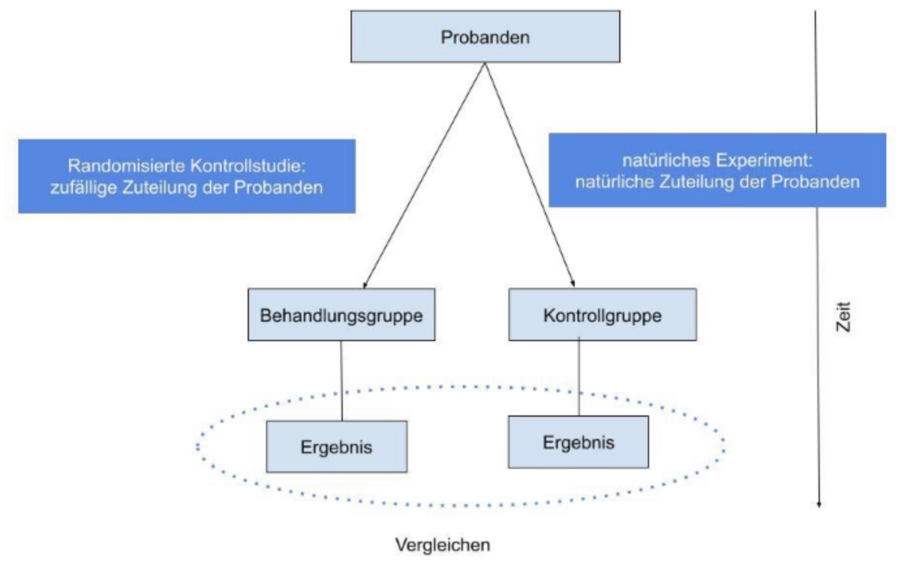
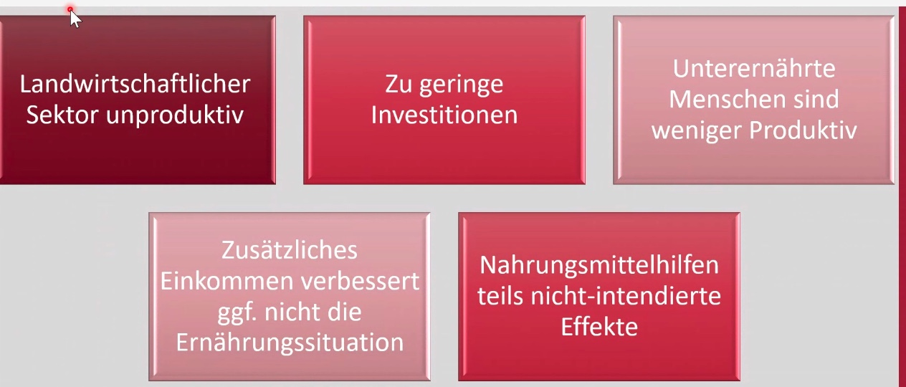

# 12.02.2022 Übung

### Experimente

- **natürliche Experimente**: die "Natur" entscheidet darüber, welche Gruppe man zugeteilt wird
    - bspw. dein Wohnort in einem oder anderen Bundesland und dann wird zwischen Bundesländern unterschieden
- **Randomisierte Kontrollstudie:** zufallsauswahl der Gruppenzuteilung

### Armut

- **relative Armut**: Haushaltseinkommen weniger als 60% des mittleren Einkommens (abhängig von Land)
- **absolute Armut**: Haushaltseinkommen weniger als 3.10$ pro Tag (Weltbank legt fest)
- **extreme Armut**: Haushaltseinkommen weniger als $2 pro Tag (Weltbank legt fest)

### Giffen Güter und andere Güter

**definitiv klassurrelevant!**

diese Folie ist wild wtf?

### Landwirtschaft

- Dünger ist wachstumsfördernd
- nicht alle können sich Dünger leisten

wichtige Grundsätze:

### Wachstum

- was sind Wachstumsfaktoren? 
    - technologische Entwicklung
    - Infrastruktur
    - stabile Institutionen (*Institutions matter*)

Zusammenfassung: 

### Forschungstrends

- Wandel hin zu datengetriebenen Untersuchungen
    - mehr *evidence-based-economics*
- viele natürliche Experimente (letzten beiden Nobelpreise)
- außerdem psychologische Analysen von Handeln (Nobelpreis 2015)

