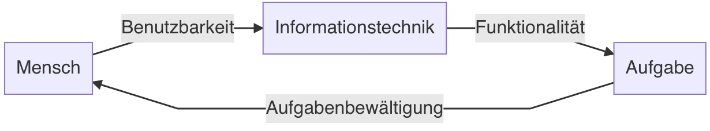
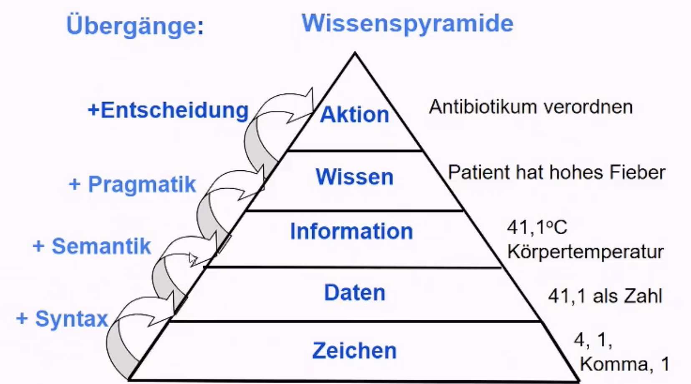

# 18.10.21 Wirtschaftsinfo

### Bedeutung

Informationen = Produktionsfaktor / Ressource

Bewirtschaftung der Information = **Wirtschaftsinformatik**

bestmöglicher Einsatz der Ressource Information (Hinblick Unternehmensziele) durch: 

- **Enabler:** Geschäftsmodelle durch Information ( Online Handel, Soziale Medien)
- **Align**: IT als Unterstützer geschäftlicher Impulse

Herausforderungen der WiInfoler: Internet of Things, Web 2.0 

### Definitionen

>  WI: **Konzeption, Entwicklung, Einführung, Wartung, Nutzung** von Systemen in von computergestützte Informationsverarbeitung-Systemen in **Betrieben**
>
>  *Mertens*

Online-Enzyklopädie: https://www.enzyklopaedie-der-wirtschaftsinformatik.de/

**Gegenstand**: Informations- und Kommunikationssysteme (*IUK*) in Wirtschaft und öfftl. Verwaltung

- in Verbindung mit menschlicher Komponente -\> *Soziotechnisches System* 

**Zweck**: betriebliche Geschehen lenken

**Mittelpunkt:** Konzeption, Wartung, Einführung 

> **Information- + Kommunikationsystem:** 
> Mensch-Aufgaben-Technik-Systeme (MAT) 
> Anwendungs- + Organisationssystem
>
> mehr als Computerprogramme!

### Entwicklung von IUKs

1. Existierende Strukturen berücksichtigen
2. kleinere Projekte auf Desktop
3. größere im Team

### Unterschiede zu IS

Wirtschaftsinformatik <--> Information Systems (angelsächsisch):

- Konstruktiver Ansatz (Neuentwurf) <--> Behavioristischer Ansatz (Untersuchung bestehender Systeme)

## Daten

> **Definition:** *Zeichen oder Zeichenketten* die aufgrund von bekannten / unterstellten Vereinbarungen *Information* darstellen 
>
> ISO-Norm

**DATEN**:

- *Darstellung*: Binärdarstellung
- *Verarbeitung*: Algorithmus  
- *Organisation*: Datenformen, Struktur

### Codierung + Darstellung

zentrale Informationseinheiten: *Bit* (Binary Digit) und *Byte* (8 Bit)

**Dualsystem** B=2: Ziffernmenge {0,1}

| Stelle | 0    | 1    | 2    | 3    | 4    | 5    | 6    | 7    | n    |
| ------ | ---- | ---- | ---- | ---- | ---- | ---- | ---- | ---- | ---- |
| Wert   | 2^0  | 2^1  | 2^2  | 2^3  | 2^4  | 2^5  | 2^6  | 2^7  | 2^n  |
| Dezi.  | 1    | 2    | 4    | 8    | 16   | 32   | 64   | 128  |      |

für bessere / verkürzte Schreibweise das Hexadezimalsystem: Ziffernmenge {0,1,2,...,9,A,B,...,F} für 16er Basis

**Darstellungsarten:**

[ASCII-Code](https://www.ascii-code.com/) als Text-Darstellung von Bytes

- 7-Bit / 8-Bit mit Länderspezifiken
- bspw. 01000001 (65) = A

oder auch Verschlüsselungen etc...

### Verarbeitung

Verarbeitung von Daten / Informationen erfolgt mit Hilfe von *Programmen*

> **Programm:** in einer *Programmiersprache* formulierter *Algorithmus* + die zu verarbeitenden Daten

> **Algorithmus:** genau definierte Rechen-/Handlungs-/Verarbeitungsvorschrift zur Lösung eines Problems

> **Programmiersprache:** Sprache mit genau definierter Syntax (Regeln) und Semantik (Bedeutung), 
>
> in der Algorithmen formuliert werden können, dass Computer sie ausführen können

Programmiersprachen: 

- nach *EVA*-Prinzip: Eingabe-Verarbeitung-Ausgabe
- oft mit Schleifen (*for und while*)

### Datenorganisation

> **Datenorganisation:** logische Strukturierung und physische Speicherung von Daten

**Ziele:**

- schneller Zugriff
- leicht aktualisierbar
- Auswertbar + verknüpfbar
- Schutz
- Effizienz (Vermeidung Redundanz)

zentrales Element = *Datei*

> **Datei:** Komplexer Datentyp = dauerhafte Speicherung von Daten auf Datenträger
>
> mit Metadaten versehen (bspw. Name, Uhrzeit, Attribute)

Arten der Dateiorganisation

- sequenzielle Organisation: systematisches Durchlaufen bis Finden
- direkt addressierbare Organisation: Kenntnis der Adresse -> Zugriff

