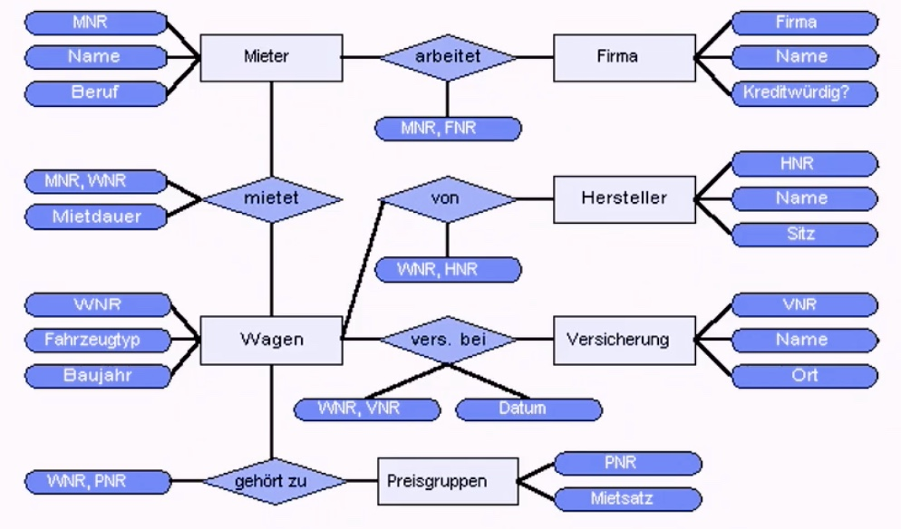

# 03.11.2021 ERM

> **Entity Relationship Modell:** graphische  Darstellung zur Datenmodellierung

nützlich für Verständigung zwischen Anwender und Entwickler

> **Entity** : Objekt der Anschaung mit verschiedenen Attributen, unterteilt nach *Entitätstypen* 

**Entity-Typ**: Struktur der Entität

**Entitätsmenge** : Menge von Entitäten eines Entitätstypes

Attribute:

- tragen Attributsbezeichnugnen
- immer Attribut-Wert-Paar

mehrere Entitäten werden durch *Relationship* verbunden

> **Relationships**: Art der Verbindung zwischen zwei Entitäten

Beispiel Bibliothek:

- 1:1 (Standort : Buch)
- 1:n (Verlag : Bücher)
- n:m (Autor : Buch)

Beispiel ERM einer Autovermietung: 

