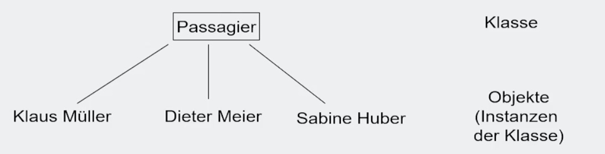
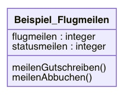
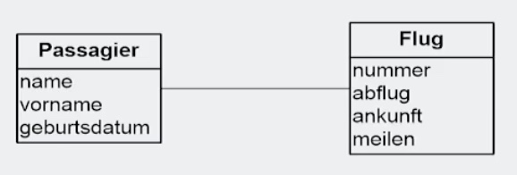
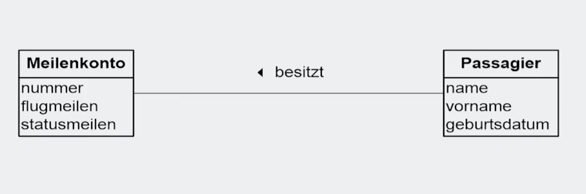
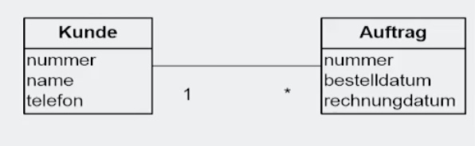
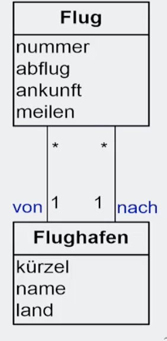
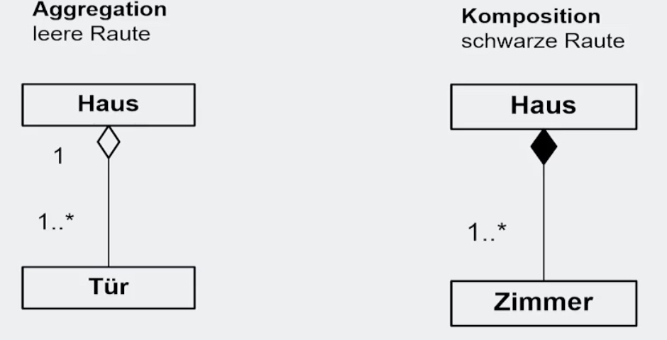
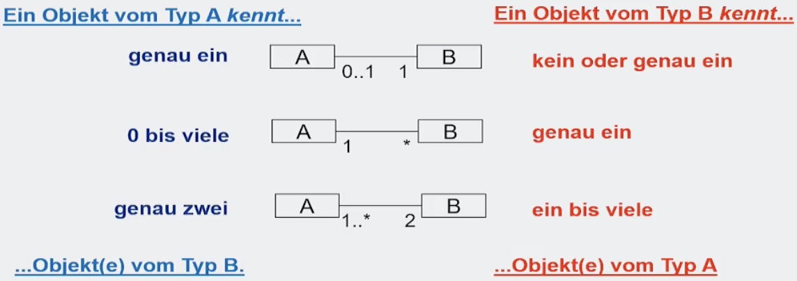
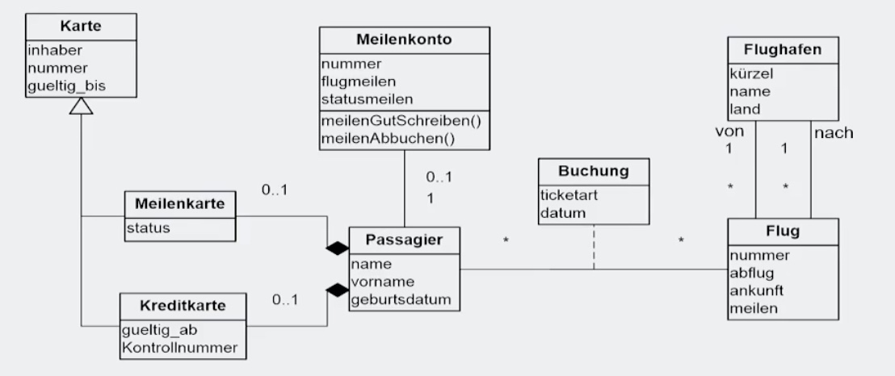

# 29.11.2021 UML-Diagramme

### Einführung

> **Unified Modeling Language (UML):** Sprache zur Beschreibung von Softwarekonzepten und -systemen

Nutzung für:

- Analyse
- Entwurf
- Implementierung 

ihm Rahmen von Objekt-Orientierter Entwicklung

> **Objekt-Orientierung**: Fokus auf Objekte und ihr Zusammenspiel miteinander

Arten von UML-Diagrammen unterteilt in: 

- *Strukturdiagramme* 
    - modellieren die statischen Elemente und 
    - Systemzustand
    - Besipiel: Klassendiagramm
- *Verhaltensdiagramme* 
    - dynamische Abläufe im System und 
    - zeitabhängige Interaktionen
    - Beispiel : Use-Case-Diagramm; Aktivitätsdiagramm

### Klassendiagramm

Nachfolger des ERM, aber mit mehr Funktionen

- beschreibt Klassen und 
- Beziehungen zwischen Klassen

#### Klassen

zentraler Begriff der Objektorientierung

> **Klassen:** Objekttyp; stellt Struktur von Objekten dar

Instanzen der Klasse = Objekte

bestehen aus:

- Eigenschaften (Attribute) mit Typ
    - Beispiel `flugmeilen : integer`
- Operationen (Methoden)
    - Beispiel: `meilenAbbuchen()`

| Darstellung                                     | Beschreibung                                                 |
| ----------------------------------------------- | ------------------------------------------------------------ |
|  | Kopfzeile: Klassenname Mitte: Attribute Unten: Methoden |

#### Beziehungen zwischen Klassen

| Beziehungstyp                | Beschreibung                                                 | Bild                                            |
| ---------------------------- | ------------------------------------------------------------ | ----------------------------------------------- |
| Assoziation                  | eine Beziehung zwischen zwei Klassen, dargestellt durch *Linie* |  |
| Assoziation mit Beschreibung | Bezeichnung für Assoziation mit schwarzem Dreieck als Leserichtung |  |
| Multiplizitäten              | Bezeichnug, wie viele Objekte sich auf Quellobjekt beziehen  |  |
| Rolle                        | kennzeichnet Rolle, die Objekt für anderes spielt            |  |
| Aggregation                  | spezielle Form: "ist Teil von"                               |  |
| Komposition                  | Form der Aggregation, nur wenn Quellobjekt existiert         | siehe oben ↑                                    |
| Vererbung+ Generalisierung   | Objekt ist Untergruppe eines anderen Objekts                 |  |

Arten von Multiplizitäten: 

Beispielmodell: 

